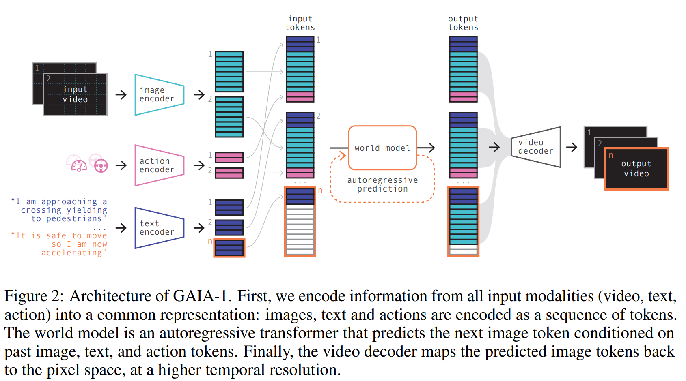

- **GAIA-1 A Generative World Model for Autonomous Driving**
 **[`arXiv 2023`]** *Anthony Hu, Lloyd Russell, Hudson Yeo, Zak Murez, George Fedoseev, Alex Kendall, Jamie Shotton, Gianluca Corrado* [(arXiv)](http://arxiv.org/abs/2309.17080) [(pdf)](./../LLM-based%20AD/GAIA-1%20A%20Generative%20World%20Model%20for%20Autonomous%20Driving.pdf) (Citation: 21)
  - **Objective:** GAIA-1 aims to address the challenge of predicting various potential outcomes in response to a vehicle’s actions as the real-world environment evolves. This capability is crucial for safe and effective autonomous navigation.
  - **Inputs:** GAIA-1 takes video data, textual information, and action commands as inputs. By combining these modalities, it constructs a comprehensive understanding of the driving environment.
  - **Output:** Output is a predictive video based on input video and action
  

  
  

  - **Sequence Modeling:** GAIA-1 approaches world modeling as an unsupervised sequence modeling problem. It maps the inputs to discrete tokens and predicts the next token in the sequence. This approach allows it to learn high-level structures, scene dynamics, contextual awareness, and geometry.

  - **Learned Representations:** GAIA-1’s learned representation captures expectations of future events. This powerful representation, combined with its ability to generate realistic samples, opens up new possibilities for innovation in autonomous driving technology.
  - **Fine-Grained Control:** The model provides fine-grained control over ego-vehicle behavior and scene features. This control enables researchers and engineers to explore different scenarios and train autonomous systems more effectively.