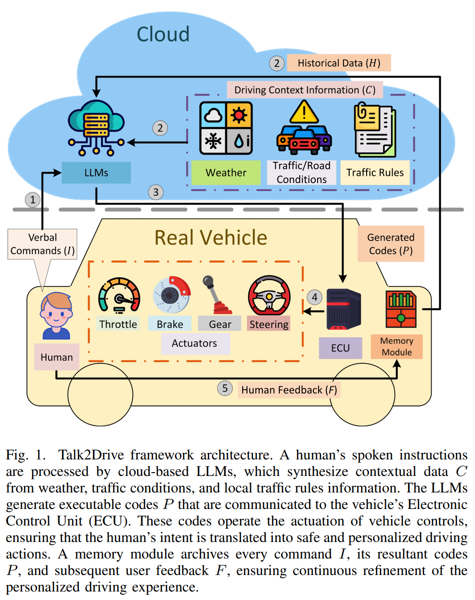

- **Large Language Models for Autonomous Driving Real-World Experiments**
 **[`arXiv 2023`]** *Can Cui, Zichong Yang, Yupeng Zhou, Yunsheng Ma, Juanwu Lu, Lingxi Li, Yaobin Chen, Jitesh Panchal, Ziran Wang* [(arXiv)](http://arxiv.org/abs/2312.09397) [(pdf)](./../LLM-based%20AD/Large%20Language%20Models%20for%20Autonomous%20Driving%20with%20Real-World%20Experiments.pdf) (Citation: 0)

  

  - This paper presents a Talk-to-Drive LLM to process verbal commands from humans and make autonomous driving decisions with contextual information.  
  - **Problems on traditional autonomous driving**:
    - Traditional AD rely on manually configured human preferences. 
    - Conventional systems struggle to interpret and adapt to the abstract instructions from humans. 
    - Most current autonomous driving systems are trained on limited and model-specific driving data, which results in the deficiency of driving context information and a large database of common sense that would greatly help decision-making. Therefore, there are underlying risks for the system to make bad decisions in unseen or rare scenarios. 
  - **Talk-to-Drive** transforms verbal commands from humans into textual instructions, which are then processed by LLMs in the cloud. 
    - LLMs generate specific driving codes that are executed by the autonomous vehicle, adjusting driving behaviors and control parameters to align with the human's preferences. 
    - Talk2Drive allows for more natural and intuitive communications with the vehicle. 
    - **LLM Inputs** include human commands, weather (openweather API), traffic/road (TomTom API), and map information (OpenStreetMap API).
    - **LLM output** icnludes executable codes used for planning and control. The generated code adjust control parameters like the *look-ahead distance* and *look-ahead ratio* to optimize pure pursuit performance.
    - The LLMs are trained using **in-context learning**, coupled with **chain-of-thought prompting**. 
      - In-context learning (ICL): is a method of prompt engineering where demonstrations of the task are provided to teh model as part of the prompt in natural language. With ICL, you can use off-the-shelf LLMs to solve novel tasks without the need for **fine-tuning**.
  - **Problem of LLM-based Agent in AD**:
    - LLM's **latency** is too large.