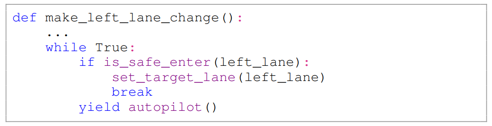

- **LaMPilot An Open Benchmark Dataset for Autonomous Driving with Language Model Programs**
 **[`arXiv 2023`]** *Yunsheng Ma, Can Cui, Xu Cao, Wenqian Ye, Peiran Liu, Juanwu Lu, Amr Abdelraouf, Rohit Gupta, Kyungtae Han, Aniket Bera, James M. Rehg, Ziran Wang* [(arXiv)](http://arxiv.org/abs/2312.04372) [(pdf)](./../LLM-based%20AD/LaMPilot%20An%20Open%20Benchmark%20Dataset%20for%20Autonomous%20Driving%20with%20Language%20Model%20Programs.pdf) (Citation: 0)

  - **Objective:** Introduce LaMPilot Benchmark specifically designed to quantitatively evaluate the efficacy of Large Language MOdels (LLMs) in translating human driectives into actionable driving policies. 
  

  - **Problems of Existing planners** rely on clear objectives and constraints to guide their deicisions. 
    - However, when faced with arbitrary commands like "overtake the car in front of me", existing planners struggle to handle them effectively. 
  - Research Gaps: 
    - There is a lack of datasets specifically for evalutaing and comparing the capacity of LLM-based models in teh context of autonomous driving. 
    - Controlling autonomous vehicles requires careful consideration due to its safety-critical nature. Existing frameworks often prioritize successful execution of actions predicted by LLMs without adequately addressing safety concerns.
  - Problem Statement:
    - Define a benchmark $B$ as the tuple $<S, A, T, I>$, where
      - $S$: the states of the vehicle and env.
      - $A$: set of actions for the vehicle
      - $T$: transition model, encapsulating the dynamics of the env.
      - $I$: high-level instructions that guide the planning for the vehicle
    - For each task in benchmark $B$, we begin form an initial state $b$. aiming to reach a goal state in $g$. The benchmark outlines a policy rollout for each task.
    - The rollout is steered by the conditional probability $p(a_{t+1}|s_t, I)$ and concludes upon arrival at a goal state $g$. Note that the agent does not have direct access to the goal state $g$, but only a high-level instruction $I$.
    - **An example**: consider the instruction $I$="Make a right lane change". If the initial state $s$ includes the ego vehicle in the curretn lane $l \in s$, the policy ``set_target_lane(get_right_lane(ego))`` will enact a series of state-action pairs. This process transitions the vehicle from its current state $l\in s$ to a new state $l'\in s'$, where $l'$ is the lane to the right of $l$. 
  - Simulator: [HighwayEnv](https://github.com/Farama-Foundation/HighwayEnv) 
  - Input Prompt to LLMs:
    - Environmental contexts (provided by the simulator) are encapusulated into a **structured language generator**, including information about other vehicles on the road, the ego vehicle, and the map. 
    

    
    

    
  - **Outputs of LLM:** The LLM receives prompts and is responsible for generating a completion. The completion produced by the LLMs is anticipated to be valid functions, written using the provided APIs.
    - **API Docs**: bridge the gap between the LLM outputs and low-level controls. Examples are presented below: 
    

    
    
    

  - **Evaluator**: 
    - Safety Metric: time to collision
    - Comfort Metric: speed variance
    - Efficiency Metric: time efficiency of the pollicy code
  - **Baselines**: rule-based models are favored for their deterministic and interpretable nature. 
    - Intelligent Driver Model (IDM)
    - Minimizing Overall Braking Induced by Lane Changes (MOBIL)
    - Human Feedback Baselines
    

    
    

    
    - After an LLM generates a policy program $P$, it can intergate feedback $F$ to receive context-specific guidance, enabling the LLM to refine its output. This approach does not involve calculating gradients or modifying model weights. Instead, we introduce a code repository module, which functions as a vector database. This repository allows for the storage and retrieval of effective code snippets to be used in similar situations.  

  - **Conclusion**: the ongoing need for substantial improvements for LLMs to better support instruction following in driving tasks. 
