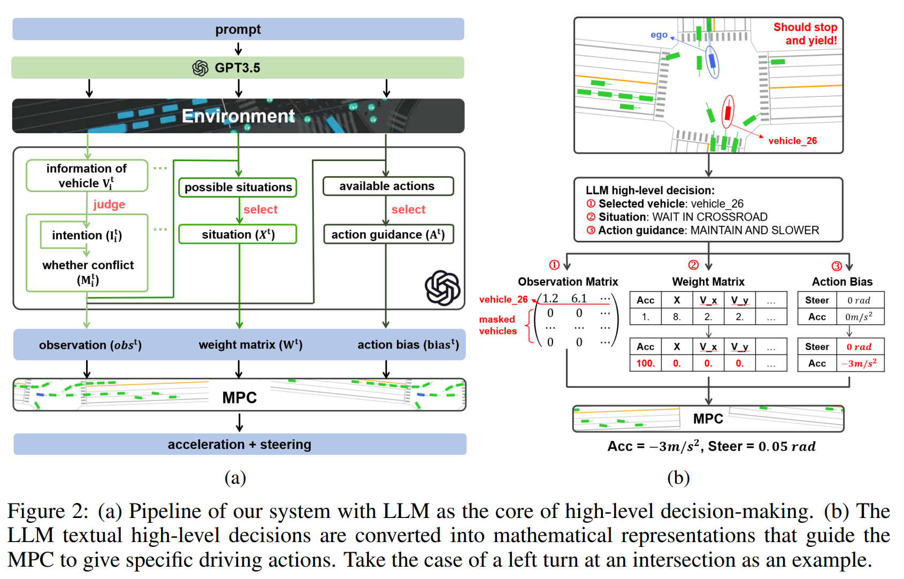
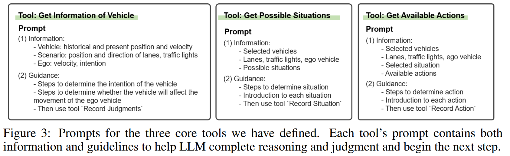

- **LanguageMPC Large Language Models as Decision Makers for Autonomous
  Driving**
 **[`arXiv 2023`]** *Hao Sha, Yao Mu, Yuxuan Jiang, Li Chen, Chenfeng Xu, Ping Luo, Shengbo Eben Li, Masayoshi Tomizuka, Wei Zhan, Mingyu Ding* [(arXiv)](http://arxiv.org/abs/2310.03026) [(pdf)](./../LLM-based%20AD/LanguageMPC%20Large%20Language%20Models%20as%20Decision%20Makers%20for%20Autonomous.pdf) (Citation: 35)

    - **Objective:** 
      - This work employs LLM as a decision-mkaing component for complex AD scenarios that require human commmonsense understanding.
      - Through this approach, LLM decisions are seamlessly intergrated with low-level controllers by guided parameter matrix adaptation. 
    - **Traditional Methods Limits**:
      - Reliance on Predefined Rules or Rewards -> limits their ability to generalize to various situations
      - Long-tail problem -> Limited datasets and sampling efficiency
      - The lack of interpretability -> AD system is a black box 
    - **Key Research Question**:
      - *Can we equip AD systems with the capability to think and drive like humans?* 
    - **Method Overview**:
      - Use LLM to analyze and reason about various scenarios, enabling it to provide high-level decisions
      - *Tune parameter matrix to convert high-level decisions into mathematical representations to guide the bottom-level controller, Model Predictive Control (MPC)*
    - **Data Pipeline**: 
      - Identify the vehicle requiring attention
      - Evaluate the situation
      - Offer action guidance
      - For instance, in Fig 2b, the LLM:
        - Selects `vehicle_26` and maskout all elements in the observation matrix to focus solely on `vehicle_26`.  
        - Situation: waitingt `vehicle_26` to pass intersection first
          - According to this, adjust the weight matrix to **prioritize deceleration** 
        - Action guidance -> Action bias.
      
    

    
    
 

    - **Model Predictive Control (MPC)** 
      - Solves a finite-time open-loop optimization problem online at each moment, based on the current sensor measurements, and applies the first element of the resulting control sequence with the lowest cost to the controlled vehicle. 
      - MPC model the control problem as MDP, where reward is defined as: 
      $C(\mathbf{s}, \mathbf{a})=\sum_{i=0}^M w_i \cdot \mathrm{n}_i\left(r_i\left(\mathbf{s}, \mathbf{a}, \psi_i\right)\right)$
        - where $w$ is the weight
        - $\mathrm{n}$ is twice-differentiable **norm**
        - $r$ is the residual term that achieves optimality when $r=0$
        - $\psi$ is the parameters of the $i^th$ residual term.  
      - For instance, if we want the vehicle to adopt the desired acceleration, we may design a residual term $r_{acc}(acc, \psi)=acc - \psi$, where the cost parameter $\psi$ denotes the desired acceleration, and use the $\ell_2$ norm to construct the final reward function: $C_{acc}=w|r_{acc}|_2$
      - Use LLM to give action bias and select weight matrices for driving in complex scenarios. 
    - **Chain-of-Throught**
      - Use LangChain as a framework to manage the LLM and establish a structured thought process for the LLM. 
      - Define a set of tools and specifying the sequence in which they should be utilized. 
      - **First,** we introduce these designated tools in a prompt at the outset of the conversation. 
      - **Second,** during the coursse of the dialogue, the LLM actively invokes these tools to acquire pertinent information and guidance for its ongoing decision-making process.
      - **Third,** the LLM follows these guidelines to determine its next course of action until it successfully addresses the entire problem.
      - An example:
        

        
        
  
    - **Attention Allocation**
      - Take the LLM with systematically assessing information to surrounding vehicles. 
      - Discern the intentions of these vehicles and to determine if they pose any conflicts with the movements of the ego vehicle. 
    - **Situation awareness and action guidance**
      - Within this framework, the LLM is tasked to select one specific situation from several options
    - **Experiment Platform:** IdSim 