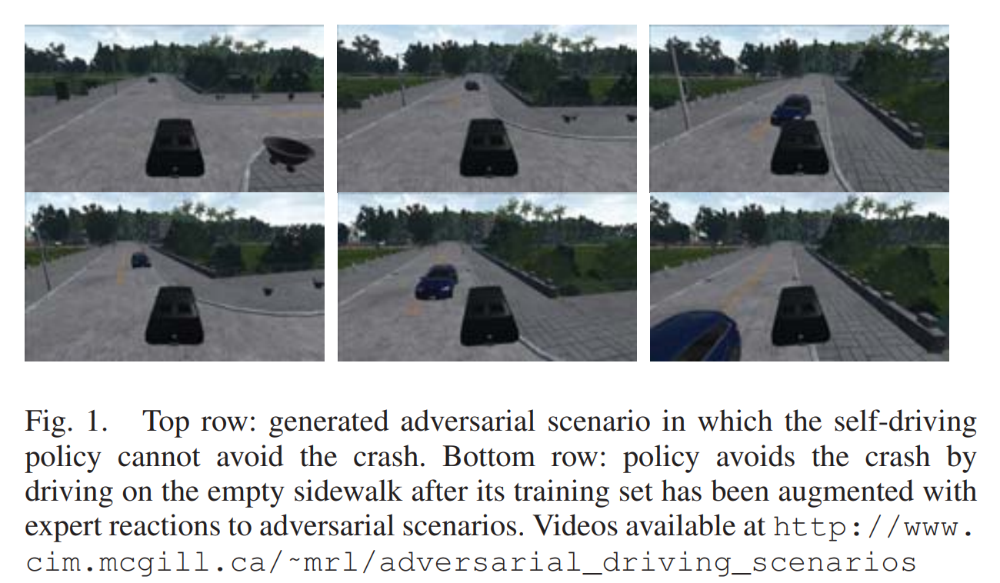

- **Generating adversarial driving scenarios in high-fidelity simulators**
 **[`ICRA 2019`]** *Yasasa Abeysirigoonawardena, Florian Shkurti, and Gregory Dudek* [(IEEE)](https://ieeexplore.ieee.org/stamp/stamp.jsp?tp=&arnumber=8793740) [(pdf)](./../RL-based/Generating%20adversarial%20driving%20scenarios%20in%20high-fidelity%20simulators.pdf) [(Notes)](./AD_notes/adversarialDriving.md) (Citation: 120)

  

  
  

   - **Objective**: Use Bayesian Optimization to generate *adversarial self-driving policies*, and *increase the risk of collision with simulated pedestrians and vehicles*. 
     - Via incorporating the generated scenarios into the training set of the self-driving policy, and by fine-tuning the policy using vision-based imitation learning, we can obtain safer self-driving behavior.
   - **Bayesian Optimization**:
     - BO is an approach for finding global optima of a noisy black box function. 
   - **Algorithm**:
     - $o_t$ and $a_t$ stand for observation and action at $t$.
     - Model the cost-to-go function $J$ as a Gaussian Process (GP) to capture the uncertainty around the performance of scenarios that we have not evaluated yet. 