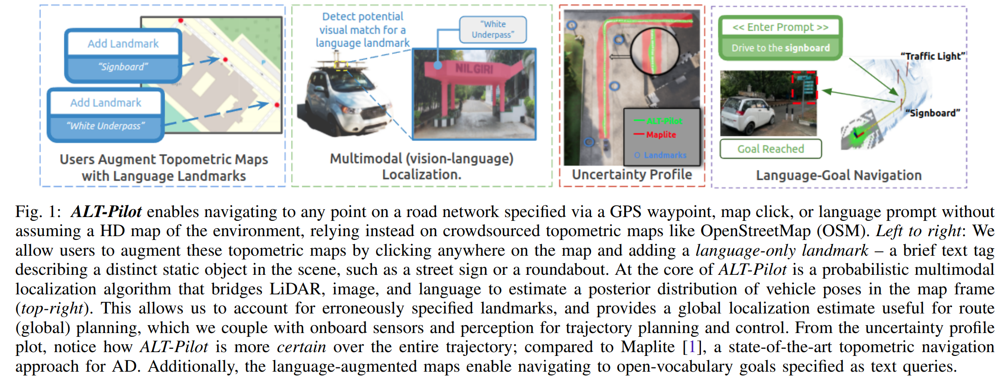
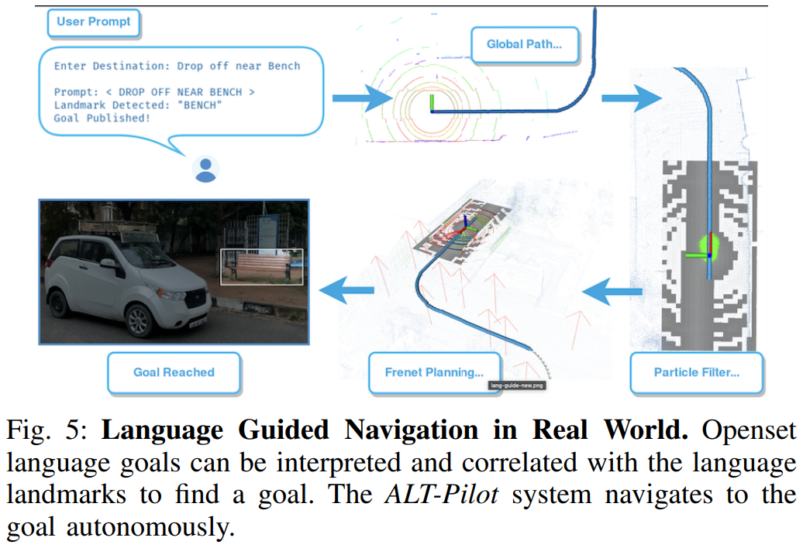

- **ALT-Pilot Autonomous navigation with Language augmented Topometric maps**
 **[`arXiv 2023`]** *Mohammad Omama, Pranav Inani, Pranjal Paul, Sarat Chandra Yellapragada, Krishna Murthy Jatavallabhula, Sandeep Chinchali, Madhava Krishna* [(arXiv)](http://arxiv.org/abs/2310.02324) [(pdf)](./../LLM-based%20AD/ALT-Pilot%20-%20Autonomous%20navigation%20with%20Language%20augmented%20Topometric%20maps.pdf) (Citation: 3)
    - **Objective**: present an autonomous navigation system that operates withouit HD LiDAR maps fo the environment. 
      - With the help of onboard sensors and a language-augmented topometric map, **Alt_Pilot** can pilots the vehicle to any detination on the road network. 
      - Use LLM to identify potential landmarks in a scene, incorporating vision-language features into the recursive Bayesian state estimation stack to generate global plans. 
    - **Current Methods**:
      - Existing industry-led autonomous driving (AD) systems rely on HD maps, which is computational costly and requires large memory.
      - To elimiate the dependence on HD maps, existing approaches use crowdsourced topometric maps like OpenStreetMap (OSM) - topologically accurate, but metrically imprecise road networks.  
      - **Vision-language models**:
        - Enable navigation to open-vocabulary goals, usually specified in the form of text prompts, by aligning semantic concepts across language and images. 
        - However, these approaches also require significantly large memory and compute footprints. 
    - **Key Reserach Questions**:
      - What kinds of map representations enable autonomous navigation to any destination on a road network $\rightarrow$ **Language-agumented topometric maps**
        - Augment off-the-shelf OSM road networks with a small number of language landmarks (e.g., street signs, traffic signals, and other persistent features in the environment useful for localization). 
      - How do we accurately localize on this map representation, while accounting for errors arising due to the map representation, and due to imperfect perception and control? $\rightarrow$ **ALT-Pilot**
        - Autonomous navigation system capable of piloting a vehicle to any destination over a language-augmented topometric map. 
    

    
    
   

  - **Multimodal Localization Across LiDAR, Image and Text**
    - **Problem**: Use IMU to calculate position has accumulated errors. 
    - **Mitigation:** Use CLIP to align vision and language. 
      - Recompute CLIP text features for all landmarks in the map to create a set $K$ where each $k_i\in K$ has an associated position $k_i^{pos}$ and a language feature $k_i^{feat}$
  
  - **Language-driven Navigation**. 
    - Use LLM (GPT-4) to parse natural language goal descriptions into an appropriate function call. 
    - For instance, a natural language request such as “*Take me to a place where I can sit*” will be transformed into goal(“*place where I can sit*”). 
    - The goal selection function will then identify the closest match among landmarks (possibly a bench) corresponding to the description and plan a path to it. 
    - Subsequently, the ALT-Pilot system will autonomously navigate to the specified goal.
    

    
    
    