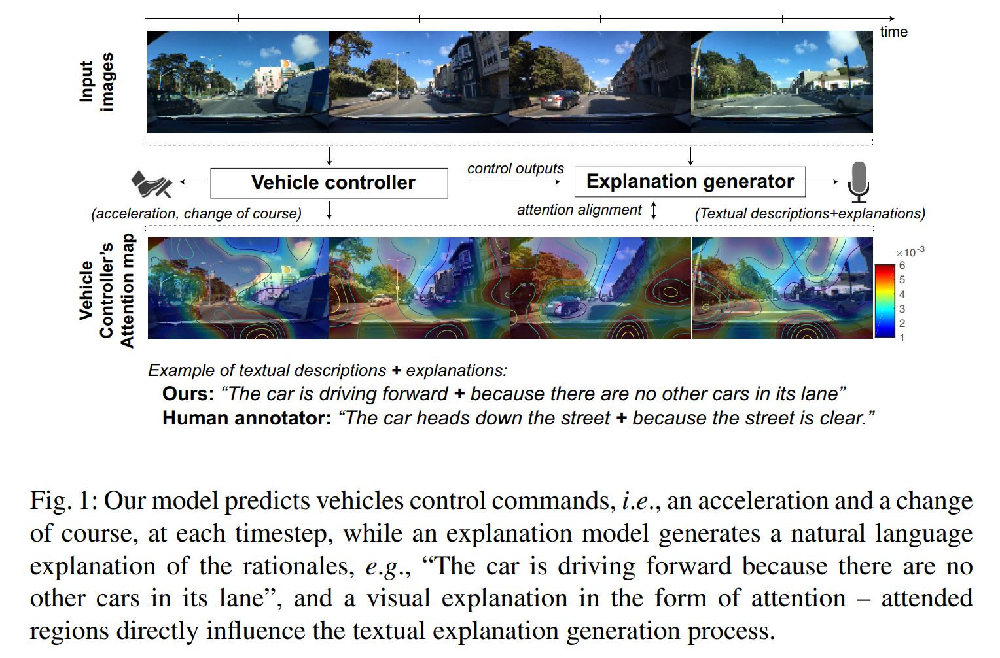
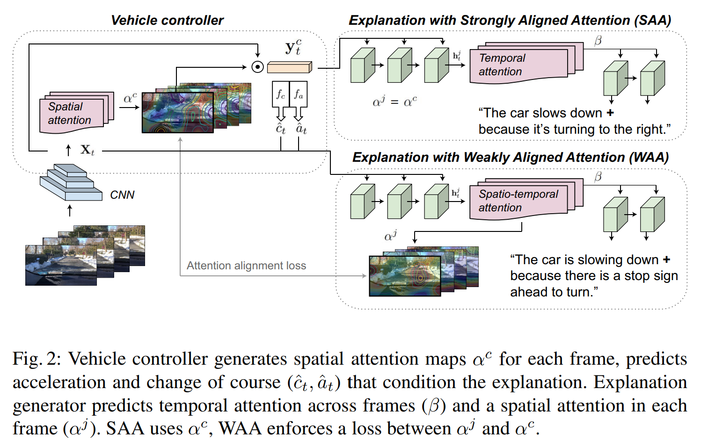

- **Textual Explanations for Self-Driving Vehicles**
 **[`ECCV 2018`]** *Jinkyu Kim, Anna Rohrbach, Trevor Darrell, John Canny, Zeynep Akata* [(arXiv)](http://arxiv.org/abs/1807.11546) [(pdf)](./../dataset/Textual%20Explanations%20for%20Self-Driving%20Vehicles.pdf) (Citation: 280)
    - **Motivation**: User acceptance is likely to benefit from easyto-interpret textual explanations which allow end-users to understand what triggered a particular behavior
    - **Objective**: We propose a new approach to introspective explanations which consists of two parts
      -  **First**, we use a visual (spatial) attention model to train a convolutional network end-to-end from images to the vehicle control commands
      -  **Second**, we use an attention-based video-to-text model to produce textual explanations of model actions.
       -  The attention maps of controller and explanation model are aligned so that explanations are grounded in the parts of the scene that mattered to the controller.
    - **A novel driving dataset** with ground-truth human explanations, the Berkeley DeepDrive eXplanation (BDDX) dataset.
    

    
    
 

    - **Framework**:
     
    

    
    
 