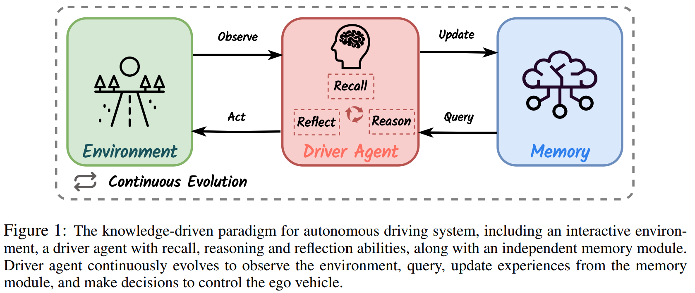
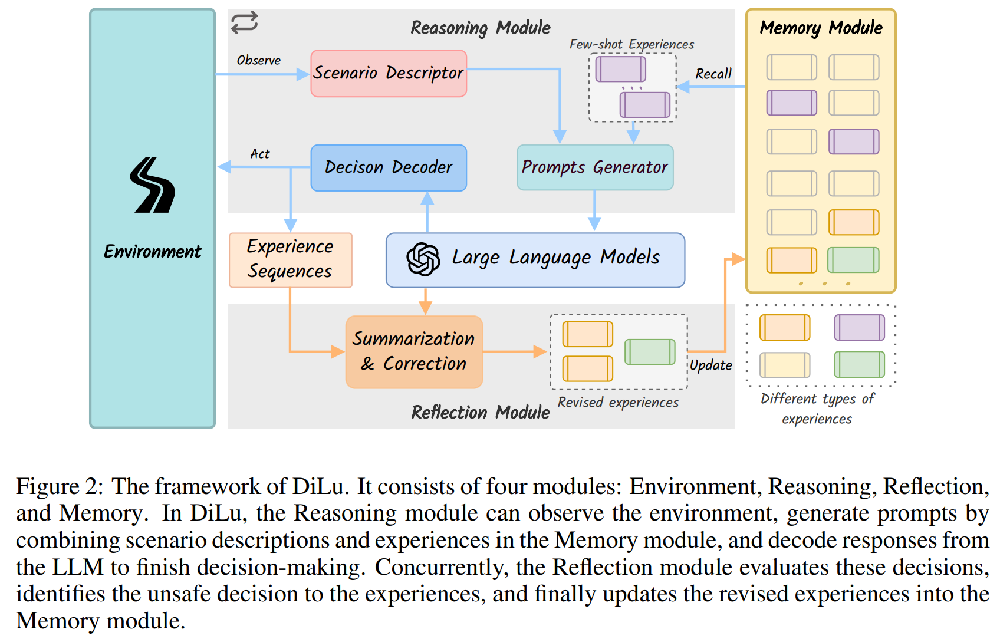
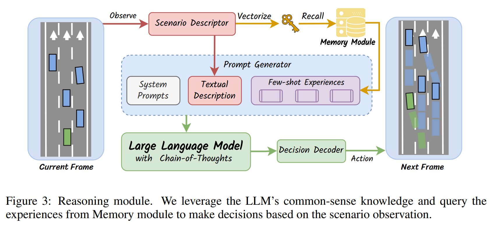
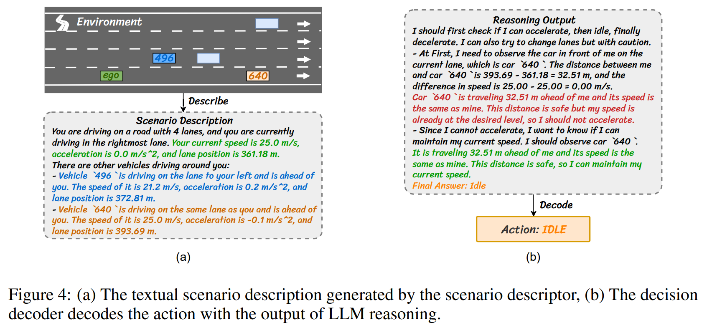
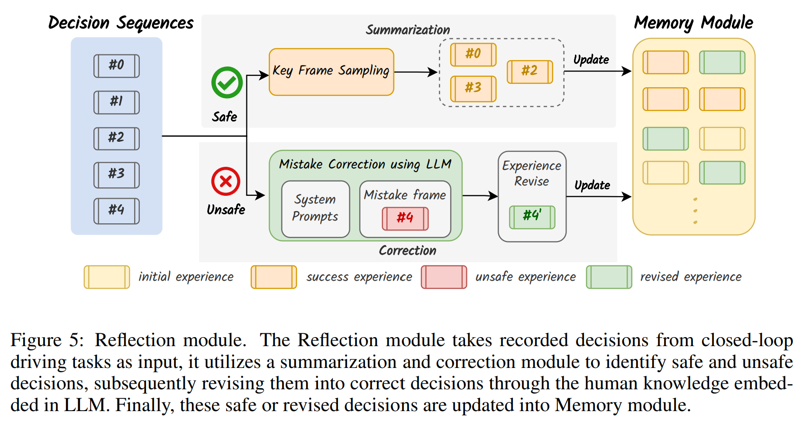
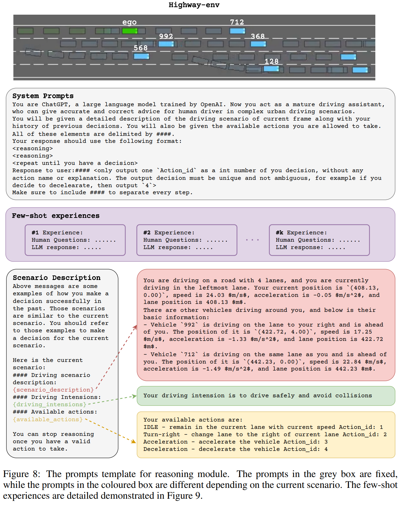
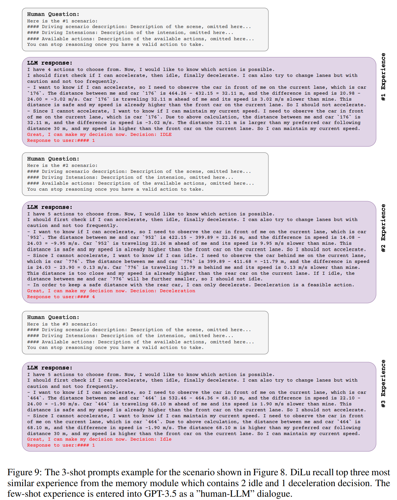

- **DiLu A Knowledge-Driven Approach to Autonomous Driving with Large
  Language Models**
 **[`ICLR 2024`]** *Licheng Wen, Daocheng Fu, Xin Li, Xinyu Cai, Tao Ma, Pinlong Cai, Min Dou, Botian Shi, Liang He, Yu Qiao* [(arXiv)](http://arxiv.org/abs/2309.16292) [(pdf)](./../LLM-based%20AD/DiLu%20A%20Knowledge-Driven%20Approach%20to%20Autonomous%20Driving%20with%20Large.pdf) [(Notes)](./../AD_notes/dilu.md) (Citation: 34)

    - **Current Methods**: Recent advancements in autonomous driving have relied on **data-driven** approaches, which are widely adopted but face challenges including **dataset bias**, **overfitting**, and **uninterpretability**.
    - **Key Research Question**: how to use LLM in autonomous driving systems and summarize a **paradigm** that integrates **an interactive environment**, **a driver agent**, as well as **a memory component** to address this question.
    - **DiLu**: combines a **Reasoning** and a **Reflection** module to enable the system to perform decision-making based on common-sense knowledge and evolve continuously
    - **Significance**: To the best of our knowledge, we are the first to leverage **knowledge-driven capability** in decision-making for autonomous vehicles.
      - **Reasoning:** Query Exeprience from the memory and use LLM to generate decisions.
      - **Memory**: Store past experience
      - **Reflection**: Identify safe and unsafe decisions produced by the Reasoning Module, subsequently refining them into correct decisions using the knowledge embedded in the LLM. These safe or revised decisions are then updated into the memory module.  

    

    
    
 

    - **Detailed Module Diagram**
      
        

        
        
 
      
      - **Memory Module**
        - **Pre-condition**: Without few-shot experiences, the out-of-the-box LLMs fail to perform precise reasoning when tackling the complex closed-loop driving tasks. 
        - **Functionality**: Employ a Memory module to store the experiences from past driving scenarios, which include the decision prompts, reasoning processes, and other valuable information.
        - **Components**: 
          - **Scene Descriptions:** a detailed account of the situation
          - **Reasoning Processes:** records the appropriate method for handling the situation
      - **Reasoning** **Module**
        - **Functionality**: we utilize the experiences derived from the Memory module and the common-sense knowledge of the LLM to perform decision-making for the current traffic scenario.

        

        
        
 

        - Reasoning includes the following procedures:
          - Encode the scenario by a **descriptor**
            - The scenario **descriptor** transcribes the present scenario data into descriptive text.
            -  The scenario descriptor follows a standard sentence structure and utilizes natural language to offer a comprehensive depiction of the ongoing driving scenario.
            -  These generated descriptions are then used as input for the prompt generator and as **keys** to acquire relevant few-shot experiences from the Memory module.
          - Recall several experience from the Memory module
            - During the reasoning process, the description of the current driving scenario is also embedded into a **vector**.
            - This vector is then used to initiate a similarity query within the Memory module, searching for the top k similar situations.
            - The resulting paired scene descriptions and reasoning procedures assemble as few-shot experiences, which are then integrated into the prompt generator.
          - Generate the prompt
            - *System Prompts*: a concise overview of the closed-loop driving task, which includes an introduction to the content and format of task inputs and outputs, along with constraints governing the reasoning process.
          - Feed the prompt into the LLM
            - Employ the *Chain-of-Thought* to generate a sequence of sentences that describe the step-by-step reasoning logic, ultimately leading to the final decision.
          - Decode the action from the LLM's response
           
    

    
    
 

    - **Reflection** **Module**
      - **Objective**: to accumulate valuable experiences and enrich the Memory module upon the conclusion of a driving session.
        - Continuously learns from past driving experiences
      - **Procedures**: 
        - During the closed-loop driving task, we record the prompts used as input based on the driving scenario and the corresponding decisions generated by the LLM for each decision frame.
        - Once a driving session concludes, we obtain a decision sequence, e.g., 5 decision frames from 0 to 4.
        - Successful sessions (without collision) is added to the memory module.
        - Unsuccessful sessions (with collision) is corrected by the LLM and then saved into the memory module
      - **How to correct unsafe sessions?**
        -  Use chain-of-thoughts responses, we can easily find the causes of dangerous situations.
        -  Use the driving scenarios in which incorrect decisions occurred, together with the original reasoning output, as prompts for LLM.
        -  We instruct LLM to pinpoint the reasons behind the incorrect decision and provide the correct one
        -  We also ask LLM to propose strategies in order to avoid similar errors in the future. 
    
        

        
        
 

    - **Experiment**
      - **GPT-3.5** is the LLM in the reasoning module 
      - **GPT-4** is the LLM in reflection module
      - **Chroma** is the memory module (open-source embedding vector dataset)
    
    - **Prompts**:
      - **Reasoning** **Prompts**: 
        - **System** **Prompts**: entirely fixed and mainly includes an introduction to the closed-loop driving task, instructions for input and output, and formatting requirements for LLM responses.
        - **Scenario** **Description**: Most of the scenario description is fixed, but three parts are directly related to the scenario and are dynamically generated based on the current decision frame. 
          -  It’s important to note that we only embed the text of the driving scenario description into vectors and use it as a query input to the memory module.

        

        
        

        - **Few-shot Experience**: it is entirely obtained from the memory module.
          - Each experience consists of a human-LLM dialogue pair, where the human question includes the scenario description at that decision frame, and the LLM response represents the correct (or correct after revised) reasoning and decision made by the driver agent.
        

        
        

    - **Reflection** **Prompts**: contains system prompts and reflection prompts.
      - **System** **prompts**: The system prompts section is **entirely** **fixed** and mainly consists of an introduction to the reflection task, along with instructions and formatting requirements for LLM responses.
      - **Reflection** **Prompts**: includes the scenario description of the erroneous decision and the **faulty** **reasoning** process made by the LLM.
        - We require the reflection module to produce three components: **(i)** an error analysis, **(ii)** corrected reasoning and decision-making, and **(iii)** suggestions on how to avoid making the same mistake in the future.

      