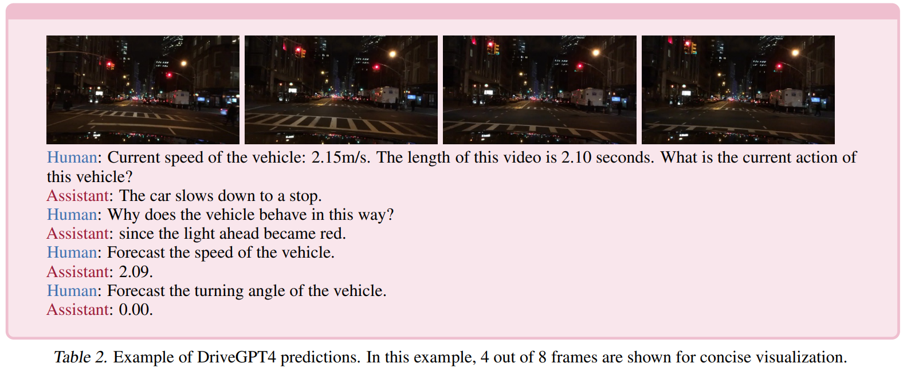

- **DriveGPT4 Interpretable End-to-end Autonomous Driving via Large
  Language Model**
 **[`arXiv 2023`]** *Zhenhua Xu, Yujia Zhang, Enze Xie, Zhen Zhao, Yong Guo, Kwan-Yee. K. Wong, Zhenguo Li, Hengshuang Zhao* [(arXiv)](http://arxiv.org/abs/2310.01412) [(pdf)](./../LLM-based%20AD/DriveGPT4%20Interpretable%20End-to-end%20Autonomous%20Driving%20via%20Large.pdf) (Citation: 28)
  - LLM-based Autonomous driving
  - **Dataset**: BBD-X, LLM: LLaMA 2
  - **Architecture**:

    

    
    

    - The vision encoder is a CLIP to process input video frames
    - The output actions are processed similarly to texts, i.e., tokenized (similar to RT-2). The tokenizer in LLaMA is used to decode tokens back into texts.
    - A sample input/output is presented as follows

    

    
    

  - **Training**:
    - **Stage 1**: pretaining on LLaVA and Valley (595K videos + 703K images). The datasets encompass various topics that are not specifically designed for AD. CLIP encoder and LLM weights are fixed, only the projector is trained.
    - **Stage 2**: training on BBD-X and ChatGPT generated Video-text insturction-follwing data (56K). Projector and LLM are updated in this stage.