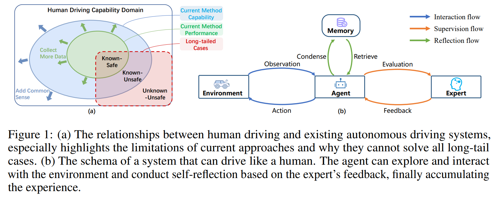
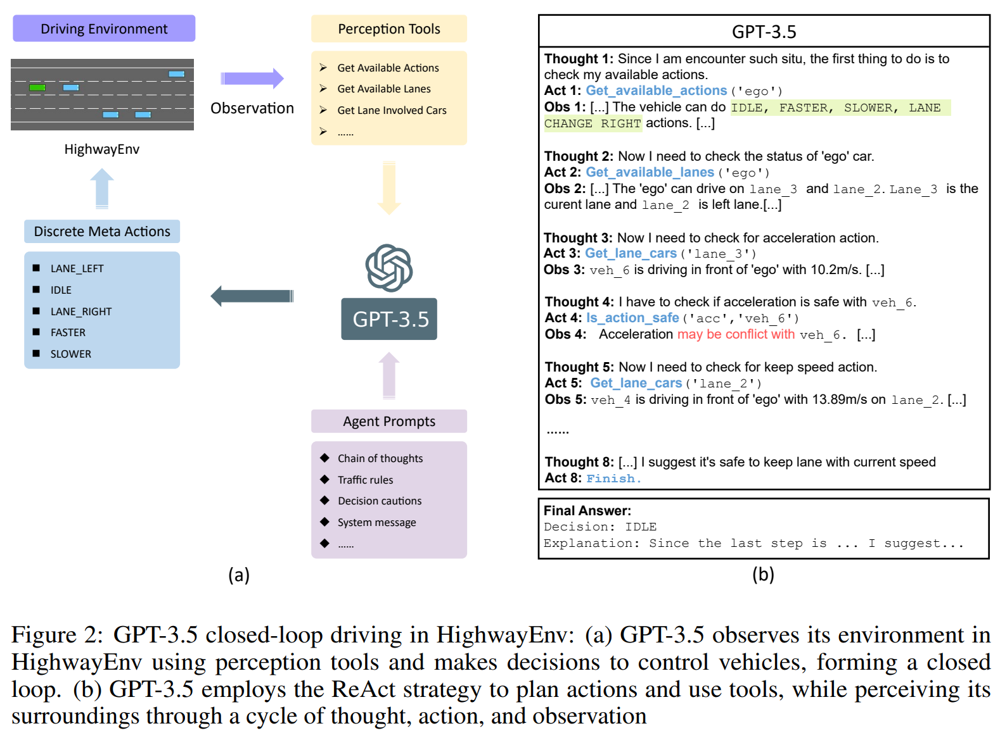
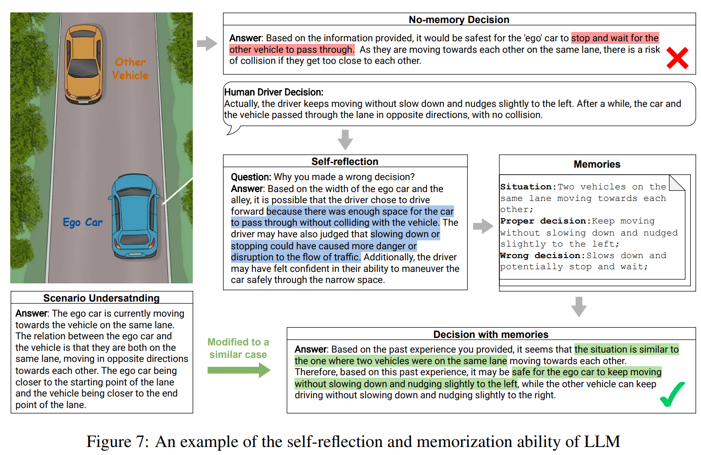

- **Drive Like a Human Rethinking Autonomous Driving with Large Language
  Models**
 **[`arXiv 2023`]** *Daocheng Fu, Xin Li, Licheng Wen, Min Dou, Pinlong Cai, Botian Shi, Yu Qiao* [(arXiv)](http://arxiv.org/abs/2307.07162) [(pdf)](./../LLM-based%20AD/Drive%20Like%20a%20Human%20Rethinking%20Autonomous%20Driving%20with%20Large%20Language.pdf) (Citation: 33)

    - **Objective:** Use LLM as the brain of the vehicle
      - Three key abilities: reasoning, interpretation, and memorization
    - **Current Methods:**
      - Divide the complex AD problem into a set of sub-tasks
      - The goal of optimizing the loss function tends to be trapped by local optimizations when facing a complex scenario, which limits its generalization ability. 
      - Cannot handle long-tail cases 
    - Drive like Human:
      - Reasoning: common-sense reasoning
      - Interpretation: the decisions made by the agent should be able to be interpreted. 
      - Memorization: A memory mechanism is required to remember previous experiences. 

    

    
    
 

    - **Closed-loop interaction ability in driving scenarios**
      - **LLM**: GPT-3.5
      - **Env**: HighwayEnv
        

        
        
  

    - Performance Enhancement through Memorization Ability
      - Add a memory module
        - It only records the decision that deviate from the experts. 
        - Experts could be the developer's evaluation of the LLM decision or the ground truth of human driver's decision
        - Self-reflection: to see why its decision deviates from the expert's. 
        - It then summarrizes the traffic situation into a decision scenario and adds it to the memory pool as a new memory entry. 

        

        
        
  
 