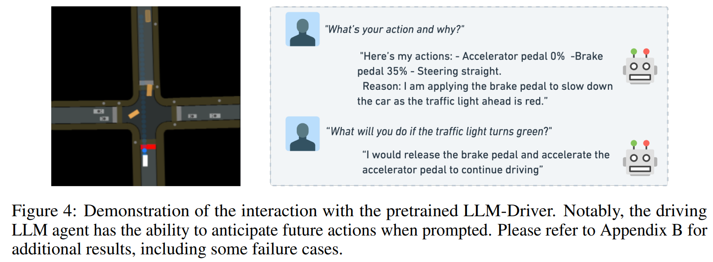

- **Driving with LLMs Fusing Object-Level Vector Modality for Explainable
  Autonomous Driving**
 **[`ICRA 2024`]** *Long Chen, Oleg Sinavski, Jan Hünermann, Alice Karnsund, Andrew James Willmott, Danny Birch, Daniel Maund, Jamie Shotton* [(arXiv)](http://arxiv.org/abs/2310.01957) [(pdf)](./../LLM-based%20AD/Driving%20with%20LLMs%20Fusing%20Object-Level%20Vector%20Modality%20for%20Explainable.pdf) (Citation: 26)

    - **Objective**: We introduce a unique object-level **multimodal** LLM architecture that merges **vectorized** **numeric** **modalities** with a **pre-trained LLM** to improve context understanding in driving situations.
      - We also present a new **dataset** of 160k QA pairs derived from 10k driving scenarios, paired with high quality control commands collected with RL agent and question answer pairs generated by teacher LLM (GPT-3.5).
        
    

    
    
 

    - **Numeric Vector Modality:** 
      - A type of data that is frequently used in robotics for representing speed, actuator positions and distance measurements.
      - Such modality is considerably more **compact** than vision alleviating some of the VLM scaling challenges.
      - We fuse vectorized object-level 2D scene representation.
      - This fusion enables the model to directly interpret and reason about comprehensive driving situations.
    - **Method**:
      - *Collect ground truth driving data with RL*:
        - Use a RL agent to drive a car in a 2D simulator. 
        - Collection includes a 100K dataset for pretraining, a 10K set for QA labeling and fine-tuning, and a 1k set to evaluation. 
      - *Convert Numerical Vectors into Language.*
        - Aim to convert vector representations into language using a structured language generator to facilitate the grounding the vector representation into LLMs.
        - We employ a structured language generator (**lanGen**) function to craft pseudo-language labels derived from the vector space.
        

        
        
 

      - *Training the driving LLM agent*:
        

        
        
 
        
        -  We use a **two-stage** process to train our model:
           -  **First**, we ground the vector representation into an embedding that can be decoded by the LLMs.
              -  This is accomplished by freezing the language model and optimizing the weights of the vector encoders and the vector transformer.
              -  **Vector Encoder**: four MLP to process four input features
              -  **Vector Former**: Self/Cross-attention that work with the latent space and question tokens. This transforms the latent vectors into an embedding that the LLM can decode.
              -  Training data: 100k question-answer pairs. 

           -  **Second**, we finetune the model to the DQA task, training it to answer driving-related questions and take appropriate actions based on its current understanding of the environment.
              -  **LLM**: LLaMA-7b
   

    - **Evaluation**: 
        

        
        
  
