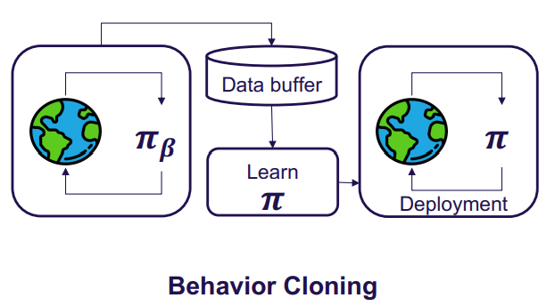
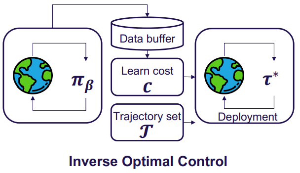

- **End-to-end Autonomous Driving Challenges and Frontiers**
 **[`arXiv 2023`]** *Li Chen, Penghao Wu, Kashyap Chitta, Bernhard Jaeger, Andreas Geiger, Hongyang Li* [(arXiv)](http://arxiv.org/abs/2306.16927) [(pdf)](./../Survey/End-to-end%20Autonomous%20Driving%20-%20Challenges%20and%20Frontiers.pdf) (Citation: 46)

    - **End to End Control:**
      - **Definition:** Take raw sensor data as input and produce a plan and/or low-level control actions as output.
      - **Benefits**: 
        - The most apparent merit is its simplicity in combing perception, prediction, and planning into a single model that can be jointly trained. 
        - The whole system, including its intermediate representations, is optimized towards the ultimate task.
        - Shared backbones increase computational efficiency.
        - Data-driven optimization has the potential to offer emergent abilities that improve the system by simply scaling training resources.
    - **Methods:**
      - **Imitation Learning**: learning from demonstrations, training the agent to learn the optimal policy by imitating the bahvior of an expert.
        - Require a dataset containing trajectories collected under the expert's policy.
        - The goal is to learn an agent policy that matches expert. 
        - One widely used category is **Behavior Cloning (BC)** which reduces the problem to supervised learning. 
          - **Problem**: covariate shift: treat each state as independently and identically distributed. 
          - **Problem 2**: causal confusion: imitator exploits and relies on false correlations between certain input components and output signals.
        

        
        

        - **Inverse RL**: another type of IL, utilizing expert demonstration to learn a reward function. 
          - End-to-end approach learns a reasonable cost $c(\cdot)$ in conjunction with other auxiliary tasks, and use simple non-learnable algorithmic trajectory samplers to select the trajectory $\pi^*$ with the minimum cost.  
        

        
        

    - **Benchmarks**
      - Online Evaluation (Closed-loop)
        - Constructing a simulated environment that closely mimics a real-world driving environment.  
        - CARLA
      - Offline Evaluation (Open-loop)
        - Assessing a system against pre-recorded expert driving behavior. 
    - **Multi-Sensor Fusion**:
      - **Early Fusion**: combine sensory information before feeding it into the feature extractor
      - **Middle Fusion**: separately encoding inputs and then combining them at the feature level
      - **Late Fusion**: combines multiple results from multi-modalities. 