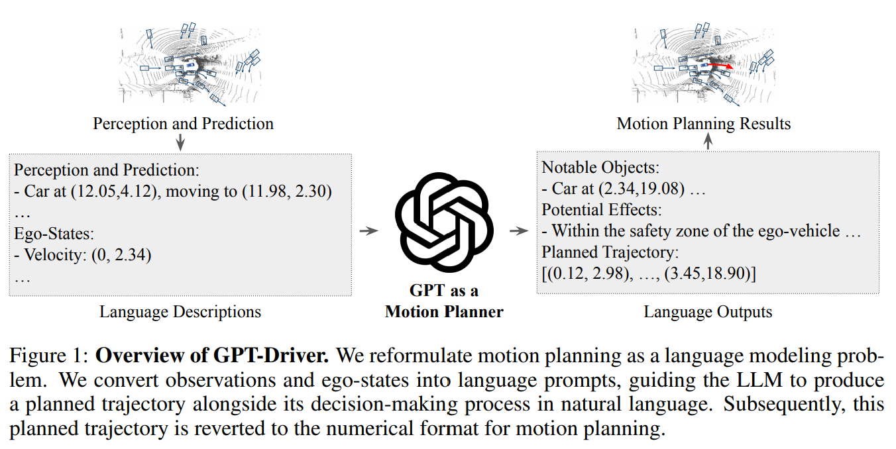
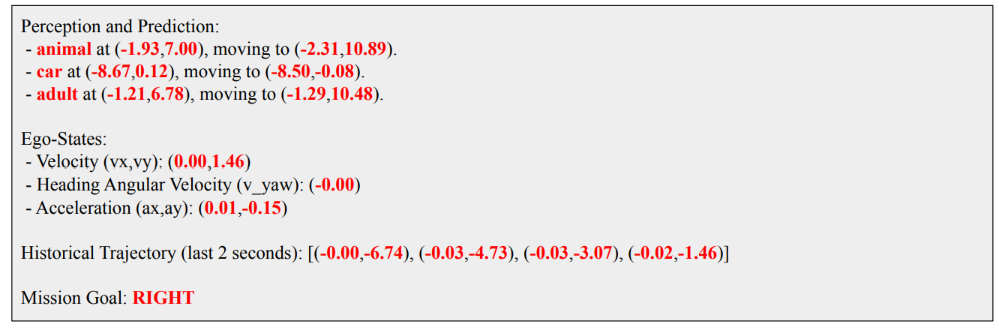
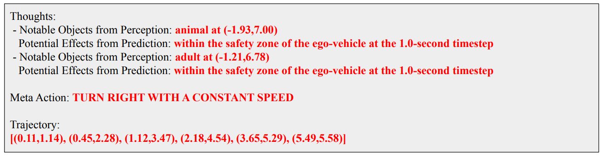

- **GPT-Driver Learning to Drive with GPT**
 **[`NeurIPS 2023`]** *Jiageng Mao, Yuxi Qian, Junjie Ye, Hang Zhao, Yue Wang* [(arXiv)](http://arxiv.org/abs/2310.01415) [(pdf)](./../LLM-based%20AD/GPT-Driver%20Learning%20to%20Drive%20with%20GPT.pdf) (Citation: 32)
 - **Key Research Question**: 
   - How can we leverage LLMs to resolve the motion planning porblem?
   - The major challenge is that motion planners are required to process heterogeneous inputs, e.g., ego-vehicle information, maps, and perception results, and they need to predict high-precision waypoint coordinates that represent a future driving trajectory. 
   - While LLMs excels at langauge understanding, they cannot directly handle heterogeneous data. 
   - Moreover, it is yet to be established whether LLMs are capable of precise numerical reasoning, e.g., forecasting precise coordinate values that are demanded by motion planning. 
 - **Critical Insight**
   - WE can reformulate motion planning as a langauge modeling problem.
   - **Input**: transform heterogeneous sensor inputs into unified language tokens
   - **Output**: instruct GPT-3.5 to understand these tokens and then articulate the waypoint coordinates of a future driving trajectory through natural language description.

  

  
  
 

 - **Prompting-Reasoning-Finetuning**
   - **Prompting**: GPT-3.5 is initially prompted in the context of autonomous driving
     - We utilize detected objects that are parameterized by their class names and locations as perception results. 
     - For each object, we formulate a sentence capturing these attributes. 
     - **Prediction**: convert the parameterized future trajectories of detected objects inot natural language descriptions.
        - Perception and Prediction Models are the same as [uniAD](uniAD.md).

    

    
    
  
      
    
   - **Reasoning**: performs chain-of-thought reasoning to generate sensible outputs. Three steps:
     - Step 1: From the perception results, the LLM needs to identify those critical objects that my affect its driving dynamics 
     - Step 2: By analyzing future motions of these critical objects from the prediction results, LLM should infer *when*, *where*, and *how* this critical objects that may affect its driving dynamics. 
     - Step 3: the planner needs to draw a high-level driving decision and then covert it into a planned trajectory
    

    
    
   

   - **Mathmatical Expression**:
     - $\{\mathcal{T}, \mathcal{R}\}=F_{G P T}(K(\mathcal{O}, \mathcal{S}))$
     - $\mathcal{T}$ is the language description of the trajectory
     - $\mathcal{R}$ is a language description of the *Chain-of-thought reasoning* and *decision-making process*. 

   - **Finetuning**: the model is fine-tuned with human driving trajectories to ensure alignments with human driving behaviors. 
     - Finetuned with the OpenAI fine-tuning API
     - Obtain Ground-truth Data:
       - Collect human driving trajectories, $\hat{\mathcal{T}}$, for each scenario from driving logs. 
       - To get $\hat{\mathcal{R}}$, 
         - 1st: compute a hypothetical ego-trajectory based on the current velocity and acceleration of the ego vehicle. assuming there is no interference.
         - 2nd: identify the critical objects and their potential effects by exmaining if any objects, based on their present positions and predicted future paths, overlap with the hypothetical ego-trajectory. 
 - **Traditional Motion Planning in AD**:
   - Motion planning **aims** to forecast safe and comfortable driving routes for autonomous vehicels.
   - **Three categories:**
     - *Rule-based*: Unable to handle complex traffic cases and driving behaviors, such as U-turns.
     - *Optimized-based*: formulate the driving as an optimal control problem. 
     - *Learning-based*: use DNN, thus less interpretable. 
 - **Tokenization**:
   - GPT tokenizer already has sufficient capability to estimate very precise values for motion planning.

  - **Experiments**:
    - Dataset: nuScenes 
