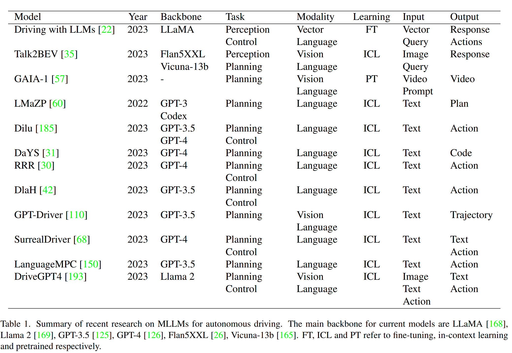
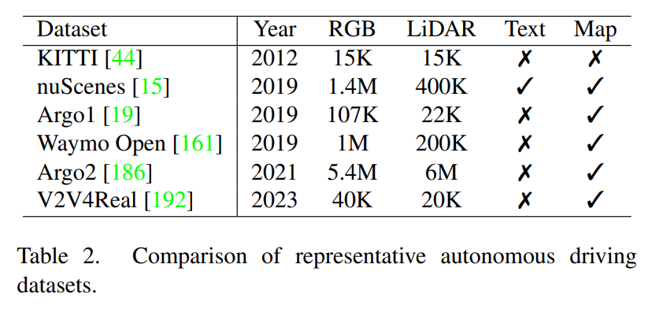
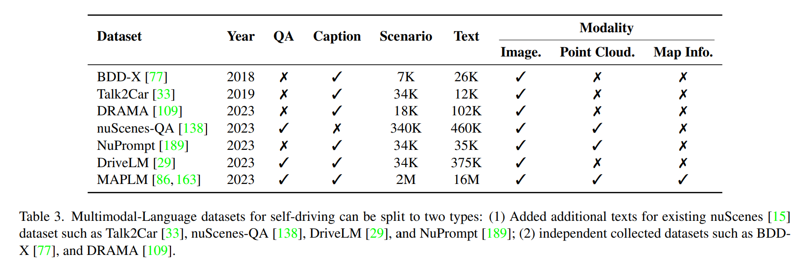

- **A Survey on Multimodal Large Language Models for Autonomous Driving** [(pdf)](./../LLM-based%20AD/A%20Survey%20on%20Multimodal%20Large%20Language%20Models%20for%20Autonomous%20Driving.pdf)
  - **Problems of DL for autonomous driving:**
    - Edge cases: extreme weather, bad lighting conditions, or rare situations
    - DNN often be considered as a black box
  - **LLM for AD**:
    - **Perception:**
      - LLMs can harness external APIs to access real-time text-based information sources, such as HD maps, traffic reports, and weather updates. [[Reason&React]](./reason&react.md)
        - LLMs can process real-time traffic data to identify congested routes and suggest alternative paths, ultimately optimizing navigation for efficiency and safety. 
    - **Motion Planning**:
      - Users can use their daily languages to express their intentions and preferences. [[GPT-Driver]](./gpt_driver.md)
      - Besides, LLMs also process textual data sources such as maps, traffic reports, and real-time information to make high-level decisions for optimized route planning. [[Alt_Pilot]](./alt_pilot.md)
    - **Motion Control:**
      - LLMS first enables the customization of controller parameters to align with driver perferences, achieving personalization in the driving experience [[LanguageMPC]](./LanguageMPC.md). 
      - Additionally, LLMs can provide transparency by explaining each step of the motion control process.
  - **Ways to enhance the safety of autonomous systems:**
    - Trustworthy AI: generating adversarial safety-critical scenarios for training autonomous driving systems such that the system is more capable of handling cases with low probability [[AdversialDriving]](./adversarialDriving.md) [36]
    - Vehicle-to-infrastructure and vehicle-to-vehicle communication: with information from nearby instances, the system will have improved robustness and can receive early warnings [122]. 
  - **LLMs in AD**:
    - Converting Visual Information into text represntation, enabling LLMs to interpret the surrounding world [[DriveLikeHuman]](./driveLikeHuman.md) [68]. 
    - Human-centric AD framework that breaks down user commands into a series of intermediate reasoning steps, accompaniesd by a detailed list of action descriptions to accomplish the objective [30].

  

  
  

  - Multi-modal LLM for Planning and Control
    - LLMs could enable reasoning of planning and perceiving the environment with textual description to develop user in the loop robotics. 
    - In AD, LLMs could serve as the bridge to support human-machine interactions [60, 61, 185, 31]. 
    - Meanwhile, it is essential to enhance the safety and explainable of autonomous driving. The multimodal language model provides the potential to comprehend its surroundings and the transparency of the decision process [77, 33, 193, 31]. 
    - Explanable: [22]

  - **Vision Datasets for AD**

  

  
  

  - **Multi-modal LLM AD Datasets**
  

  
  
 
---

