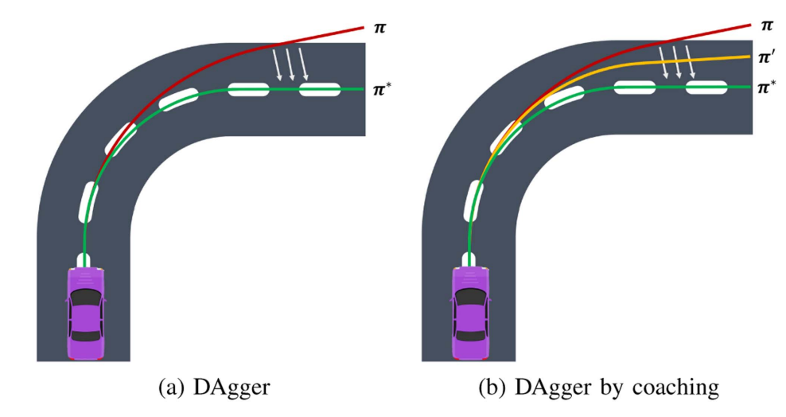
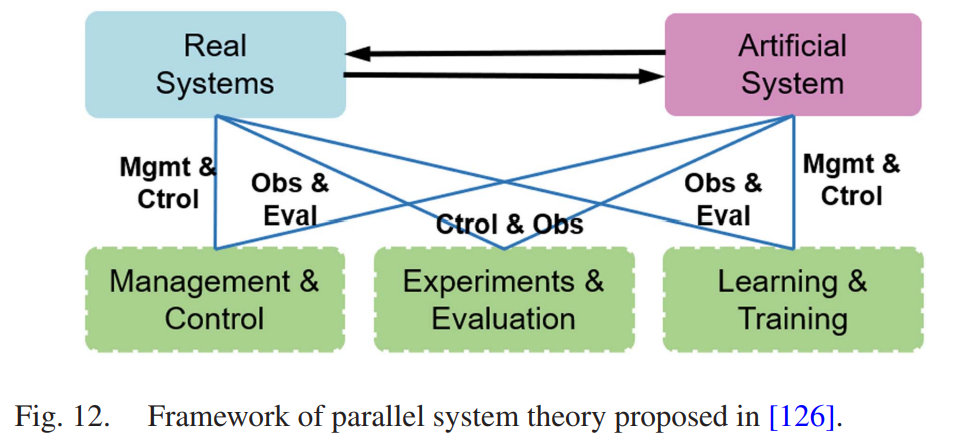
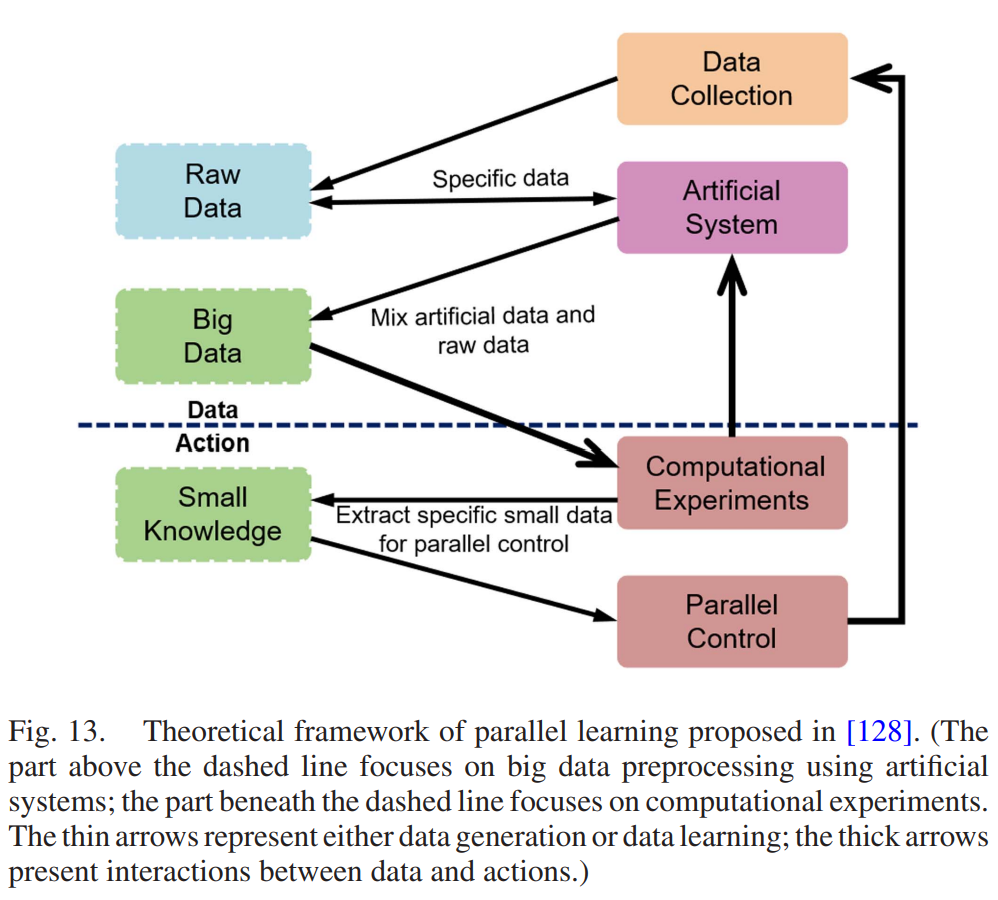
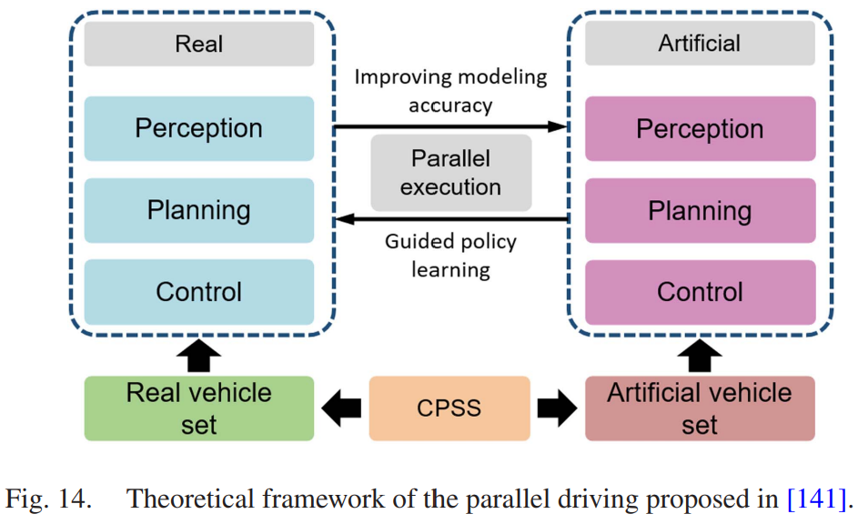
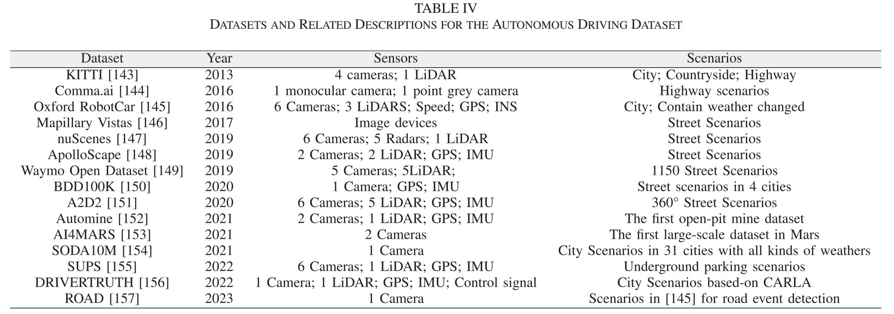
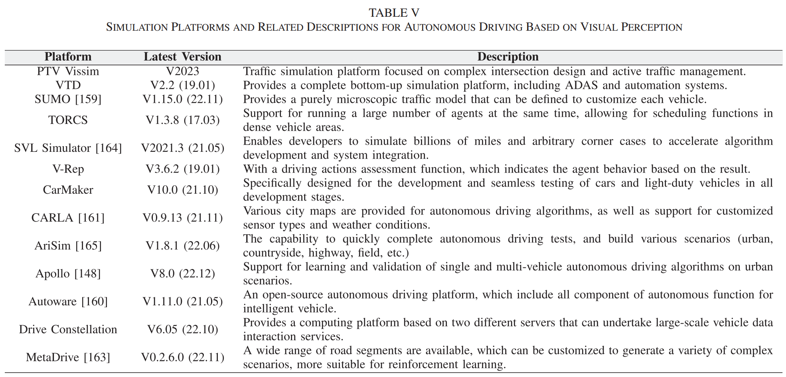

- **Motion Planning for Autonomous Driving: The State of Art and Future Perspectives**
**[IEEE Transactions on Intelligent Vehicles]** *Siyu Teng, Xuemin Hu, ...* [(IEEE)](https://ieeexplore.ieee.org/stamp/stamp.jsp?tp=&arnumber=10122127) [(pdf)](./../Survey/Motion_Planning_for_Autonomous_Driving_The_State_of_the_Art_and_Future_Perspectives.pdf) [(Notes)](./AD_notes/motion_planning_survey.md) (Citation: 145)

    

    
    

    
    - **Planning method**:
      - Responsible for calculating a sequence of trajectory points for the vehicle's low-level controller to track.
      - Contains 3 functions:
        - *Global route planning*:
          - Provides a road-level path from point A to B
          - Traditional methods: DJ search, A-star search. 
        - *Local Behavior/Trajectory Planning*
          - Decides on a driving action type (e.g., car-following, side pass, yeild, and overtake)
          - Generates a short-term trajectory based on the decided behavior type. 
          - Local planning is done by solving an optimal control problem, minimizing a predefined cost function with multiple types of hard or soft constraints satisfied. 

    - **Two kinds**:
      - **Pipeline framework (module-based) control**
        - Widely-used in industries. 
        - Clear interpretation
        - Drawbacks: 
          - Individual sub-models may not be optimal for all driving cases. 
          - The concatenation of sub-modules and the numerous manual customization constraints in each sub-model can compromise the robustness and real-time capabilities of the method.
      - **End-to-End DL**
        - Optimize  the entire driving task
        - Without human-defined information bottleneck.
        - Generalize for various scenarios. 
        - Drawback: hard to interpretate. 

    

    - **End-to-End DL Methods**:
      - **Imitation Learning**:
        - *Behavioral Cloning*: the agent leverages expert trajectories to the training model and replicates the policy using a DNN. 
        - *Direct Policy Learning*: Evaluates the current policy and then obtains more suitable training data for self-optimization. 
          - Compared to BC, the main advantage of DPL leverages expert trajectories to instruct the agent how to receover from current errors.  
          
        
        - *Inverse Reinforcement learning*: designed to circumvent the drawbacks of the DPL by inferring the latent reasons between input and output. 
          - IRL needs to collect a set of expert trajectories at the beginning. 
          - Instead of learning a state-action mapping, these expert trajectories are first inferred and then the behavioral policy is optimized based on the elaborate reward function. 
          - IRL contains **three** methods:
            - **Max-margin**: Leverages expert trajectories to eavluate a reward function that maximizes the margin between the optimal policy and estimates sub-optimal policies. (the quality and distribution of expert trajectories sets an upper bound on the performance of this method).
            - **Bayesian Method**: use the optimized trajectory or the prior distribution of the reward to maximize the posterior distribution of the reward. 
            - **Maximum Entropy Method**: use maximum entropy in the optimization routine to estimate the reward function. 
      - **Reinforcement Learning**. 
        - Value-based: DQN
        - Policy-Based: DDPG
        - Hierarchical RL: decomposes the total problem into a hierarchy of subtasks. The subtasks are organized in a hierarchical manner, with high-level subtasks providing context and guidance for lower-level ones. 
          - For instance, **two-stage HRL**: one is to decide whether to execute a lane change action, the low-level network learns policies for executing the chosen commands. 
      - **Parallel Learning**
        - CPSS: Cyber-Physical-Social Systems (CPSS)
          - CPSS enables virtual and real systems to interact, feedback, and promote each other. The real system provides valuable datasets for the construction and calibration of the artificial system, while the artificial system directs and supports the operation of real system, thus achieving self-evolution.
          
          
          - In the above diagram, the action phase follows the RL paradigm, employing state transfer to represent the movement of the model, learning from big data, and storing the learned policy in the state-transition function. 
          - Here, small refers to specific and intelligent knowledge for the practical problem, rather than denoting the magnitude of knowledge.
          
          - This framework (the above diagram) directly bridges expert trajectories and control commands to compute the most optimal policy for specific scenarios. 
          - Plenty of expert trajectories are collected from real scenarios, and a neural network is employed to learn all these trajectories, inputs and otuputs of this network are destination state and control signals. 
    - **Experiment Platforms**
      - **Dataset** 
       
      - **Simulation Platforms** 
       
    - **Challenges and Future Perspectives**
      - **Challenges**:
        - *Perception*: Effected by the environment
        - *Planning*: both pipeline and end-to-end planning have limitations
        - *Safety*: hacking of AD is increasing 
        - *Real-world Dataset*: Sim-to-Real gap
      - **Future Persepectives**:
        - *Interpretability*: ML is a blackbox. How to explain the causality of its inference process. 
          - In AD, the consequences of lacking interpretability could be catestrophic. 
          - Thus, providing clear and understandable interpretations for the motion planner is crucial in enhancing trust in intelligent vehicles.  
        - *Sim2Real*: The well-trained models in simulators may not optimally perform in real-world settings. 
        - *Reliability*: Constructing an AI-based algorithm that can identify the corner cases in a short time is a key direction for the validation of IVs. 
  
