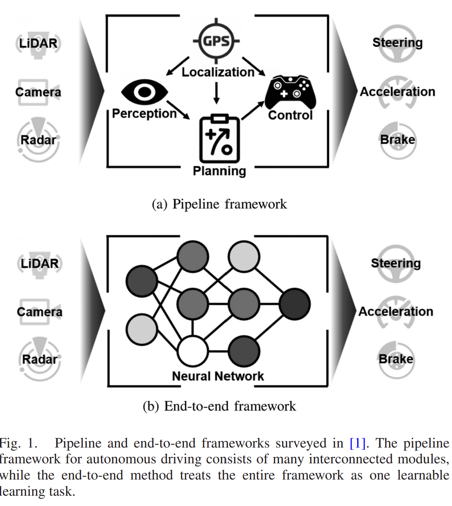

- **Motion Planning for Autonomous Driving: The State of Art and Future Perspectives**
**[IEEE Transactions on Intelligent Vehicles]** *Siyu Teng, Xuemin Hu, ...* [(IEEE)](https://ieeexplore.ieee.org/stamp/stamp.jsp?tp=&arnumber=10122127) [(pdf)](./../Survey/Motion_Planning_for_Autonomous_Driving_The_State_of_the_Art_and_Future_Perspectives.pdf) [(Notes)](./AD_notes/motion_planning_survey.md) (Citation: 145)

    
    
    - **Planning method**:
      - Responsible for calculating a sequence of trajectory points for the vehicle's low-level controller to track.
      - Contains 3 functions:
        - *Global route planning*:
          - Provides a road-level path from point A to B
          - Traditional methods: DJ search, A-star search. 
        - *Local Behavior/Trajectory Planning*
          - Decides on a driving action type (e.g., car-following, side pass, yeild, and overtake)
          - Generates a short-term trajectory based on the decided behavior type. 
          - Local planning is done by solving an optimal control problem, minimizing a predefined cost function with multiple types of hard or soft constraints satisfied. 

    - **Two kinds**:
      - **Pipeline framework (module-based) control**
        - Widely-used in industries. 
        - Clear interpretation
        - Drawbacks: 
          - Individual sub-models may not be optimal for all driving cases. 
          - The concatenation of sub-modules and the numerous manual customization constraints in each sub-model can compromise the robustness and real-time capabilities of the method.
      - **End-to-End DL**
        - Optimize  the entire driving task
        - Without human-defined information bottleneck.
        - Generalize for various scenarios. 
        - Drawback: hard to interpretate. 