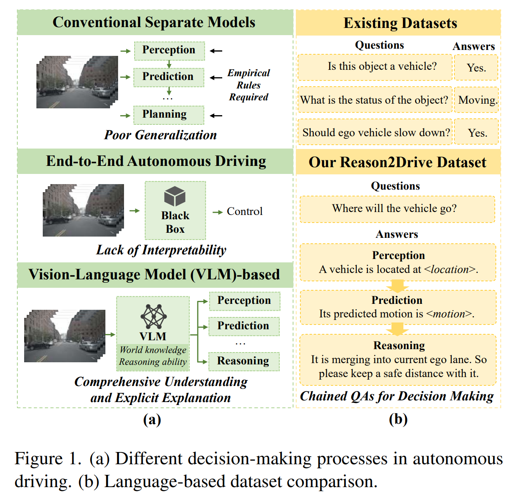
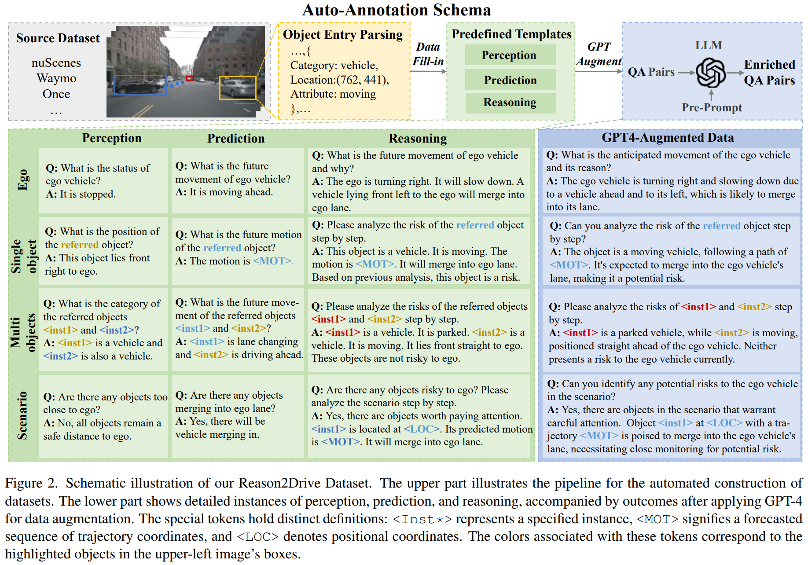
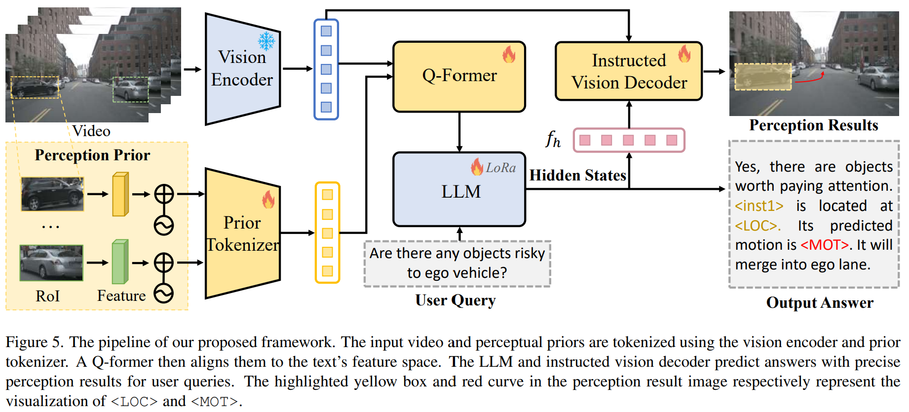

- **Reason2Drive Towards Interpretable and Chain-based Reasoning for
  Autonomous Driving**
 **[`arXiv 2023`]** *Ming Nie, Renyuan Peng, Chunwei Wang, Xinyue Cai, Jianhua Han, Hang Xu, Li Zhang* [(arXiv)](http://arxiv.org/abs/2312.03661) [(pdf)](./../LLM-based%20AD/Reason2Drive%20-%20Towards%20Interpretable%20and%20Chain-based%20Reasoning%20for%20Autonomous%20Driving.pdf) (Citation: 0)

  - Research in Autonomous System using LLMs is hindered by the lack of datasets with annotated reasoning chains that explain the decision-making processes in driving. To bridge this gap, this work proposes Reason2Drive, a benchmark dataset with over 600K video-text pairs. 
  - Characterize the autonomous driving process as a sequential combination of perception, prediction, and reasoning steps. 
  - Traditional end-to-end approaches have been developed to derive control signals directly from sensor inputs, treating the system as a black box that requires extensive data for training. However, thsi approach tends to obscure the underlying logic of decisions, complicating failure diagonosis in real-world applications. 
  - By contrast, VLMs have the potential to provide a more thorough understanding and explicit explanation for reliable decision-making. 
    

    
    

  - Most existing datasets often oversimplify the complex processes of driving into straightforward question-answering tasks with only a few specific tasks covered. 
  - They found that 
    - Most LLMs struggle to effectively leverage perceptual pirors, resulting in subpar reasoning performance.
    - Constrained by the language model functioning solely as a decoder, these methods often fail to deliver accuarte perceptual results.  
    

    
    

  - **Model Architecture**
    

    
    

    
    - Vision Encoder: Pre-trained [Blip-2](https://arxiv.org/pdf/2301.12597.pdf) visual encoder. 
    - Prior Tokenizer: 2-layer MLP that extracts local image features and positional embeddings from visual priors. 
    - Q-Former: align the non-text features into textual domain
    - LLM: generate final text output.
    - Instructed Vision Decoder: A transformer decoder for features alignments