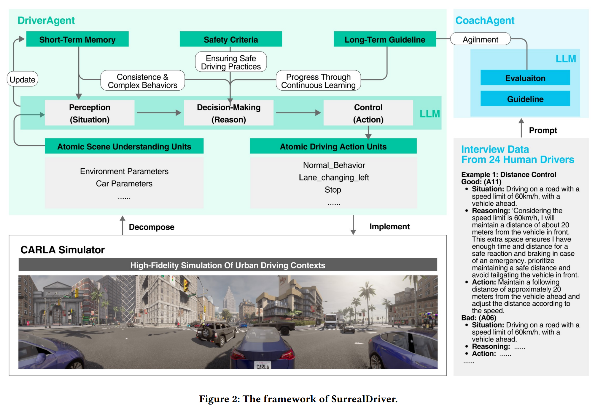
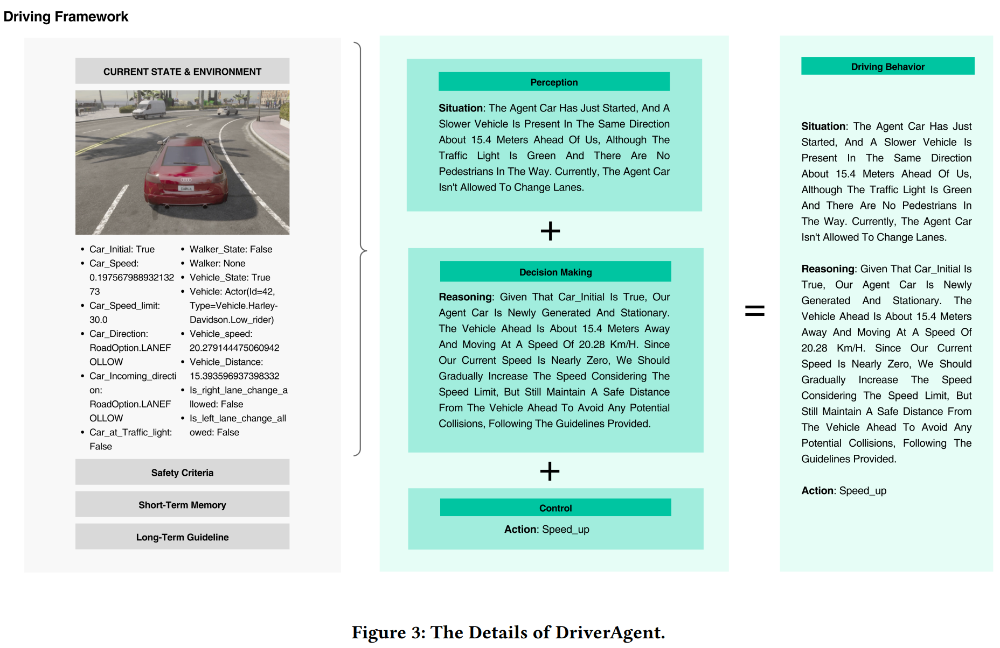
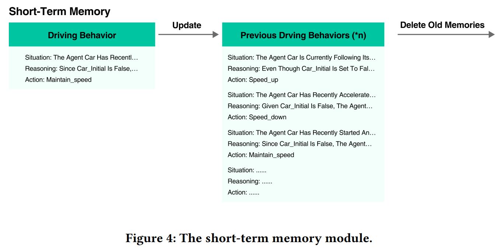

- **SurrealDriver Designing Generative Driver Agent Simulation Framework in
  Urban Contexts based on Large Language Model**
 **[`arXiv 2023`]** *Ye Jin, Xiaoxi Shen, Huiling Peng, Xiaoan Liu, Jingli Qin, Jiayang Li, Jintao Xie, Peizhong Gao, Guyue Zhou, Jiangtao Gong* [(arXiv)](http://arxiv.org/abs/2309.13193) [(pdf)](./../LLM-based%20AD/SurrealDriver%20Designing%20Generative%20Driver%20Agent%20Simulation%20Framework%20in.pdf) [(Notes)]() (Citation: 14)

  - **Objective:** propose a generative driver agent simulation framework based on LLMs, capable of perceving complex traffic scenarios and providing realistic driving maneuvers. 
  - **Coach Agent**: interview 24 drivers and use their chain-of-thought prompts to develop a 'coach agent' module, which can evaluate and assist driver agents in accumulating driving experience and developing human-like driving styles.  
  - **Results**: The results show that the framework with full architect decreased the collision rate by 81.04% and increased the humanlikeness by 50%.
  - **SurrealDriver Framework**:
    

    
    
 
    
    - *Perception: Atomic Scene and Atomic Actions:* disassemble driving scenarios into discrete parameters; deconstruct driving actions within the simulator into elementary operations.
      - DriverAgent receives information from the CARLA simulator regarding the vehicle’s own state and the surrounding environment.
      - Break down this information into atomic modules and provide it as input parameters to the DriverAgent, allowing it to integrate this data. These pieces of information are provided to the DriverAgent in the form of **parameters**.
    

    
    
  
    
    - *Execution: Short-term driving memory:*  Capture the agent’s recent driving behavior over a few steps in the Short-term driving memory module to maintain smooth driving. 
    

    
    
  

    - *Planning: Long-term human-like driving guidelines:* Design CoachAgent (generate from human driver interview) to assess the DriverAgent’s driving behaviors and impart guidelines that must be adhered to. 
      - Align SurrealDriver with human driver, use human driver text data as **a few-shot prompt**.
  - **Experiment**
    - **LLM:** GPT-4
    - **Inference Time**: 3 to 4 seconds
    - **Simulation Env:** Carla
  - **Results:**
    - Safety criteria plays a crucial role in ensuring safety
    - Short-term memory is essential for ensuring driving continuity and performing complex operations
    - Long-term guidelines. 