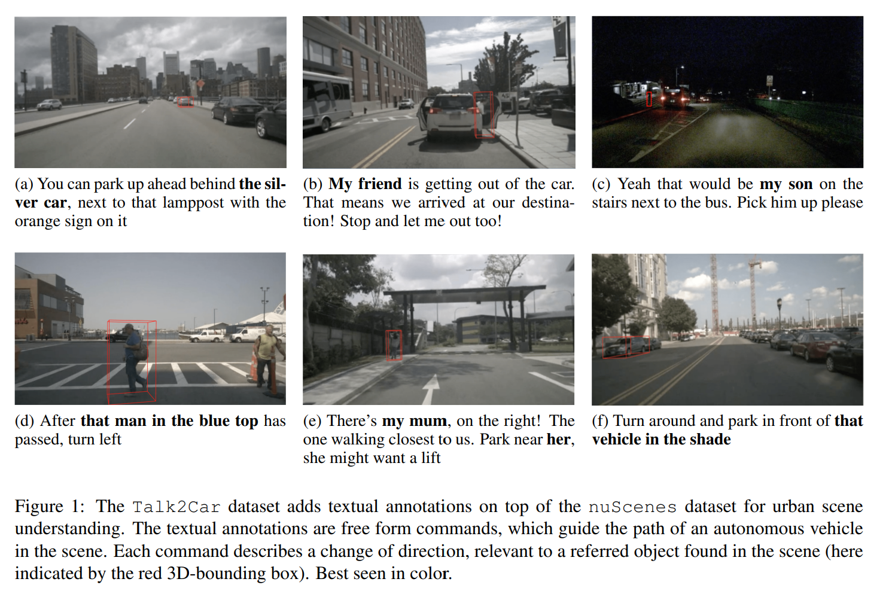

- **Talk2Car Taking Control of Your Self-Driving Car**
 **[`arXiv 2019`]** *Thierry Deruyttere, Simon Vandenhende, Dusan Grujicic, Luc Van Gool, Marie-Francine Moens* [(arXiv)](http://arxiv.org/abs/1909.10838) [(pdf)](./../dataset/Talk2Car%20Taking%20Control%20of%20Your%20Self-Driving%20Car.pdf) (Citation: 75)

    - **Objective**: proposed a Talk2Car dataset. 
      - Consider the problem in an autonomous driving setting, where a passenger requests an action that can be associated with an object found in a street scene.
      - The first object referral dataset that contains commands written in natural language for self-driving cars.

    

    
    
