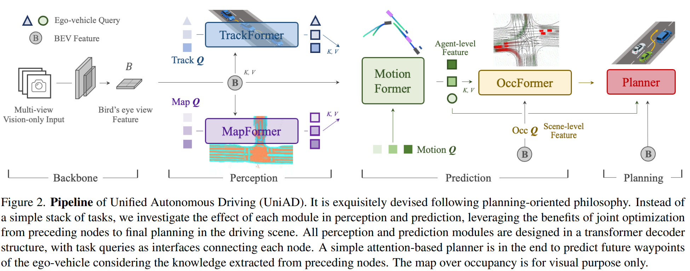

- **Planning-oriented Autonomous Driving**
 **[`CVPR 2023`]** *Yihan Hu, Jiazhi Yang, Li Chen, Keyu Li, Chonghao Sima, Xizhou Zhu, Siqi Chai, Senyao Du, Tianwei Lin, Wenhai Wang, Lewei Lu, Xiaosong Jia, Qiang Liu, Jifeng Dai, Yu Qiao, Hongyang Li* [(arXiv)](http://arxiv.org/abs/2212.10156) [(pdf)](./../LLM-based%20AD/Planning-oriented%20Autonomous%20Driving.pdf) (Citation: 153)

  - **Current Limitation**:
    - Curernt AD is characterized as modular tasks in sequential order, i.e., perception, prediction, and planning. 
    - Each function has a module -> Accumulative errors or deficient task coordination.
    

    
    

    - **(a) Industry Solution**: standalone models for eac htask independently, as long as the resource bandwidth of the onboard chip allows.
      - Accumulated errors from each model
    - **(b) Multi-task Learning (MTL)**: pluging several task-specific heads into a shared feature extractor.
      - This scheme may cause undesirable ``negative transfer".
    - **(c)1 Valliana End-to-End:** Sensor -> Action Planning. 
      - This scheme lacks interpretability.
      - Inadequate in safety guarantee.
    - **(c)2 An inituitive resolution End-to-End:** Perception -> Prediction -> Plan
      - Still lack some components in the motion planning (as shown in the table below)
        

        
        
 
       

  - **UniAD**: a new framework that incorporates full-stack driving tasks in one network. 
    

    
    
  
    
    - UniAD comprises **4 transformer decoder-based** perception and prediction modules and one planner in the end. 
    - **Queries Q** play the role of connecting the pipeline to model different interactions of entities in the driving scenario. 
    - **Data Pipeline**:
      - A sequence of multi-camera images is fed into the feature extractor, and the resulting perspective-view features are transformed into a unified bird's-eye-view (BEV) feature $B$ by [BEVFormer](https://github.com/fundamentalvision/BEVFormer) (OpenSource Model)
      - In the **TrackFormer**, the learnable embeddings that we refer to as track queries inquire about the agents' information from $B$ to detect and track agents (objects surround the ego-vehicle). 
      - In the **MapFormer**, it takes map queries as semantic abstractions of road elements (e.g., lanes and dividers) and performs panoptic segmentation of the map using [Panoptic SegFormer](https://github.com/zhiqi-li/Panoptic-SegFormer). 
      - In the **MotionFormer**, it captures interactions among agents and maps and forecasts per-agent future trajectories. 
        - MotionFormer predicts all agents' multimodal future movements, i.e., top-k possible trajectories, in a scene-centric manner. 
      - In the **OccFormer**, it employs the BEV feature $B$ as queries, equipped with agent-wise knowledge as keys and values, and predicts multi-step future occupancy with agent identity preserved.
        - Occupancy grid map is a discretized BEV representation where each cell holds a belief indicating whether it is occupied, and the occupancy prediction task is to discover how the grid map changes in the future. 
      - Finally, the planner utilizes the expressive ego-vehicle query from MotionFormer to predict the planning result, and keep itself away from occupied regions predicted by OccFormer to avoid collisions. 
    
    - **Learning**:
      - UniAD is trained in two stages. 
        - First jointly train perception parts, i.e., the tracking and mapping modules, for a few epochs, 
        - Second, train the model end-to-end for 20 epochs with all perception, prediction, and planning modules. 