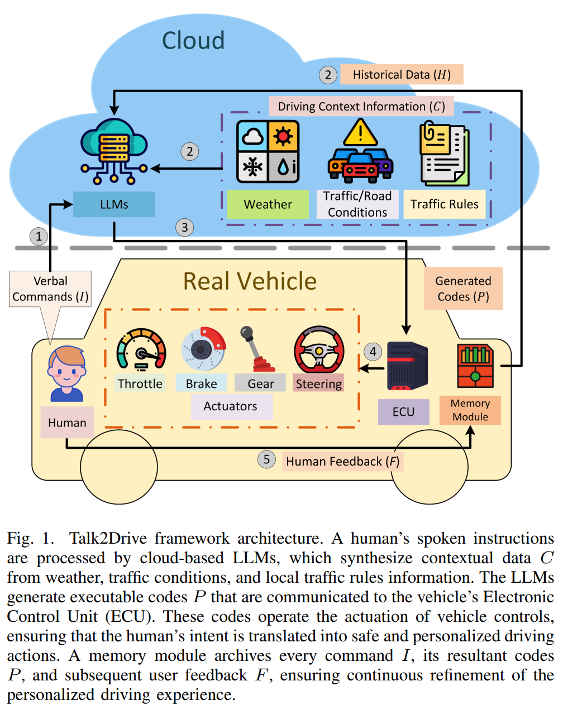
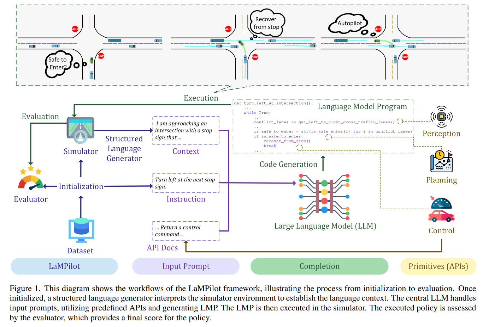
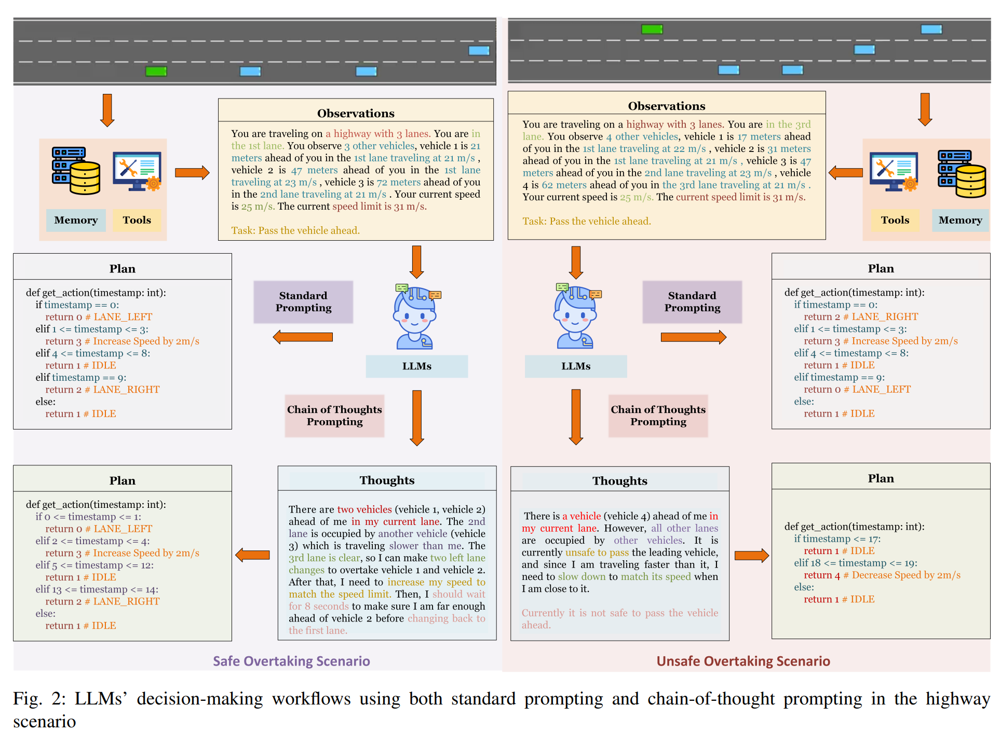
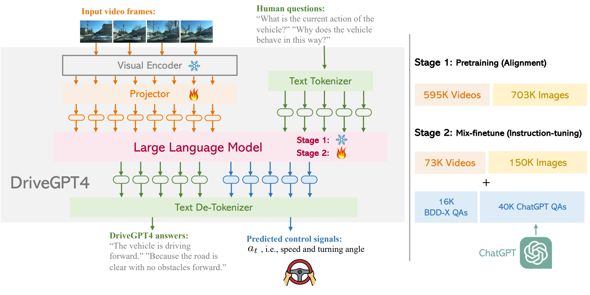
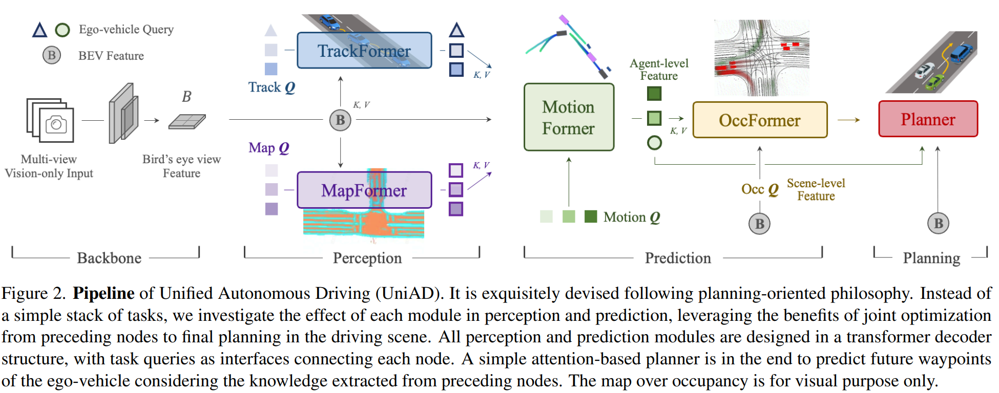

# Autonomous Driving 

### Terminologies:
- **Close Loop**: train AD agent in a simulation, e.g., Reinforcement Learning
- **Open Loop**: train AD agent in historical data, e.g., Behavior Cloning

### Review Articles
- **A Survey on Multimodal Large Language Models for Autonomous Driving** [(pdf)](./LLM-based%20AD/A%20Survey%20on%20Multimodal%20Large%20Language%20Models%20for%20Autonomous%20Driving.pdf) [(Notes)](./AD_notes/llm_survey.md)

 

- **End-to-end Autonomous Driving Challenges and Frontiers**
 **[`arXiv 2023`]** *Li Chen, Penghao Wu, Kashyap Chitta, Bernhard Jaeger, Andreas Geiger, Hongyang Li* [(arXiv)](http://arxiv.org/abs/2306.16927) [(pdf)](./Survey/End-to-end%20Autonomous%20Driving%20-%20Challenges%20and%20Frontiers.pdf) [(Notes)](./AD_notes/end2end_AD_survey.md) (Citation: 46)

 

- **Decision-Making Technology for Autonomous Vehicles Learning-Based Methods Applications and Future Outlook**
 **[`arXiv 2021`]** *Qi Liu, Xueyuan Li, Shihua Yuan, Zirui Li* [(arXiv)](http://arxiv.org/abs/2107.01110) [(pdf)](./Survey/Decision-Making%20Technology%20for%20Autonomous%20Vehicles%20Learning-Based%20Methods%20Applications%20and%20Future%20Outlook.pdf) (Citation: 53)

 

- **Motion Planning for Autonomous Driving: The State of Art and Future Perspectives**
**[IEEE Transactions on Intelligent Vehicles]** *Siyu Teng, Xuemin Hu, ...* [(IEEE)](https://ieeexplore.ieee.org/stamp/stamp.jsp?tp=&arnumber=10122127) [(pdf)](./Survey/Motion_Planning_for_Autonomous_Driving_The_State_of_the_Art_and_Future_Perspectives.pdf) [(Notes)](./AD_notes/motion_planning_survey.md) (Citation: 145)

---

### RL based

- **DQ-GAT Towards Safe and Efficient Autonomous Driving with Deep
  Q-Learning and Graph Attention Networks**
 **[`arXiv 2021`]** *Peide Cai, Hengli Wang, Yuxiang Sun, Ming Liu* [(arXiv)](http://arxiv.org/abs/2108.05030) [(pdf)](./RL-based/DQ-GAT_Towards_Safe_and_Efficient_Autonomous_Driving_With_Deep_Q-Learning_and_Graph_Attention_Networks.pdf) (Citation: 21)
  - Simultion-based and RL-based interaction control algorithm

 

- **Learning to Drive in a Day**
 **[`arXiv 2018`]** *Alex Kendall, Jeffrey Hawke, David Janz, Przemyslaw Mazur, Daniele Reda, John-Mark Allen, Vinh-Dieu Lam, Alex Bewley, Amar Shah* [(arXiv)](http://arxiv.org/abs/1807.00412) [(pdf)](./RL-based/Learning%20to%20Drive%20a%20Day.pdf) (Citation:666)
  - End-2-End (Vision-2-Control) Driving model, training with DDPG
  - Trained in Simulation first, then in real-world

 

- **Deep Reinforcement Learning for Autonomous Driving A Survey**
 **[`arXiv 2020`]** *B Ravi Kiran, Ibrahim Sobh, Victor Talpaert, Patrick Mannion, Ahmad A. Al Sallab, Senthil Yogamani, Patrick Pérez* [(arXiv)](http://arxiv.org/abs/2002.00444) [(pdf)](./RL-based/Deep%20Reinforcement%20Learning%20for%20Autonomous%20Driving%20A%20Survey.pdf) (Citation: 1200)
  - A survey for DRL in autonomous driving (not very useful, reviewed a lot RL algorithms)

 

- **DQ-GAT Towards Safe and Efficient Autonomous Driving with Deep
  Q-Learning and Graph Attention Networks**
 **[`arXiv 2021`]** *Peide Cai, Hengli Wang, Yuxiang Sun, Ming Liu* [(arXiv)](http://arxiv.org/abs/2108.05030) [(pdf)](./RL-based/DQ-GAT_Towards_Safe_and_Efficient_Autonomous_Driving_With_Deep_Q-Learning_and_Graph_Attention_Networks.pdf) (Citation: 21)
  - Simultion-based and RL-based interaction control algorithm

 

- **Generating adversarial driving scenarios in high-fidelity simulators**
 **[`ICRA 2019`]** *Yasasa Abeysirigoonawardena, Florian Shkurti, and Gregory Dudek* [(IEEE)](https://ieeexplore.ieee.org/stamp/stamp.jsp?tp=&arnumber=8793740) [(pdf)](./RL-based/Generating%20adversarial%20driving%20scenarios%20in%20high-fidelity%20simulators.pdf) [(Notes)](./AD_notes/adversarialDriving.md) (Citation: 120)
   - Use Bayesian Optimization to generate *adversarial self-driving policies*, and *increase the risk of collision with simulated pedestrians and vehicles*

---

### LLM based

- **Large Language Models for Autonomous Driving Real-World Experiments**
 **[`arXiv 2023`]** *Can Cui, Zichong Yang, Yupeng Zhou, Yunsheng Ma, Juanwu Lu, Lingxi Li, Yaobin Chen, Jitesh Panchal, Ziran Wang* [(arXiv)](http://arxiv.org/abs/2312.09397) [(Notes)](./AD_notes/LLM_AD_Real.md) [(pdf)](./LLM-based%20AD/Large%20Language%20Models%20for%20Autonomous%20Driving%20with%20Real-World%20Experiments.pdf) (Citation: 0)
  - **Talk-to-Drive** transforms verbal commands from humans into textual instructions, which are then processed by LLMs in the cloud. 
  

  
  

 

- **LaMPilot: An Open Benchmark Dataset for Autonomous Driving with Language Model Programs**
 **[`arXiv 2023`]** *Yunsheng Ma, Can Cui, Xu Cao, Wenqian Ye, Peiran Liu, Juanwu Lu, Amr Abdelraouf, Rohit Gupta, Kyungtae Han, Aniket Bera, James M. Rehg, Ziran Wang* [(arXiv)](http://arxiv.org/abs/2312.04372) [(Notes)](./AD_notes/LaMPilot.md) [(pdf)](./../LLM-based%20AD/LaMPilot%20An%20Open%20Benchmark%20Dataset%20for%20Autonomous%20Driving%20with%20Language%20Model%20Programs.pdf) (Citation: 0)
   - Introduce **LaMPilot** Benchmark specifically designed to quantitatively evaluate the efficacy of Large Language MOdels (LLMs) in translating human driectives into actionable driving policies.
  

 

- **Reason2Drive: Towards Interpretable and Chain-based Reasoning for
  Autonomous Driving**
 **[`arXiv 2023`]** *Ming Nie, Renyuan Peng, Chunwei Wang, Xinyue Cai, Jianhua Han, Hang Xu, Li Zhang* [(arXiv)](http://arxiv.org/abs/2312.03661) [(Notes)](./AD_notes/reason2drive.md) [(pdf)](./LLM-based%20AD/Reason2Drive%20-%20Towards%20Interpretable%20and%20Chain-based%20Reasoning%20for%20Autonomous%20Driving.pdf) (Citation: 0)
  - Research in Autonomous System using LLMs is hindered by the lack of datasets with annotated reasoning chains that explain the decision-making processes in driving. To bridge this gap, this work proposes **Reason2Drive**, a benchmark dataset with over 600K video-text pairs.

    

    
    

 

- **Drive Like a Human Rethinking Autonomous Driving with Large Language
  Models**
 **[`arXiv 2023`]** *Daocheng Fu, Xin Li, Licheng Wen, Min Dou, Pinlong Cai, Botian Shi, Yu Qiao* [(arXiv)](http://arxiv.org/abs/2307.07162) [(pdf)](./LLM-based%20AD/Drive%20Like%20a%20Human%20Rethinking%20Autonomous%20Driving%20with%20Large%20Language.pdf) [(Notes)](./AD_notes/driveLikeHuman.md) (Citation: 33)
  - Contains an example of using **Highway Env** to train LLM in AD

 

- **Receive Reason and React Drive as You Say with Large Language Models
  in Autonomous Vehicles**
 **[`arXiv 2023`]** *Can Cui, Yunsheng Ma, Xu Cao, Wenqian Ye, Ziran Wang* [(arXiv)](http://arxiv.org/abs/2310.08034) [(Note)](./AD_notes/reason&react.md) [(pdf)](./LLM-based%20AD/Receive%20Reason%20and%20React%20Drive%20as%20You%20Say%20with%20Large%20Language%20Models.pdf) (Citation: 9)
  - **Summary:** Use GPT-4 in **Highway Env** simulator to control a vehicle in taking over lanes.
  
  

  
  

 

- **GAIA-1 A Generative World Model for Autonomous Driving**
 **[`arXiv 2023`]** *Anthony Hu, Lloyd Russell, Hudson Yeo, Zak Murez, George Fedoseev, Alex Kendall, Jamie Shotton, Gianluca Corrado* [(arXiv)](http://arxiv.org/abs/2309.17080) [(Note)](./AD_notes/GAIA-1.md) [(pdf)](./LLM-based%20AD/GAIA-1%20A%20Generative%20World%20Model%20for%20Autonomous%20Driving.pdf) (Citation: 21)
  - **Objective:** GAIA-1 aims to address the challenge of predicting various potential outcomes in response to a vehicle’s actions as the real-world environment evolves. 
  - Anticipate various potential outcomes based on the vehicle's maneuvers. 
  

  
  

 

- **DriveGPT4: Interpretable End-to-end Autonomous Driving via Large
  Language Model**
 **[`arXiv 2023`]** *Zhenhua Xu, Yujia Zhang, Enze Xie, Zhen Zhao, Yong Guo, Kwan-Yee. K. Wong, Zhenguo Li, Hengshuang Zhao* [(arXiv)](http://arxiv.org/abs/2310.01412) [(Note)](./AD_notes/driveGPT4.md) [(pdf)](./LLM-based%20AD/DriveGPT4%20Interpretable%20End-to-end%20Autonomous%20Driving%20via%20Large.pdf) (Citation: 28)
  - LLM-based Autonomous driving
  - Dataset: BBD-X, LLM: LLaMA 2

    

    
    

 

- **GPT-Driver: Learning to Drive with GPT**
 **[`NeurIPS 2023`]** *Jiageng Mao, Yuxi Qian, Junjie Ye, Hang Zhao, Yue Wang* [(arXiv)](http://arxiv.org/abs/2310.01415) [(pdf)](./LLM-based%20AD/GPT-Driver%20Learning%20to%20Drive%20with%20GPT.pdf) [(Notes)](./AD_notes/driveGPT4.md) (Citation: 32)
  - Convert the AD motion planning problem as a language task
  - Propose a **Prompt-Reason-Planning** framework for a GPT-3.5 to predict vehicle's future trajectory
  - Use OpenAI fine-tune API to fine-tune the model

 

- **Planning-oriented Autonomous Driving**
 **[`CVPR 2023`]** *Yihan Hu, Jiazhi Yang, Li Chen, Keyu Li, Chonghao Sima, Xizhou Zhu, Siqi Chai, Senyao Du, Tianwei Lin, Wenhai Wang, Lewei Lu, Xiaosong Jia, Qiang Liu, Jifeng Dai, Yu Qiao, Hongyang Li* [(arXiv)](http://arxiv.org/abs/2212.10156) [(pdf)](./LLM-based%20AD/Planning-oriented%20Autonomous%20Driving.pdf) [(Notes)](./AD_notes/uniAD.md) (Citation: 153)
  - Proposed a **Perception -> Prediction -> Planning** framework for end-to-end motion planning in AD.

    

    
    
  

 

- **ALT-Pilot: Autonomous navigation with Language augmented Topometric maps**
 **[`arXiv 2023`]** *Mohammad Omama, Pranav Inani, Pranjal Paul, Sarat Chandra Yellapragada, Krishna Murthy Jatavallabhula, Sandeep Chinchali, Madhava Krishna* [(arXiv)](http://arxiv.org/abs/2310.02324) [(pdf)](./LLM-based%20AD/ALT-Pilot%20-%20Autonomous%20navigation%20with%20Language%20augmented%20Topometric%20maps.pdf) [(Notes)](./AD_notes/alt_pilot.md) (Citation: 3)

  - Use CLIP in the Particle Filter to update vehicle's position 

 

- **LanguageMPC: Large Language Models as Decision Makers for Autonomous
  Driving**
 **[`arXiv 2023`]** *Hao Sha, Yao Mu, Yuxuan Jiang, Li Chen, Chenfeng Xu, Ping Luo, Shengbo Eben Li, Masayoshi Tomizuka, Wei Zhan, Mingyu Ding* [(arXiv)](http://arxiv.org/abs/2310.03026) [(pdf)](./LLM-based%20AD/LanguageMPC%20Large%20Language%20Models%20as%20Decision%20Makers%20for%20Autonomous.pdf) [(Notes)](./AD_notes/LanguageMPC.md) (Citation: 35)

  - Integrate MDP with LLM, let LLM to determine an action and let the MDP to achieve the proposed action. 

 

- **SurrealDriver: Designing Generative Driver Agent Simulation Framework in
  Urban Contexts based on Large Language Model**
 **[`arXiv 2023`]** *Ye Jin, Xiaoxi Shen, Huiling Peng, Xiaoan Liu, Jingli Qin, Jiayang Li, Jintao Xie, Peizhong Gao, Guyue Zhou, Jiangtao Gong* [(arXiv)](http://arxiv.org/abs/2309.13193) [(pdf)](./LLM-based%20AD/SurrealDriver%20Designing%20Generative%20Driver%20Agent%20Simulation%20Framework%20in.pdf) [(Notes)](./AD_notes/surrealdriver.md) (Citation: 14)

   - Proposed a LLM-based AD agent. Use text to describe perception and action. 
   - Use human driver experience to generate some examples and few-shot learning to finetune the LLM. 

 

- **DiLu: A Knowledge-Driven Approach to Autonomous Driving with Large
  Language Models**
 **[`ICLR 2024`]** *Licheng Wen, Daocheng Fu, Xin Li, Xinyu Cai, Tao Ma, Pinlong Cai, Min Dou, Botian Shi, Liang He, Yu Qiao* [(arXiv)](http://arxiv.org/abs/2309.16292) [(pdf)](./LLM-based%20AD/DiLu%20A%20Knowledge-Driven%20Approach%20to%20Autonomous%20Driving%20with%20Large.pdf) [(Notes)](./AD_notes/dilu.md) [(Code)](https://github.com/PJLab-ADG/DiLu) (Citation: 34)

  - Pure LLM-based AD agent. Use text to describe perception and action.
  - Use HighwayEnv as the simulation program. 
  - Useful in defining the agent for other tasks. 

 

- **Driving with LLMs Fusing Object-Level Vector Modality for Explainable
  Autonomous Driving**
 **[`arXiv 2023`]** *Long Chen, Oleg Sinavski, Jan Hünermann, Alice Karnsund, Andrew James Willmott, Danny Birch, Daniel Maund, Jamie Shotton* [(arXiv)](http://arxiv.org/abs/2310.01957) [(pdf)](./LLM-based%20AD/Driving%20with%20LLMs%20Fusing%20Object-Level%20Vector%20Modality%20for%20Explainable.pdf) [(Notes)](./AD_notes/drivingwithLLM.md) (Citation: 26)

  - Train a Transformer to convert driving situation into vectors and feed them into a LLM to ask LLM generate actions. 
  - Create a Q & A dataset based on a simulation program. 

---

### DataSet

- **Textual Explanations for Self-Driving Vehicles**
 **[`ECCV 2018`]** *Jinkyu Kim, Anna Rohrbach, Trevor Darrell, John Canny, Zeynep Akata* [(arXiv)](http://arxiv.org/abs/1807.11546) [(pdf)](./dataset/Textual%20Explanations%20for%20Self-Driving%20Vehicles.pdf) [(Notes)](./AD_notes/bdd-x.md) (Citation: 280)

 

- **Talk2Car Taking Control of Your Self-Driving Car**
 **[`arXiv 2019`]** *Thierry Deruyttere, Simon Vandenhende, Dusan Grujicic, Luc Van Gool, Marie-Francine Moens* [(arXiv)](http://arxiv.org/abs/1909.10838) [(pdf)](./dataset/Talk2Car%20Taking%20Control%20of%20Your%20Self-Driving%20Car.pdf) [(Notes)](./AD_notes/talk2car.md) (Citation: 75)

