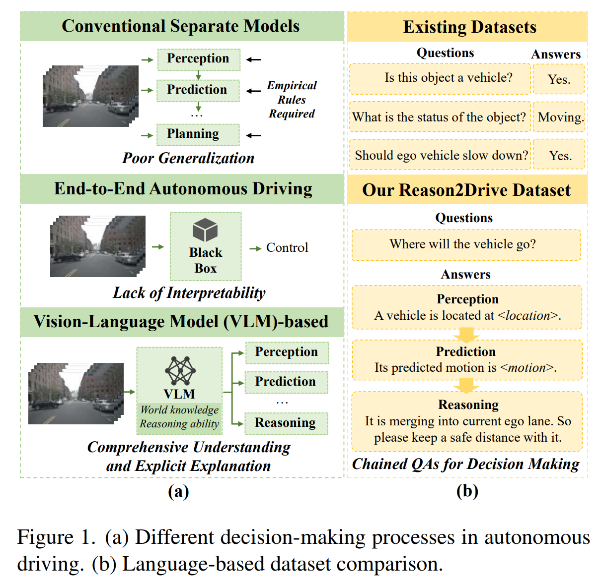
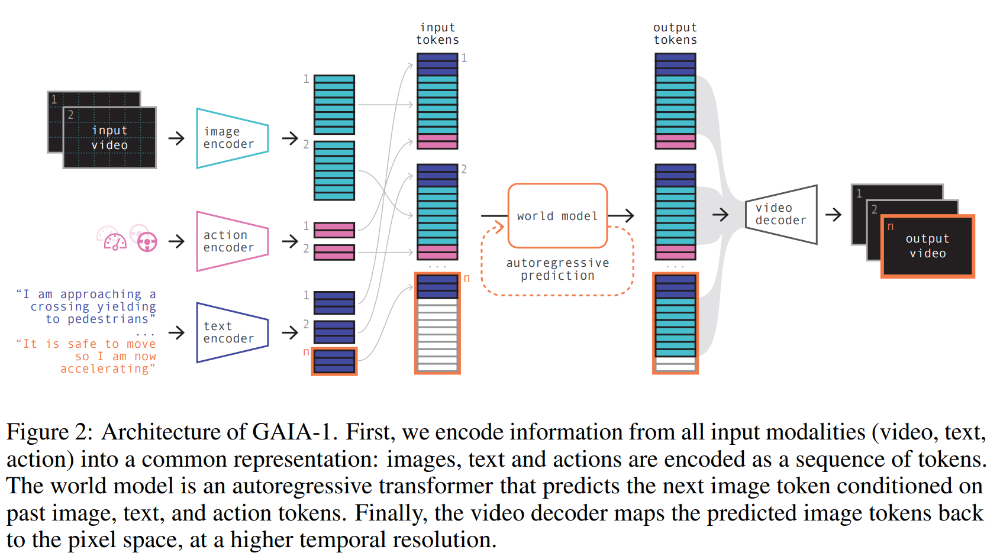

# Autonomous Driving 

### Review Articles
- **A Survey on Multimodal Large Language Models for Autonomous Driving** [(pdf)](./LLM-based%20AD/A%20Survey%20on%20Multimodal%20Large%20Language%20Models%20for%20Autonomous%20Driving.pdf) [(Notes)](./AD_notes/llm_survey.md)

- **End-to-end Autonomous Driving Challenges and Frontiers**
 **[`arXiv 2023`]** *Li Chen, Penghao Wu, Kashyap Chitta, Bernhard Jaeger, Andreas Geiger, Hongyang Li* [(arXiv)](http://arxiv.org/abs/2306.16927) [(pdf)](./Survey/End-to-end%20Autonomous%20Driving%20-%20Challenges%20and%20Frontiers.pdf) [(Notes)](./AD_notes/end2end_AD_survey.md) (Citation: 46)

- **Decision-Making Technology for Autonomous Vehicles Learning-Based Methods Applications and Future Outlook**
 **[`arXiv 2021`]** *Qi Liu, Xueyuan Li, Shihua Yuan, Zirui Li* [(arXiv)](http://arxiv.org/abs/2107.01110) [(pdf)]() (Citation: )

- **Motion Planning for Autonomous Driving: The State of Art and Future Perspectives**
**[IEEE Transactions on Intelligent Vehicles]** *Siyu Teng, Xuemin Hu, ...* [(IEEE)](https://ieeexplore.ieee.org/stamp/stamp.jsp?tp=&arnumber=10122127) [(pdf)](./Survey/Motion_Planning_for_Autonomous_Driving_The_State_of_the_Art_and_Future_Perspectives.pdf) [(Notes)](./AD_notes/motion_planning_survey.md) (Citation: 145)

---

### RL based

- **DQ-GAT Towards Safe and Efficient Autonomous Driving with Deep
  Q-Learning and Graph Attention Networks**
 **[`arXiv 2021`]** *Peide Cai, Hengli Wang, Yuxiang Sun, Ming Liu* [(arXiv)](http://arxiv.org/abs/2108.05030) [(pdf)](./RL-based/DQ-GAT_Towards_Safe_and_Efficient_Autonomous_Driving_With_Deep_Q-Learning_and_Graph_Attention_Networks.pdf) (Citation: 21)
  - Simultion-based and RL-based interaction control algorithm

 

- **Learning to Drive in a Day**
 **[`arXiv 2018`]** *Alex Kendall, Jeffrey Hawke, David Janz, Przemyslaw Mazur, Daniele Reda, John-Mark Allen, Vinh-Dieu Lam, Alex Bewley, Amar Shah* [(arXiv)](http://arxiv.org/abs/1807.00412) [(pdf)](./RL-based/Learning%20to%20Drive%20a%20Day.pdf) (Citation:666)
  - End-2-End (Vision-2-Control) Driving model, training with DDPG
  - Trained in Simulation first, then in real-world

 

- **Deep Reinforcement Learning for Autonomous Driving A Survey**
 **[`arXiv 2020`]** *B Ravi Kiran, Ibrahim Sobh, Victor Talpaert, Patrick Mannion, Ahmad A. Al Sallab, Senthil Yogamani, Patrick Pérez* [(arXiv)](http://arxiv.org/abs/2002.00444) [(pdf)](./RL-based/Deep%20Reinforcement%20Learning%20for%20Autonomous%20Driving%20A%20Survey.pdf) (Citation: 1200)
  - A survey for DRL in autonomous driving (not very useful, reviewed a lot RL algorithms)

---

### LLM based

- **Large Language Models for Autonomous Driving Real-World Experiments**
 **[`arXiv 2023`]** *Can Cui, Zichong Yang, Yupeng Zhou, Yunsheng Ma, Juanwu Lu, Lingxi Li, Yaobin Chen, Jitesh Panchal, Ziran Wang* [(arXiv)](http://arxiv.org/abs/2312.09397) [(Notes)](./AD_notes/LLM_AD_Real.md) [(pdf)](./LLM-based%20AD/Large%20Language%20Models%20for%20Autonomous%20Driving%20with%20Real-World%20Experiments.pdf) (Citation: 0)
  - **Talk-to-Drive** transforms verbal commands from humans into textual instructions, which are then processed by LLMs in the cloud. 
  

  
  

 

- **LaMPilot An Open Benchmark Dataset for Autonomous Driving with Language Model Programs**
 **[`arXiv 2023`]** *Yunsheng Ma, Can Cui, Xu Cao, Wenqian Ye, Peiran Liu, Juanwu Lu, Amr Abdelraouf, Rohit Gupta, Kyungtae Han, Aniket Bera, James M. Rehg, Ziran Wang* [(arXiv)](http://arxiv.org/abs/2312.04372) [(Notes)](./AD_notes/LaMPilot.md) [(pdf)](./../LLM-based%20AD/LaMPilot%20An%20Open%20Benchmark%20Dataset%20for%20Autonomous%20Driving%20with%20Language%20Model%20Programs.pdf) (Citation: 0)
   - Introduce **LaMPilot** Benchmark specifically designed to quantitatively evaluate the efficacy of Large Language MOdels (LLMs) in translating human driectives into actionable driving policies.
  

 

- **Reason2Drive Towards Interpretable and Chain-based Reasoning for
  Autonomous Driving**
 **[`arXiv 2023`]** *Ming Nie, Renyuan Peng, Chunwei Wang, Xinyue Cai, Jianhua Han, Hang Xu, Li Zhang* [(arXiv)](http://arxiv.org/abs/2312.03661) [(Notes)](./AD_notes/reason2drive.md) [(pdf)](./LLM-based%20AD/Reason2Drive%20-%20Towards%20Interpretable%20and%20Chain-based%20Reasoning%20for%20Autonomous%20Driving.pdf) (Citation: 0)
  - Research in Autonomous System using LLMs is hindered by the lack of datasets with annotated reasoning chains that explain the decision-making processes in driving. To bridge this gap, this work proposes **Reason2Drive**, a benchmark dataset with over 600K video-text pairs.

    

    
    

 

- **Drive Like a Human Rethinking Autonomous Driving with Large Language
  Models**
 **[`arXiv 2023`]** *Daocheng Fu, Xin Li, Licheng Wen, Min Dou, Pinlong Cai, Botian Shi, Yu Qiao* [(arXiv)](http://arxiv.org/abs/2307.07162) [(pdf)](./LLM-based%20AD/Drive%20Like%20a%20Human%20Rethinking%20Autonomous%20Driving%20with%20Large%20Language.pdf) (Citation: 33)
  - Contains an example of using **Highway Env** to train LLM in AD

 

- **Receive Reason and React Drive as You Say with Large Language Models
  in Autonomous Vehicles**
 **[`arXiv 2023`]** *Can Cui, Yunsheng Ma, Xu Cao, Wenqian Ye, Ziran Wang* [(arXiv)](http://arxiv.org/abs/2310.08034) [(Note)](./AD_notes/reason2drive.md) [(pdf)](./../LLM-based%20AD/Receive%20Reason%20and%20React%20Drive%20as%20You%20Say%20with%20Large%20Language%20Models.pdf) (Citation: 9)
  - **Summary:** Use GPT-4 in **Highway Env** simulator to control a vehicle in taking over lanes.
  
  

  
  

 

- **GAIA-1 A Generative World Model for Autonomous Driving**
 **[`arXiv 2023`]** *Anthony Hu, Lloyd Russell, Hudson Yeo, Zak Murez, George Fedoseev, Alex Kendall, Jamie Shotton, Gianluca Corrado* [(arXiv)](http://arxiv.org/abs/2309.17080) [(Note)](./AD_notes/GAIA-1.md) [(pdf)](./LLM-based%20AD/GAIA-1%20A%20Generative%20World%20Model%20for%20Autonomous%20Driving.pdf) (Citation: 21)
  - **Objective:** GAIA-1 aims to address the challenge of predicting various potential outcomes in response to a vehicle’s actions as the real-world environment evolves. This capability is crucial for safe and effective autonomous navigation.
  

  
  

 

- **DriveGPT4 Interpretable End-to-end Autonomous Driving via Large
  Language Model**
 **[`arXiv 2023`]** *Zhenhua Xu, Yujia Zhang, Enze Xie, Zhen Zhao, Yong Guo, Kwan-Yee. K. Wong, Zhenguo Li, Hengshuang Zhao* [(arXiv)](http://arxiv.org/abs/2310.01412) [(Note)](./AD_notes/driveGPT4.md) [(pdf)](./LLM-based%20AD/DriveGPT4%20Interpretable%20End-to-end%20Autonomous%20Driving%20via%20Large.pdf) (Citation: 28)
  - LLM-based Autonomous driving
  - Dataset: BBD-X, LLM: LLaMA 2

    

    
    

---

