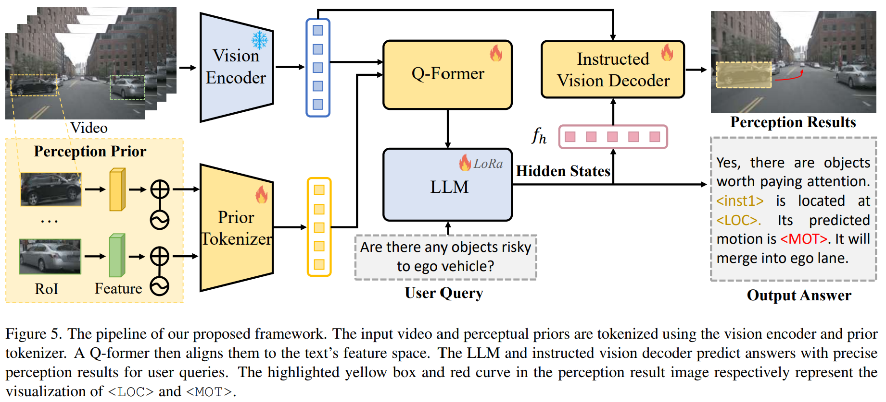

# Autonomous Driving 

### Review Articles
- **A Survey on Multimodal Large Language Models for Autonomous Driving** [(pdf)](./LLM-based%20AD/A%20Survey%20on%20Multimodal%20Large%20Language%20Models%20for%20Autonomous%20Driving.pdf) [(Notes)](./AD_notes/llm_survey.md)

- **End-to-end Autonomous Driving Challenges and Frontiers**
 **[`arXiv 2023`]** *Li Chen, Penghao Wu, Kashyap Chitta, Bernhard Jaeger, Andreas Geiger, Hongyang Li* [(arXiv)](http://arxiv.org/abs/2306.16927) [(pdf)](./Survey/End-to-end%20Autonomous%20Driving%20-%20Challenges%20and%20Frontiers.pdf) [(Notes)](./AD_notes/end2end_AD_survey.md) (Citation: 46)

- **Decision-Making Technology for Autonomous Vehicles Learning-Based Methods Applications and Future Outlook**
 **[`arXiv 2021`]** *Qi Liu, Xueyuan Li, Shihua Yuan, Zirui Li* [(arXiv)](http://arxiv.org/abs/2107.01110) [(pdf)]() (Citation: )

- **Motion Planning for Autonomous Driving: The State of Art and Future Perspectives**
**[IEEE Transactions on Intelligent Vehicles]** *Siyu Teng, Xuemin Hu, ...* [(IEEE)](https://ieeexplore.ieee.org/stamp/stamp.jsp?tp=&arnumber=10122127) [(pdf)](./Survey/Motion_Planning_for_Autonomous_Driving_The_State_of_the_Art_and_Future_Perspectives.pdf) [(Notes)](./AD_notes/motion_planning_survey.md) (Citation: 145)

---

### RL based

- **DQ-GAT Towards Safe and Efficient Autonomous Driving with Deep
  Q-Learning and Graph Attention Networks**
 **[`arXiv 2021`]** *Peide Cai, Hengli Wang, Yuxiang Sun, Ming Liu* [(arXiv)](http://arxiv.org/abs/2108.05030) [(pdf)](./RL-based/DQ-GAT_Towards_Safe_and_Efficient_Autonomous_Driving_With_Deep_Q-Learning_and_Graph_Attention_Networks.pdf) (Citation: 21)
  - Simultion-based and RL-based interaction control algorithm

 

- **Learning to Drive in a Day**
 **[`arXiv 2018`]** *Alex Kendall, Jeffrey Hawke, David Janz, Przemyslaw Mazur, Daniele Reda, John-Mark Allen, Vinh-Dieu Lam, Alex Bewley, Amar Shah* [(arXiv)](http://arxiv.org/abs/1807.00412) [(pdf)](./RL-based/Learning%20to%20Drive%20a%20Day.pdf) (Citation:666)
  - End-2-End (Vision-2-Control) Driving model, training with DDPG
  - Trained in Simulation first, then in real-world

 

- **Deep Reinforcement Learning for Autonomous Driving A Survey**
 **[`arXiv 2020`]** *B Ravi Kiran, Ibrahim Sobh, Victor Talpaert, Patrick Mannion, Ahmad A. Al Sallab, Senthil Yogamani, Patrick Pérez* [(arXiv)](http://arxiv.org/abs/2002.00444) [(pdf)](./RL-based/Deep%20Reinforcement%20Learning%20for%20Autonomous%20Driving%20A%20Survey.pdf) (Citation: 1200)
  - A survey for DRL in autonomous driving (not very useful, reviewed a lot RL algorithms)

---

### LLM based

- **Large Language Models for Autonomous Driving Real-World Experiments**
 **[`arXiv 2023`]** *Can Cui, Zichong Yang, Yupeng Zhou, Yunsheng Ma, Juanwu Lu, Lingxi Li, Yaobin Chen, Jitesh Panchal, Ziran Wang* [(arXiv)](http://arxiv.org/abs/2312.09397) [(pdf)](./LLM-based%20AD/Large%20Language%20Models%20for%20Autonomous%20Driving%20with%20Real-World%20Experiments.pdf) (Citation: 0)

  

  - This paper presents a Talk-to-Drive LLM to process verbal commands from humans and make autonomous driving decisions with contextual information.  
  - **Problems on traditional autonomous driving**:
    - Traditional AD rely on manually configured human preferences. 
    - Conventional systems struggle to interpret and adapt to the abstract instructions from humans. 
    - Most current autonomous driving systems are trained on limited and model-specific driving data, which results in the deficiency of driving context information and a large database of common sense that would greatly help decision-making. Therefore, there are underlying risks for the system to make bad decisions in unseen or rare scenarios. 
  - Talk-to-Drive transforms verbal commands from humans into textual instructions, which are then processed by LLMs in the cloud. 
    - LLMs generate specific driving codes that are executed by the autonomous vehicle, adjusting driving behaviors and control parameters to align with the human's preferences. 
    - Talk2Drive allows for more natural and intuitive communications with the vehicle. 
    - **LLM Inputs** include human commands, weather (openweather API), traffic/road (TomTom API), and map information (OpenStreetMap API).
    - **LLM output** icnludes executable codes used for planning and control. The generated code adjust control parameters like the *look-ahead distance* and *look-ahead ratio* to optimize pure pursuit performance.
    - The LLMs are trained using **in-context learning**, coupled with **chain-of-thought prompting**. 
      - In-context learning (ICL): is a method of prompt engineering where demonstrations of the task are provided to teh model as part of the prompt in natural language. With ICL, you can use off-the-shelf LLMs to solve novel tasks without the need for **fine-tuning**.
  - **Problem of LLM-based Agent in AD**:
    - LLM's **latency** is too large.

 

- **LaMPilot An Open Benchmark Dataset for Autonomous Driving with Language
  Model Programs**
 **[`arXiv 2023`]** *Yunsheng Ma, Can Cui, Xu Cao, Wenqian Ye, Peiran Liu, Juanwu Lu, Amr Abdelraouf, Rohit Gupta, Kyungtae Han, Aniket Bera, James M. Rehg, Ziran Wang* [(arXiv)](http://arxiv.org/abs/2312.04372) [(pdf)](./LLM-based%20AD/LaMPilot%20An%20Open%20Benchmark%20Dataset%20for%20Autonomous%20Driving%20with%20Language%20Model%20Programs.pdf) (Citation: 0)

  - **Objective:** Introduce LaMPilot Benchmark specifically designed to quantitatively evaluate the efficacy of Large Language MOdels (LLMs) in translating human driectives into actionable driving policies. 
  - **Problems of Existing planners** rely on clear objectives and constraints to guide their deicisions. 
    - However, when faced with arbitrary commands like "overtake the car in front of me", existing planners struggle to handle them effectively. 
  - Research Gaps: 
    - There is a lack of datasets specifically for evalutaing and comparing the capacity of LLM-based models in teh context of autonomous driving. 
    - Controlling autonomous vehicles requires careful consideration due to its safety-critical nature. Existing frameworks often prioritize successful execution of actions predicted by LLMs without adequately addressing safety concerns.
  - Problem Statement:
    - Define a benchmark $B$ as the tuple $<S, A, T, I>$, where
      - $S$: the states of the vehicle and env.
      - $A$: set of actions for the vehicle
      - $T$: transition model, encapsulating the dynamics of the env.
      - $I$: high-level instructions that guide the planning for the vehicle
    - For each task in benchmark $B$, we begin form an initial state $b$. aiming to reach a goal state in $g$. The benchmark outlines a policy rollout for each task.
    - The rollout is steered by the conditional probability $p(a_{t+1}|s_t, I)$ and concludes upon arrival at a goal state $g$. Note that the agent does not have direct access to the goal state $g$, but only a high-level instruction $I$.
    - **An example**: consider the instruction $I$="Make a right lane change". If the initial state $s$ includes the ego vehicle in the curretn lane $l \in s$, the policy ``set_target_lane(get_right_lane(ego))`` will enact a series of state-action pairs. This process transitions the vehicle from its current state $l\in s$ to a new state $l'\in s'$, where $l'$ is the lane to the right of $l$. 
  - Simulator: [HighwayEnv](https://github.com/Farama-Foundation/HighwayEnv) 
  - Input Prompt to LLMs:
    - Environmental contexts (provided by the simulator) are encapusulated into a **structured language generator**, including information about other vehicles on the road, the ego vehicle, and the map. 
    

    
    

    
  - **Outputs of LLM:** The LLM receives prompts and is responsible for generating a completion. The completion produced by the LLMs is anticipated to be valid functions, written using the provided APIs.
    - **API Docs**: bridge the gap between the LLM outputs and low-level controls. Examples are presented below: 
    

    
    
    

  - **Evaluator**: 
    - Safety Metric: time to collision
    - Comfort Metric: speed variance
    - Efficiency Metric: time efficiency of the pollicy code
  - **Baselines**: rule-based models are favored for their deterministic and interpretable nature. 
    - Intelligent Driver Model (IDM)
    - Minimizing Overall Braking Induced by Lane Changes (MOBIL)
    - Human Feedback Baselines
    

    
    

    
    - After an LLM generates a policy program $P$, it can intergate feedback $F$ to receive context-specific guidance, enabling the LLM to refine its output. This approach does not involve calculating gradients or modifying model weights. Instead, we introduce a code repository module, which functions as a vector database. This repository allows for the storage and retrieval of effective code snippets to be used in similar situations.  

  - **Conclusion**: the ongoing need for substantial improvements for LLMs to better support instruction following in driving tasks. 

 

- **Reason2Drive Towards Interpretable and Chain-based Reasoning for
  Autonomous Driving**
 **[`arXiv 2023`]** *Ming Nie, Renyuan Peng, Chunwei Wang, Xinyue Cai, Jianhua Han, Hang Xu, Li Zhang* [(arXiv)](http://arxiv.org/abs/2312.03661) [(pdf)](./LLM-based%20AD/Reason2Drive%20-%20Towards%20Interpretable%20and%20Chain-based%20Reasoning%20for%20Autonomous%20Driving.pdf) (Citation: 0)

  - Research in Autonomous System using LLMs is hindered by the lack of datasets with annotated reasoning chains that explain the decision-making processes in driving. To bridge this gap, this work proposes Reason2Drive, a benchmark dataset with over 600K video-text pairs. 
  - Characterize the autonomous driving process as a sequential combination of perception, prediction, and reasoning steps. 
  - Traditional end-to-end approaches have been developed to derive control signals directly from sensor inputs, treating the system as a black box that requires extensive data for training. However, thsi approach tends to obscure the underlying logic of decisions, complicating failure diagonosis in real-world applications. 
  - By contrast, VLMs have the potential to provide a more thorough understanding and explicit explanation for reliable decision-making. 
    

    
    

  - Most existing datasets often oversimplify the complex processes of driving into straightforward question-answering tasks with only a few specific tasks covered. 
  - They found that 
    - Most LLMs struggle to effectively leverage perceptual pirors, resulting in subpar reasoning performance.
    - Constrained by the language model functioning solely as a decoder, these methods often fail to deliver accuarte perceptual results.  
    

    
    

  - Model Architecture
    

    
    

    
    - Vision Encoder: Pre-trained [Blip-2](https://arxiv.org/pdf/2301.12597.pdf) visual encoder. 
    - Prior Tokenizer: 2-layer MLP that extracts local image features and positional embeddings from visual priors. 
    - Q-Former: align the non-text features into textual domain
    - LLM: generate final text output.
    - Instructed Vision Decoder: A transformer decoder for features alignments

 

- **Drive Like a Human Rethinking Autonomous Driving with Large Language
  Models**
 **[`arXiv 2023`]** *Daocheng Fu, Xin Li, Licheng Wen, Min Dou, Pinlong Cai, Botian Shi, Yu Qiao* [(arXiv)](http://arxiv.org/abs/2307.07162) [(pdf)](./LLM-based%20AD/Drive%20Like%20a%20Human%20Rethinking%20Autonomous%20Driving%20with%20Large%20Language.pdf) (Citation: 33)
  - Contains an example of using **Highway Env** to train LLM in AD

 

- **Receive Reason and React Drive as You Say with Large Language Models
  in Autonomous Vehicles**
 **[`arXiv 2023`]** *Can Cui, Yunsheng Ma, Xu Cao, Wenqian Ye, Ziran Wang* [(arXiv)](http://arxiv.org/abs/2310.08034) [(pdf)](./LLM-based%20AD/Receive%20Reason%20and%20React%20Drive%20as%20You%20Say%20with%20Large%20Language%20Models.pdf) (Citation: 9)
  - **Summary:** Use GPT-4 in **Highway Env** simulator to control a vehicle in taking over lanes.
  
  

  
  

  - **COT**: humans provide an example of how to break down the prompt into small pieces. 
  - **In context learning**: provide the LLMs with specific examples and operational thoughts for AD, LLMs successfully navigated the challenges, underlining the importance of context. 

 

- **GAIA-1 A Generative World Model for Autonomous Driving**
 **[`arXiv 2023`]** *Anthony Hu, Lloyd Russell, Hudson Yeo, Zak Murez, George Fedoseev, Alex Kendall, Jamie Shotton, Gianluca Corrado* [(arXiv)](http://arxiv.org/abs/2309.17080) [(pdf)](./LLM-based%20AD/GAIA-1%20A%20Generative%20World%20Model%20for%20Autonomous%20Driving.pdf) (Citation: 21)
  - **Objective:** GAIA-1 aims to address the challenge of predicting various potential outcomes in response to a vehicle’s actions as the real-world environment evolves. This capability is crucial for safe and effective autonomous navigation.
  - **Inputs:** GAIA-1 takes video data, textual information, and action commands as inputs. By combining these modalities, it constructs a comprehensive understanding of the driving environment.
  - **Output:** Output is a predictive video based on input video and action
  

  
  

  - **Sequence Modeling:** GAIA-1 approaches world modeling as an unsupervised sequence modeling problem. It maps the inputs to discrete tokens and predicts the next token in the sequence. This approach allows it to learn high-level structures, scene dynamics, contextual awareness, and geometry.

  - **Learned Representations:** GAIA-1’s learned representation captures expectations of future events. This powerful representation, combined with its ability to generate realistic samples, opens up new possibilities for innovation in autonomous driving technology.
  - **Fine-Grained Control:** The model provides fine-grained control over ego-vehicle behavior and scene features. This control enables researchers and engineers to explore different scenarios and train autonomous systems more effectively.

- **DriveGPT4 Interpretable End-to-end Autonomous Driving via Large
  Language Model**
 **[`arXiv 2023`]** *Zhenhua Xu, Yujia Zhang, Enze Xie, Zhen Zhao, Yong Guo, Kwan-Yee. K. Wong, Zhenguo Li, Hengshuang Zhao* [(arXiv)](http://arxiv.org/abs/2310.01412) [(pdf)](./LLM-based%20AD/DriveGPT4%20Interpretable%20End-to-end%20Autonomous%20Driving%20via%20Large.pdf) (Citation: 28)
  - LLM-based Autonomous driving
  - Dataset: BBD-X, LLM: LLaMA 2
  - **Architecture**:

    

    
    

    - The vision encoder is a CLIP to process input video frames
    - The output actions are processed similarly to texts, i.e., tokenized (similar to RT-2). The tokenizer in LLaMA is used to decode tokens back into texts.
    - A sample input/output is presented as follows

    

    
    

  - Training:
    - **Stage 1**: pretaining on LLaVA and Valley (595K videos + 703K images). The datasets encompass various topics that are not specifically designed for AD. CLIP encoder and LLM weights are fixed, only the projector is trained.
    - **Stage 2**: training on BBD-X and ChatGPT generated Video-text insturction-follwing data (56K). Projector and LLM are updated in this stage.

---

