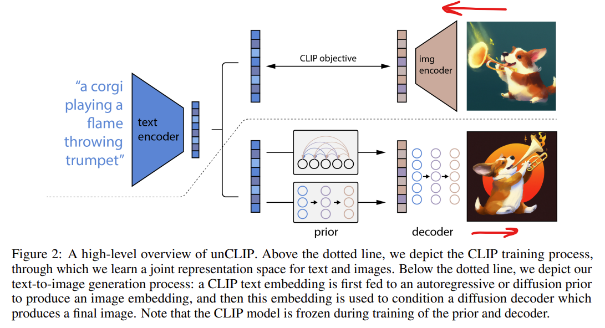

# Generative Model

- **Unpaired Image-to-Image Translation using Cycle-Consistent Adversarial
  Networks**
  **[`ICCV 2017`]** *Jun-Yan Zhu, Taesung Park, Phillip Isola, Alexei A. Efros* [(arXiv)](http://arxiv.org/abs/1703.10593) [(pdf)](./Cycle-GAN.pdf) 

 

- **Hierarchical Text-Conditional Image Generation with CLIP Latents**
 **[`arXiv 2022`]** *Aditya Ramesh, Prafulla Dhariwal, Alex Nichol, Casey Chu, Mark Chen* [(arXiv)](http://arxiv.org/abs/2204.06125) [(pdf)](./Dalle2.pdf) (Citation: 2198)

- Preliminaries:
  - GAN does not have a strong image diversity.
  - Diffusion model:
    - Forward diffusion: continuously add Gaussian noises on an image and the image will eventually becomes a noisy image.
    - Reverse diffusion: start with a noisy image and reversely find the original image.
  - Classifier Guided Diffusion
    - Add an object classifier to detect objects from images generated from the diffusion model
    - The object classifier can help the diffusion model to generate realistic images that contain actual objects.

- Two-phase Process
  - Prior: convert text embeddings into image embeddings
    - CLIP generates *text embeddings* from input text (Transformer).
  - Decoder: convert image embeddings into actual images
    - CLIP generates *image embeddings* from image encoder (ViT).
- Training:
  - Prior: 
    - Labels: image embeddings created by CLIP's image encoder
    - Inputs: text embeddings created by CLIP's text encoder
  - Decoder:
    - Standard diffusion model.