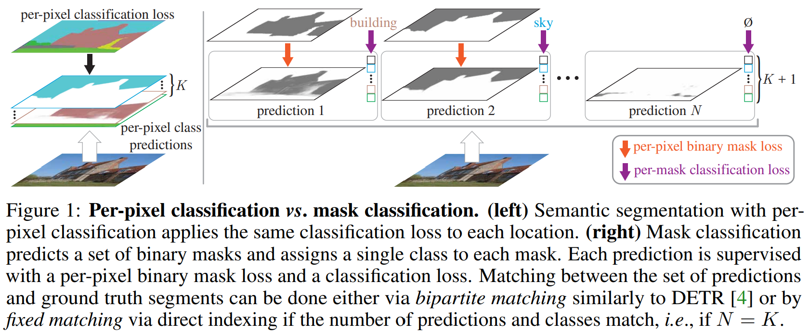

# Image Segmentation

## Backgrounds
- **Semantic Segmentation Architectures** typically treat the task a per-pixel classification problem. FCN (Fully Convolutional Network)-based architectures independently predict a category label for every pixel. 
- **Instance Segmentation Architectures** are typically based on "mask classification". They predict a set of binary masks each associated with a single class label.
  - *Instance segmentation*: is a combination of *object detection*, where the goal is to classify individual objects and localize each using a bounding box 
  - *Semantic segmentation*: the goal is to classify each pixel into a fixed set of categories without differentiating object instances.  
- **Panoptic Segmentation** has been proposed to unify both semantic and instance segmentation tasks. 
  - Architectures for panoptic either combine the best of specialized semantic and instance segmentation architectures into a single framework or design novel objectives that equally treat semantic regions and instance objects.

- **Fully Convolutional Networks-based Image Segmentation**
  - The goal deep learning-based semantic segmentation approaches formulate semantic segmentation as per-pixel classification, applying a classification loss to each output pixel. 
  - Per-pixel predictions in this formulation naturally partition an image into regions of different classes. 

- **R-CNN**: The Region-based CNN (R-CNN) is to attend to a manageable number of candidate object regions and evaluate convolutional networks independently on each RoI (Region of Interest)
  

  
  

  * This approach can be expensive because many crops may lead to significant duplicated computation from overlapping crops. 
* **Fast R-CNN** processes the entire image (instead of cropping and reasizing regioni proposals)

* **Faster R-CNN** advanced this stream by learning the attention mechanism with a Region Proposal Network (RPN).
    * RPN: is smply a neural network that proposes mltiple objects that are available within a particular image.

* **Constrastive Learning**:
  

  
  

  
  * Constrastive learning needs to make positive samples close to each others and far from the negative samples. 

## Papers
- **Mask R-CNN** 
**[`arXiv 2017`]** *Kaiming He, Georgia Gkioxari, Piotr Dollár, Ross Girshick* [(arXiv)](http://arxiv.org/abs/1703.06870) [(pdf)](./mask%20R-CNN.pdf) (Citation: 29470)
  * Mask R-CNN is used for object instance segmentation.
  * Mask R-CNN extends Faster R-CNN by adding a branch for predicting segmentation masks on each Region of Interest (RoI), in *parallel* with the existing barnch for classification and bounding box regression.
  

  
  

  * The mask branch is a small FCN (Fully Convolutional Network) applied to each RoI, predicting a segmentation mask in a pixel-to-pixel manner. 

 

- **Per-Pixel Classification is Not All You Need for Semantic Segmentation (MaskFormer)**
 **[`NeurIPS 2021`]** *Bowen Cheng, Alexander G. Schwing, Alexander Kirillov* [(arXiv)](http://arxiv.org/abs/2107.06278) [(pdf)](./Per-Pixel%20Classification%20is%20Not%20All%20You%20Need%20for%20Semantic%20Segmentation.pdf) (Citation: 761)
  - **Fully Convolutional Networks (FCN) - Per Pixel Classification** formulate semantic segmentation as *per-pixel classification*, applying a classification loss to each output pixel. 
    - A segmentation model aims to predict the probability distribution over all possible $K$ categories for every pixel of an image. 
    - Training a per-pixel classification model is straight-forward: given ground truth category labels for every pixel, a per-pixel cross-entropy loss is usually applied. 
  - **Mask Classification** is an alternative paradigm that separates the image partitioning and classification aspects of segmentation. 
    - Instead of classifying each pixel, mask classification-based methods predict a set of binary masks, each associated with a single class prediction. 
      - First, it **partitions/groups** the image into $N$ regions ($N$ may differ from $K$), represented with binary masks $\{m_i|m_i\in[0,1]^{H \times W}\}_{i=1}^N$;
      - Second, **classify each region**: associating each region as a whole with some distribution over $K$ categories. To perform mask classification, we define the desired output $z$ as a set of $N$ probability-mask pairs, i.e., $z=\{(p_i, m_i)\}_{i=1}^N$
      - In contrast to per-pixel class probability prediction, mask classification contains an auxiliary "no object" label in addition to the $K$ category labels. 
    - To train a mask classification model, a matching $\sigma$ between the set of predictions $z$ and the set of $N^{gt}$ ground truth segments is required. 
  

  
  

  - **MaskFormer** Architecture contains three parts:
  

  
  

    
    - A **pixel-level module** that extracts per-pixel embeddings used to generate **binary mask predictions**;
      - Input: an image of size $H \times W$;
      - A *backbone* generates a low-resolution image feature map $\mathcal{F}\in \mathbb{R}^{C_{\mathcal{F}} \times \frac{H}{S} \times \frac{W}{S}}$;
        - $C_{\mathcal{F}}$ is the number of channels, depending on the specific backbone;
        - $S$ is the stride of feature map ($S=32$ in this work);
        - Any backbone architecture is suitable (e.g., ResNet or Swin-Trasnformer).
      - A *pixel decoder* gradually upsamples the features to generate per-pixel embeddings $\mathcal{E}_{\text {pixel }} \in \mathbb{R}^{C_{\mathcal{E}} \times H \times W}$.
        - $C_{\mathcal{E}}$ is the embedding dimension; $C_{\mathcal{E}} = C_{\mathcal{F}}$
        - Any semantic segmentation decoder is applicable (e.g., FPN architecture).
    - A **transformer module**, where a stack of Transformer decoder layers computers $N$ per-segment embeddings
      - This module uses the standard *Transformer decoder*;
      - Inputs: image features $\mathcal{F}$; $N$ learnable positional embeddings;
      - Outputs: $N$ per-segment embeddings $Q \in \mathbb{R}^{C_{\mathcal{Q}} \times N}$ that encode global information about each segment MaskFormer predicts;
      - Use the same Transformer decoder design as DETR.  
    - A segmentation module, which generates predictions $\{(p_i, m_i)\}_{i=1}^N$ from these embeddings. 
      - Inputs: Per-segment embeddings $Q$
      - Outputs: class probability predictions $\{p_i\}_{i=1}^N$ for each segment. 

 

- **Masked-attention Mask Transformer for Universal Image Segmentation (Mask2Former)**
 **[`CVPR 2022`]** *Bowen Cheng, Ishan Misra, Alexander G. Schwing, Alexander Kirillov, Rohit Girdhar* [(arXiv)](http://arxiv.org/abs/2112.01527) [(pdf)](./Masked-attention%20Mask%20Transformer.pdf) (Citation: 612)
  - This paper proposed a **universal image segmentation architecture** named Masked-attention Mask Transformer (Mask2Former) that can do panoptic, instance, and semantic image segmentation.
  

  
  

  - Key Improvements Compared to **MaskFormer**:
    - *Masked Attention* in the Transformer decoder to restrict the attention to localized features centered around predicted segments
    - *Multi-scale High-resolution Features* help the model to segment small objects/regions
    - *Optimization Improvements*, such as switching the order of self and cross-attention, making query features learnable, and removing dropout. 
    - *Calculate Mask Loss on Few Randomly Sampled Points*, save 3X training memory without affecting the performance.
  - Mask Classification Preliminaries
    - Mask classification architectures group pixels into $N$ segments by predicting $N$ binary masks, along with $N$ corresponding labels
    - Each segment in an image can be represented as a $C$-dimensional feature vector (i.e., object query) and can be processed by a Transformer decoder. 
    - A simple meta architecture would consist of three components:
      - A backbone that extract low-resolution features from an image
      - A pixel decoder that gradully upsamples low-resolution features from the output of the backbone to generate high-resolution per-pixel embeddings
      - A Transformer decoder that operates on image features to process object queries
  

  
  

  - Masked Attention
    - Motivation: context feature extraction using constrained attention, i.e., masked attention. Not considering the global context in the normal cross-attention. 
    - Standard Cross-Attention: $\mathbf{X}_l=\operatorname{softmax}\left(\mathbf{Q}_l \mathbf{K}_l^{\mathrm{T}}\right) \mathbf{V}_l+\mathbf{X}_{l-1}$
      - $\mathbf{X}_l$ refers to $N$ $C$-dimensional query features at $l$th layer. $\mathbf{X}_0$ denots input query features to the Transformer decoder. 
      - $\mathbf{K}_l$ and $\mathbf{V}_l$ are the image features under transformation $f_K()$ and $f_V()$, respectively. 
    - Masked Attention: $\mathbf{X}_l=\operatorname{softmax}\left(\mathcal{M}_{l-1}+\mathbf{Q}_l \mathbf{K}_l^{\mathrm{T}}\right) \mathbf{V}_l+\mathbf{X}_{l-1}$
      - $\mathcal{M}_{l-1}(x, y)= \begin{cases}0 & \text { if } \mathbf{M}_{l-1}(x, y)=1 \\ -\infty & \text { otherwise }\end{cases}$
        - $\mathbf{M}_{l-1} \in\{0,1\}^{N \times H_l W_l}$ is the binarized output of the resized mask prediction of the previous $(l-1)$-th Transformer decoder layer. 
      - $(x, y)$ is feature location

  - High-resolution Features
    - Motivation: high-resolution features improve model performance, especially for small objects
    - Instead of always using the high-resolution feature map, we utilize a feature pyramid which consists of both low- and high-resolution features and feed one resolution to one Transformer decoder layer at a time. 
  - Optimization Improvements
    - Switch the order of self- and cross-attention (i.e., new "masked attention"): query features to the first self-attention layer are image-independent and do not have signals from the image, thus applying self-attention is unlikely to enrich information.
    - Make query features learnable as well. Learnable query features are directly supervised before being used in the Transformer decoder to predict masks ($\mathbf{M}_0$)
    - Don't use dropout.

  - Improving Training Efficiency
    - One limitation of training universal architectures is the large memory consumption due to high-resolution mask prediction.
    - Calculate mask loss on $K$ randomly sampled points instead of the whole mask . 

 

- **Complementary Random Masking for RGB-Thermal Semantic Segmentation**
 **[`arXiv 2023`]** *Ukcheol Shin, Kyunghyun Lee, In So Kweon* [(arXiv)](http://arxiv.org/abs/2303.17386) [(pdf)](./Complementary%20Random%20Masking%20for%20RGB-Thermal%20Semantic%20Segmentation.pdf) (Citation: 1)
   * **Motivation**:
     * Focus on RGB-thermal semantic segmentation since in foggy or low-light conditions, the RGB camera may struggle to capture objects in the scene due to reduced visibility, while the thermal camera can still detect the heat signatures of objects. 
     * Most of RGB-T segmentation networks focus on designing a multi-modal fusion without consideration of the nature of multi-modality inputs. Therefore, the networks easily become over-reliant on a single modality.
     * To overcome this problem, this paper presents a complementary random masking strategy of RGB-T images and uses a self-distillation loss between clean and masked input modalities to force the model consider two modalities.
   * **Model Structure**
    
     * Backbone: Swin Transformer
     * Feather Aggregation: Winner-take-all strategy via *max* operation. This aggregation finds the most prominent feature from the RGB and Thermal features across channel dimensions.
     * Pixel Decoder: Multi-scale deformable attention Transformer
     * Transformer Decoder: DETR
   * **Loss functions**
     * **Total loss**: $L_{\text {total }}=L_{M W S}+L_{S D C}+L_{S D N}$
     * **Self-Distillation Loss for Complementary Representations** $L_{S D C}$: aims to make the network learn to extract complement representation when one modality information is partially unavailable. 
       * Force the network to predict the same class prediction results from clean and masked RGB-thremal pairs, i.e., minimize the difference between the prediction from clean images and masked images.
      $L_{S D C}=L_1\left(z^c\left(X_{r g b}, X_{t h r}\right), z^c\left(\hat{X}_{r g b}, \hat{X}_{t h r}\right)\right)$
          * $z^c()$ is the class prediction logit
          * $L_1()$ is the mean absolute error
          * $X_{r g b}$ and $X_{t h r}$ are clean images
          * $\hat{X}_{r g b}$ and $\hat{X}_{t h r}$ are masked images
     * **Self-Distillation Loss for non-local Representations** $L_{S D N}$: aims to make the network extract robust represenations from a partially masked single modality based on their **non-local** context rather than local features. 
       * Force the class prediction consistency between the clean RGB-T pair and single masked modality. 
        $\begin{aligned}
        L_{S D N} & =L_1\left(z^c\left(X_{r g b}, X_{t h r}\right), z^c\left(\hat{X}_{r g b}\right)\right), \\
        & +L_1\left(z^c\left(X_{r g b}, X_{t h r}\right), z^c\left(\hat{X}_{t h r}\right)\right)
        \end{aligned}$
     * **Modality-wise Supervision** $L_{MWS}$: compare the model prediction of each modality to the ground truth
          $\begin{aligned}
          L_{M W S} & =L_{\text {sup }}\left(z_{g t}, z\left(X_{r g b}, X_{t h r}\right)\right), \\
          & +L_{\text {sup }}\left(z_{g t}, z\left(X_{\text {rgb }}\right)\right)+L_{\text {sup }}\left(z_{g t}, z\left(X_{\text {thr }}\right)\right),
          \end{aligned}$
          * $z_{gt}$ is ground truth class $z^c$ and binary mask $z^m$
          * $L_{sup}$ is the supervised loss $L_{\text {sup }}=L_{\text {mask }}+\lambda_{\text {cls }} L_{c l s}$
            * Where $L_{mask}$ is a combination of binary cross-entropy loss and dice loss. 

 

- **Momentum Contrast for Unsupervised Visual Representation Learning**
 **[`CVPR 2020`]** *Kaiming He, Haoqi Fan, Yuxin Wu, Saining Xie, Ross Girshick* [(arXiv)](http://arxiv.org/abs/1911.05722) [(pdf)](./moco.pdf) (Citation: 8695)
  

  
  

  * Focus on Unsupervised computer vision tasks
    * For language tasks, the inputs (word or sub-word) are discrete. Thus it is easy to convert them into feature vectors (or embeddings).
    * For computer vision task, the inputs (images) are continuous and high-dimensional. Thus it is hard to design an encoder to convert them into feature vectors
  * **Contrastive learning can be thought of as training an encoder for a dictionary look-up task.**
    * Consider an encoded query $q$ and a set of encoded samples $\{k_0, k_1, k_2, ...\}$ that are keys of a dictionary. 
    * Assume that there is a single key $k_+$ in the dictionary that $q$ matches, i.e., ($k_+$, $q$) is a pair. 
      * A constrastive loss is a function whose value is low when $q$ is similar to its positive key $k_+$ and dissimilar to all other keys. 
      * A form of contrastive loss function is presented as: 
      $\mathcal{L}_q=-\log \frac{\exp \left(q \cdot k_{+} / \tau\right)}{\sum_{i=0}^K \exp \left(q \cdot k_i / \tau\right)}$, where $\tau$ is a temperature hyper-parameter. 
    * The contrastive loss serves as an unsupervised objective function for training the encoder networks that represent the queries and keys. 
      * The query representation is $q=f_q(x^q)$, where $f_q$ is an encoder network and $x^q$ is a query sample (lilkewise, $k=f_k(x^k)$). 
      * The input $x^q$ and $x^k$ can be images, patches, or a set of patches.
      * The network $f_q$ and $f_k$ can be identical, partially shared, or different.
    * Contrastive learning is a way of building a discrete dictionary on high-dimensional continuous inputs such as images. 
  * Momentum Contrast
    * Disctionary as a queue. 
      * The size of the dictionary is a hyper-parameter.
      * The current mini-batch is enqueued to the dictionary, and the oldest mini-batch is removed. 
    * Momentum update.
      * Using a queue as dictionary makes the dictionary large and intractable to update the key encoder by back-propagation (since the gradient should propagate to all samples in the queue).
      * A naive solution is to copy the key encoder $f_k$ from the query encoder $f_q$, ignoring this gradient, but the performance is not good.
        * This is because the encoder to generate keys is changing so fast, the consistency between keys are gone. 
      * Update $f_k$ using $f_q$ with a momentum coefficient $m$: $\theta_{\mathrm{k}} \leftarrow m \theta_{\mathrm{k}}+(1-m) \theta_{\mathrm{q}}$. This operation makes 

