# Object Detection

## Vision Transformer

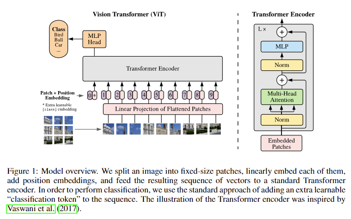

  - Tokenization:

    - Input image $x$ has dimension $H\times W\times C$, suchs as $224 \times 224 \times 3$.
    - Divide $x$ into $N$ image patches, each patch is a 2D matrix with image resolution of $(P, P)$ (such as $(16, 16)$). 
    - Thus, there are $N= (HW)/P^2$ patches. $N=196=(224 \times 224)/16^2$.
    - Therefore, there are $N$ tokens are transformer inputs, and each token is a $16\times 16 \times 3=768$ vector.
    - Each token is **added** with position embeddings to retain positional information. 
      - Position embedding: a learnable 1D vector with the length of $768$, i.e., identical to the length of a token.
    - Add a learnable embedding to the sequence of embedded patches ($1\times768$), whose state at the output of the Transformer encoder serves as the image representation $y$.
    - Overall size of the input: image patches $196\times 768$ + class embedding $1\times 768$ = $197\times 768$.

  - **Decode Vision Transformer**
  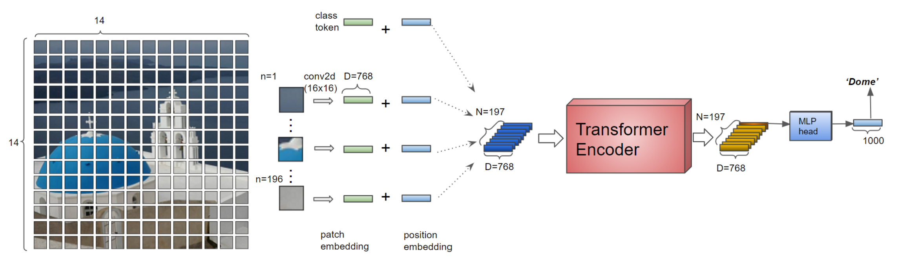
    - Step 1: split images into patches (the input image is split into 14 by 14 vectors with dimension of 768 by Conv2d (kernel size: 16 by 16) with stride = (16, 16)).
    - Step 2: Add position embeddings (learnable position embedding vectors are added to the patch embedding vectors and fed to the transformer encoder).
    - Step 3: Transformer Encoder (the embedding vectors are encoded by the transformer encoder. The dimension of input and output vectors are the same).
    - Step 4: MLP (classification) Head (the 0th output from the encoder is fed to the MLP head for classification to output the final classification results).

  - **Vit Encoder**: N=197 embedded vectors are fed to the L=12 series encoders
  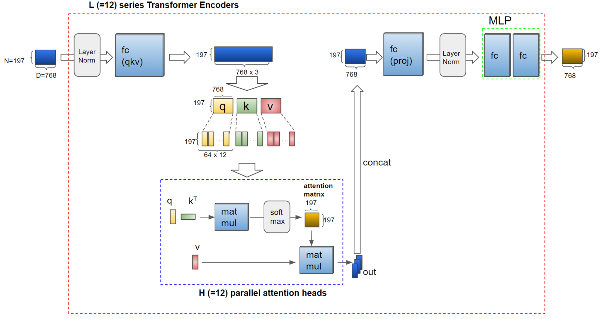
    - Step 1: The vectors are divided into query, key, and value after expanded by an ``fc`` layer.
    - Step 2: ``q``, ``k``, and ``v`` are further divided into H=12 and fed to the parallel **attention heads**.
    - Step 3: outputs from attention heads are concatenated to form the vectors whose shape is the same as the encoder input. 
    - Step 4: the vectors go through an ``fc``, a layer norm, and an MLP block that has two ``fc`` layers.

 

- **Masked Autoencoders Are Scalable Vision Learners**
 **[`arXiv 2021`]** *Kaiming He, Xinlei Chen, Saining Xie, Yanghao Li, Piotr Dollár, Ross Girshick* [(arXiv)](http://arxiv.org/abs/2111.06377) [(pdf)](./Masked%20Autoencoders%20Are%20Scalable%20Vision%20Learners.pdf) (Citation: 2861)

  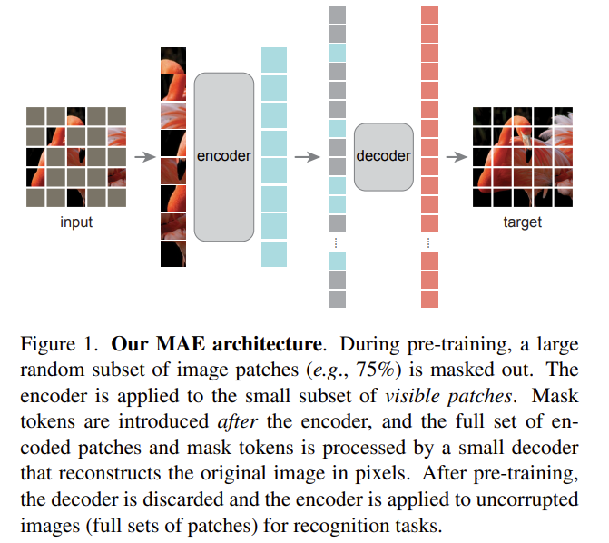

  - Title is the conclusion: ``something is something``

  - MAE contains an encoder and a decoder. Encoder maps the observed signals to a latent representation, and a decoder that reconstructs the original signal from the latent representation. 
    - *Part 1* -> Masking (divide an image into regular non-overlapping patches, then randomly sample a subset of patches and mask the remaining ones. High masking ratio largely eliminates **redundancy**.)
    - *Part 2* -> MAE encoder is a ViT, but applied only on visible, unmasked patches (MAE follows the standard ViT operation, divide an image into patches, added with positional embedding, and process through Transformer layers).
    - *Part 3* -> MAE decoder has a series of Transformer blocks. Inputs to MAE decoder include 1. encoded visible patches + 2. mask tokens (a shared, learned vector that indicates the presence of a missing patch to be predicted). 
    - *Part 4* -> Reconstruction Target. Each element in the decoder's output is a vector of pixel values representing a patch. The loss function computes the MSE between the reconstructed and original images in the pixel space.
  - Simple Implementation
    - *Step 1* -> Generate a token for every input patch (with positional embedding)
    - *Step 2* -> Encoding. Randomly shuffle the list of tokens and remove the last portion of the list, based on the masking ratio. (This process produces a small subset of tokens for the encoder)
    - *Step 3* -> Decoding. Append a list of mask tokens to the list of encoded patches, and unshuffle this full list to align all tokens with their targets. The decoder is applied to the full list.

 

- **How to train your ViT Data Augmentation and Regularization in Vision
  Transformers**
 **[`arXiv 2021`]** *Andreas Steiner, Alexander Kolesnikov, Xiaohua Zhai, Ross Wightman, Jakob Uszkoreit, Lucas Beyer* [(arXiv)](http://arxiv.org/abs/2106.10270) [(pdf)](./How%20to%20train%20your%20ViT%20-%20Data,%20Augmentation,%20and%20Regularization%20in%20Vision%20Transformers.pdf) (Citation: 356)
  - The objective is to investigate the interplay between the amount of training data, AugReg, model size, and compute budget for training Vision Transformers
    - Authors trained more than 50,000 ViT models under diverse settings on various datasets. 
  - The funding $\rightarrow$ the combination of **increased compute** and **AugReg** (**Aug**mentation & **Reg**ularization) can yield models with the same performance as models trained on an order of magnitude more training data. 
  

  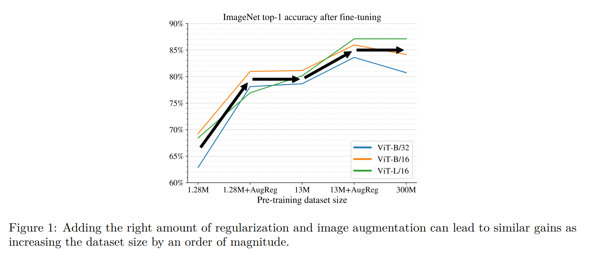
  

  - Regularization
    - Dropout to intermediate activations of ViT
    - Stochastic Depth Regularization with linearly increasing probability of dropping layers
  - Augmentation
    - Mixup: controlling a parameter $\alpha$ 
    - RandAugment: $m$ and $l$
  - Weight decay
  - Transfer pre-trained model is better than training from scratch.
  

  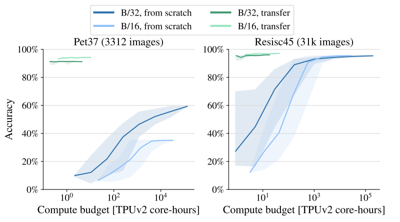
  

 

- **End-to-End Object Detection with Transformers (DETR)**
 **[`arXiv 2020`]** *Nicolas Carion, Francisco Massa, Gabriel Synnaeve, Nicolas Usunier, Alexander Kirillov, Sergey Zagoruyko* [(arXiv)](http://arxiv.org/abs/2005.12872) [(pdf)](./End-to-End%20Object%20Detection%20with%20Transformers.pdf) (Citation: 8824)
  - This work presents a new method that views object detection as **a direct set** prediction problem.
    - Goal of object detection is to predict a set of bounding boxes and category labels for each object of interest. 
    - Traditional detectors address this set prediction task in an indirect way, by defining surrogate regression and classification problems on a large set of proposals, anchors, or window centers (surrogate tasks). 
    - Traditional detectors needs a **non-maximum suppression** to remove near-duplicate predictions.
    - DETR does not need surrogate tasks thus does not need non-maximum suppression. 
  - The **DE**tection **TR**ansformer **(DETR)** predicts all objects at once, and is trained end-to-end with a set of loss function which performs bipartite matching between predicted and ground-truth objects. 
  

  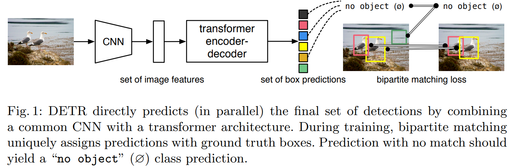
  

  - **Two ingredients** are essential for direct set predictions in detection:
    - A set of prediction loss that forces unique matching between predicted and ground truth boxes.
      - DETR infers a fixed-size set of $N$ predictions ($N$ bounding boxes).
      - One of the main difficulties of training is to score predicted objects (class, position, size) with respect to the ground truth (which bounding box is compared to the ground truth). 
        - Solution: bipartite matching.
    - An architecture that predicts a set of objects and models their relation. 

  - **DETR Architecture**:    
    - **Backbone**: a conventional CNN backbone generates a lower-resolution activation map $f$. 
    - **Transformer Encoder**: 
      - First, high-level activation map $f$ is changed to a smaller dimension $d$ to create a one dimension feature map, treated as the input to the encoder.
      - Second, **fixed** positional encodings are added to the input of each attention alyer.
    - **Transformer Decoder**:
      - The decoder follows the standard architecture of the Transformer, transforming $N$ embeddings of size $d$ using multi-headed self- and encoder-decoder attention.
      - Input embeddings of decoder (object queries) are learnt positional encodings that we refer to as *object queries*.
      - The $N$ object queries are transformed into an output embedding by the decoder, and then independently decoded into box coordinates and class labels by a feed forward network, resulting  $N$ final predictions. 
    - **Prediction Feed-forward Networks**:
      - The final prediction is computed by a 3-layer preceptron FFN
      - The FFN predicts the normalized center coordinates, height, and width of the box w.r.t. the input image, and the linear layer predicts the class label using a softmax function.
  
  

  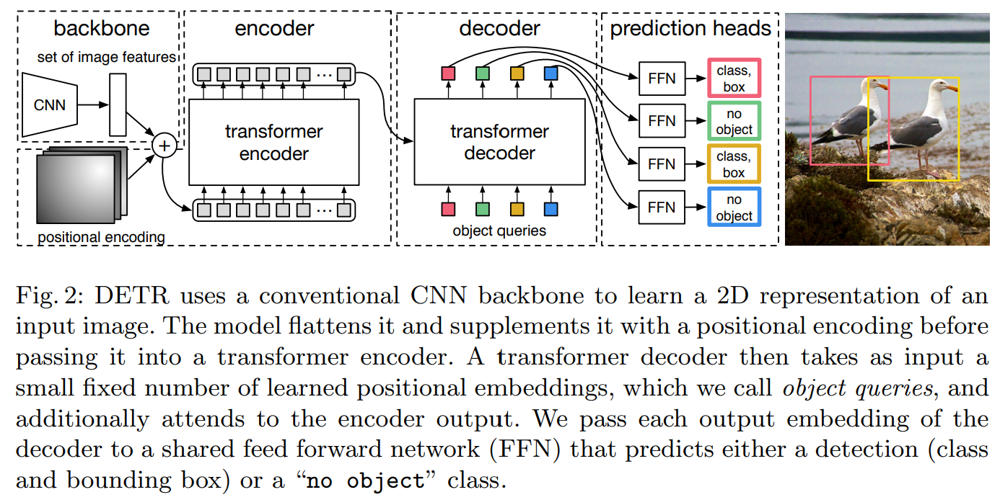
  

  - **DETR for panoptic segmentation**
    - Similarly to the extension of Faster R-CNN to Mask R-CNN, DETR can be naturally extended by adding a mask head on top of the decoder outputs. 
    - We add a mask head which predicts a binary mask for each of the predicted boxes. It takes the output of transformer decoder for each object and computes multi-head attention. 
    

    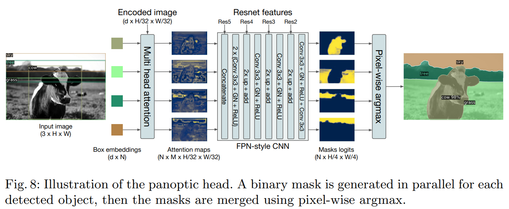
    

 

- **Deformable Convolutional Networks**
 **[`arXiv 2017`]** *Jifeng Dai, Haozhi Qi, Yuwen Xiong, Yi Li, Guodong Zhang, Han Hu, Yichen Wei* [(arXiv)](http://arxiv.org/abs/1703.06211) [(pdf)](./deformable%20CNN.pdf) (Citation: 5112)
  - A **key challenge** in visual recognition is how to accommodate geometric variations or model geometric transformations in object scale, pose, viewpoint, and part deformation. 
  - Traditional CNN is limited to model large, unknown transformations.
    - This limitation originates from the **fixed** geometric structures of CNN modules: a convolution unit samples the input feature map at **fixed** locations. 
    - A pooling layer reduces the spatial resolution at a **fixed** ratio;
    - A RoI pooling layer separates a RoI into **fixed** spatial bins, etc. 
    - There lacks internal mechanisms to handle the geometric transformations. 
    - **Adaptive** determination of scales or receptive field sizes is desirable for visual recognition with fine localization.

  - **Deformable Convolution**: it adds **2D offsets** to the regular grid sampling locations in the standard convolution. It enables free form deformation of the sampling grid. 
    - The offsets are learned from the previous feature maps, via additional convolutional layers. 
    - The deformation is conditioned on the input features in a local, dense, and adaptive manner. 
    

    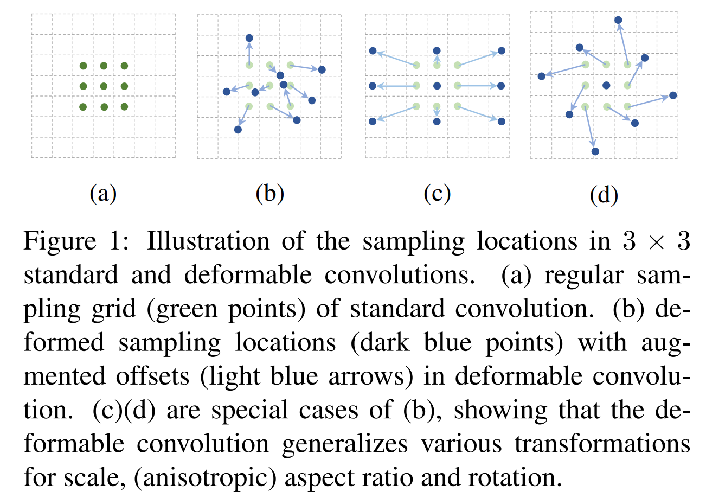
    

    

    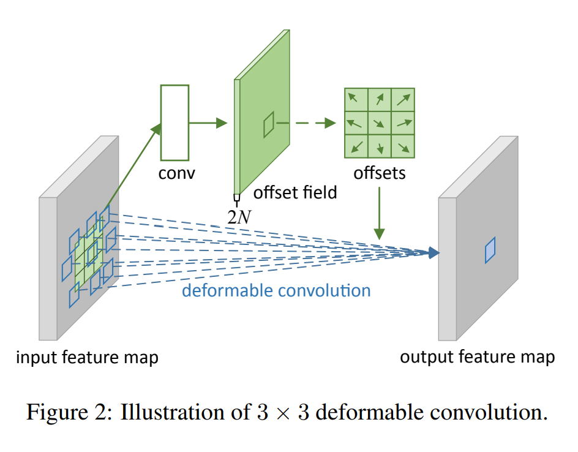
    

  - **Deformable RoI Pooling**: it adds an offset to each bin position in the regular bin partition of the previous RoI pooling. 
    - RoI pooling converts an input **rectangular region of arbitrary size** ino **fixed size features**.
      - Given the input feature map $\mathbf{x}$ and a RoI of size $w\times h$ and top-left corner $\mathbf{p}_0$, RoI pooling divides the RoI into $k\times k$ bins and outputs a $k\times k$ feature map $\mathbf{y}$. For ($i,j$)-th bin ($0  i,j$)
    
    - The offsets are learned from the previous feature maps and the RoIs, enabling adaptive part localization for objects with different shapes. 

 

- **Deformable DETR Deformable Transformers for End-to-End Object Detection**
 **[`ICLR 2021`]** *Xizhou Zhu, Weijie Su, Lewei Lu, Bin Li, Xiaogang Wang, Jifeng Dai* [(arXiv)](http://arxiv.org/abs/2010.04159) [(pdf)](./Deformable%20DETR.pdf) (Citation: 3065)

 - Strengthens of **Deformable DETR**:
   - Deformable DETR: attention modules only attend to a small set of key sampling points around **a reference**.
   - Deformable DETR can achieve better performance than DETR, especially on small objects, with 10x less training epochs.
 - Problems of DETR: 
   - DETR suffers from **slow convergence** and **limited feature spatial resolution**.
   - Mainly attributed to the deficit of Transformer components in processing image feature maps:
     - At initialization, the attention modules cast nearly uniform attention weights to all the pixels in teh feature maps. 
     - Long training epoches is necessary for the attention weights to be learned to focus on sparse meaningful locations.
     - Moreover, the attention weights computation in Transformer encoder is of quadratic computation w.r.t. pixel numbers. 

 ## YOLO Series
- **CSPNet A New Backbone that can Enhance Learning Capability of CNN**
  **[`arXiv 2019`]** *Chien-Yao Wang, Hong-Yuan Mark Liao, I-Hau Yeh, Yueh-Hua Wu, Ping-Yang Chen, Jun-Wei Hsieh* [(arXiv)](http://arxiv.org/abs/1911.11929)[(pdf)](./CSPNet%20-%20A%20New%20Backbone%20that%20can%20Enhance%20Learning%20Capability%20of%20CNN.pdf)

- **YOLOv3 An Incremental Improvement**
 **[`arXiv 2018`]** Joseph Redmon [(arXiv)](http://arxiv.org/abs/1804.02767) [(pdf)](./YOLOv3%20-%20An%20Incremental%20Improvement.pdf)

 - **YOLOv4 Optimal Speed and Accuracy of Object Detection**
 **[`arXiv 2020`]** Alexey Bochkovskiy [(arXiv)](http://arxiv.org/abs/2004.10934) [(pdf)](./YOLOv4%20-%20Optimal%20Speed%20and%20Accuracy%20of%20Object%20Detection.pdf)

 