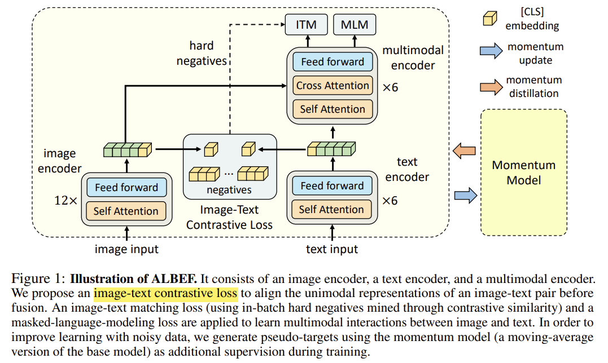

# Vision Language Model
- **A General Classification of Vision Language Models (VLMs)**

    - Class 1: Small text encoder + Large vision encoder + Simple interaction
      - VSE++, SCAN
    - Class 2: Large text encoder + Large vision encoder + Simple interaction
      - CLIP
    - Class 3: Small text encoder + Large vision encoder + Large interaction
    - Class 4: Small text encoder + Small vision encoder + Large interaction
    - General guidance: Vision encoder is larger than text encoder. 

<br />

- **CLIP: Learning Transferable Visual Models From Natural Language Supervision**
 **[`arXiv 2021`]** Alec Radford [(arXiv)](http://arxiv.org/abs/2103.00020) [(pdf)](./CLIP.pdf) (Citation: 7930)

    - Core: use natural language to supervise image training
      - Map visual semantic and language semantic
    - Constrastive pre-training:
      - Training data - collect 400M image & text pairs 
      - Image encoder (ViT, ResNet) - Extract image features
      - Text encoder (Transformer) - Extract text features
      - Training goal - Minimize the distance (cosine similarity) between text and image features if they are a pair (i.e., $I_1T_I$, $I_2T_2$ in the image). 
      - **Both image and text encoders are trained from scratch**. 
    - Downstream task example: Object detection
      - Prompt template: ```A photo of {objects}```, this ```{objects}``` are objects candidates, i.e., dog, cat, etc.
      - Calculate the consine similarity between the prompt features and image features and find the one with the highest similarity.

<br /> 

- **ViLT Vision-and-Language Transformer Without Convolution or Region Supervision**
**[`ICML 2021`]** *Wonjae Kim, Bokyung Son, Ildoo Kim* [(arXiv)](http://arxiv.org/abs/2102.03334) [(pdf)](./ViLT%20-%20Vision-and-Language%20Transformer%20without%20Convolution%20or%20Region%20Supervision.pdf) (Citation: 808)


    - Remove feature extraction model in traditional Transformer-based vision detector 
    - The Performance of ViLT is similar to the feature extration method, but the running time is much shorter.

<br /> 

- **Align before Fuse Vision and Language Representation Learning with
  Momentum Distillation**
 **[`arXiv 2021`]** *Junnan Li, Ramprasaath R. Selvaraju, Akhilesh Deepak Gotmare, Shafiq Joty, Caiming Xiong, Steven Hoi* [(arXiv)](http://arxiv.org/abs/2107.07651) [(pdf)](./albef.pdf) (Citation: 807)

 - Limitations of most esisting Vision-and-Language Pre-trained (VLP) models:
   - The image features and word token embeddings reside in their own spaces;
   - The object detector is expensive;
   - The widely used image-text dataset is nosiy.

  

 - ALign BEfore Fuse (ALBEF), a new VLP framework to address these limitations. 
   - Use an intermediate **image-text contrastive (ITC) loss** on representations from the unimodal encoders, which can
     - Align the image features and text features, making it easier for the multimodal encoder to perform cross-modal learning.
     - It improves the unimodal encoders to better understand the semantic meaning of images and texts. 
     - It learns a common low-dimensional space to embed images and texts, which enables the image-text matching objective to find more informative samples.
   - Use Momentum Distillation (MoD) that enables the model to leverage a larger uncurated web dataset.
 - Model Architecture
   - Image Encoder: 12-layer Visual Transformer ViT-B/16 (with weights pre-trained on ImageNet-1k).
   - Text Encoder: 6-layer transformer (with weights from the first 6 layers of BERT_base)
   - Multi-modal Encoder: 6-layer transformer (with weights from the last 6 layers of BERT_base)
 - Pre-train Objectives:
   - Image-text Contrastive Learning (ITC): aims to learn better unimodal representations before fusion. 
     - It learns a similarity function $s=g_v\left(\boldsymbol{v}_{\mathrm{cls}}\right)^{\top} g_w\left(\boldsymbol{w}_{\mathrm{cls}}\right)$, such that parallel image-text pairs have higher similarity scores. $g_v$ and $g_w$ are linear transformations that map the `[CLS]` embeddings to normalized lower-dimensional (256-d) representations (positive samples). 
     - Inspired by MoCo, two **queues** are maintained to store the most recent $M$ image-text representations from the momentum unimodal encoders (negative samples).  
   - Masked Language Modeling: utilize both the image and the contextual text to predict the masked word.
     - Randomly mask out the input tokens with a proability of 15% and replace them with a special token `[MASK]`
   - Image-Text Matching: predicts whether a pair of image and text is matched or not matched. 
     - Use the multimodal encoder's output embedding of the `[CLS]` token as the joint representation of the image-text pair, and append a fully connected (FC) layer followed by softmax to predict a **two-class** probability. 
     - Hard Negative: 
       - The model can easily distinguish negative samples (since there are many negative samples and only one positive sample).
       - Make this two-class classification task harder:  A negative image-text pair is hard if they share similar semantics but differ in fine-grained details. 
 - Momentum Distillation: 
   - Web data is noisy: the text may contain words that are unrelated to the image, or the image may contain entities that are not described in the text.
   - Besides, for ITC, negative texts for an image may also match the image's content. For MLM, there may exist other words different from the annotation that describes the image equally well (or btter). 
   - However, the one-hot labels for ITC and MLM penalize all negative predictions regardless of their correctness. 
   - Can we generate more 'correct answers' instead of one-hot vector? 
   - Learn from pseudo-targets generated by the momentum model.
     - The momentum modal is a continuously-evolving teacher which consists of exponential-moving-average versions of the unimodal and multimodal encoders. 
     - During the training, we train the base modal such that its predictions match the ones from the momentum model. 
