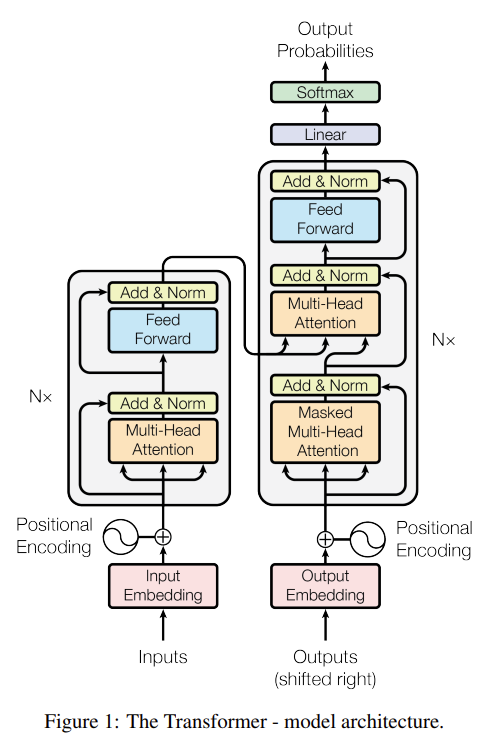

# Transformer

- **Attention Is All You Need**
 **[`arXiv 2017`]** *Ashish Vaswani, Noam Shazeer, Niki Parmar, Jakob Uszkoreit, Llion Jones, Aidan N. Gomez, Lukasz Kaiser, Illia Polosukhin* [(arXiv)](http://arxiv.org/abs/1706.03762) [(pdf)](./attention%20is%20all%20you%20need.pdf) (Citation: 89648)
  - Transformer is a seq-to-seq model that replaces RNN.
    

    
    

  - Transformer has an encoder and a decoder
    - **Encoder** mapes an input sequence of symbol representations $(x_1,...,x_n)$ to a sequence of continuous representations $\mathbf{z}=(z_1,...,z_n)$. 
      - Input: symbol representations (i.e., words, features from wave signal); Output: a squence of embeddings
      - Encoder is composed of a stack of identical layers. Each layer has two sub-layers: multi-head self-attention + position-wise fully connected network. 
      - Residual connection is employed around each of the two sub-layers, followed by layer normalization. 
    - **Decoder** generates an output sequence $(y_1, ...,y_m)$ given $\mathbf{z}$ in an auto-regressive pattern. 
      - Input: outputs from encoder + Outputs from the decoder (shifted to right); Output: a probability indicating the likelihood of choosing an embedding.
      - Decoder also contains a stack of identical layers. In addition to the two sub-layers in each encoder layer, the decoder inserts a third sub-layer, which performs multi-head attention over the output of the encoder stack. 
      - Masked Multi-Head Attention: the output only considers the current and previous inputs. 
  - Techniques used in the Transformer:
    - Self-attention: $Attention(Q,K,V)=softmax(\frac{QK^T}{\sqrt{d_k}})V$, where
      - $d_k$ is the dimension of queries and keys
      - $d_v$ is the dimension of values
      - $Q$ is the packed queries
      - $K$ is the packed keys
      - $V$ is the packed values 
      - Why divide $d_k$? This is because when $d_k$ is large, i.e., $Q$ and $K$ are long, the dot product of $Q\cdot K$ has large mangnitude. After softmax, large mangnitude values will be very close to 1, and small mangnitude values will be close to 0, resulting small gradient in training.
    - Multi-head Self-attention: $\begin{aligned}
        \operatorname{MultiHead}(Q, K, V) & =\operatorname{Concat}\left(\operatorname{head}_1, \ldots, \operatorname{head}_{\mathrm{h}}\right) W^O \\
        \text { where headi } & =\text { Attention }\left(Q W_i^Q, K W_i^K, V W_i^V\right)
        \end{aligned}$
      - Project $V$, $K$, $Q$ multiple times (i.e., $h$ times) and do the self-attention. Concatenate the self-attention result and put it through a linear layer to get the find attention score. 
    - Position-wise Feed-forward Networks
      - The fully connected feedforward network is applied on every output from the attention layer
    - Position Encoding 
    $\begin{aligned}
        P E_{(p o s, 2 i)} & =\sin \left(p o s / 10000^{2 i / d_{\text {model }}}\right) \\
        P E_{(p o s, 2 i+1)} & =\cos \left(p o s / 10000^{2 i / d_{\text {model }}}\right)
    \end{aligned}$
      - Inputs and outputs from attention layer do not include position information
      - Use sine and cosine functions of different frequencies, where $pos$ is the position of a word in the text, $i$ is the dimension (i.e., $0 - d_{modal}$).

 

- **Swin Transformer Hierarchical Vision Transformer using Shifted Windows**
 **[`arXiv 2021`]** *Ze Liu, Yutong Lin, Yue Cao, Han Hu, Yixuan Wei, Zheng Zhang, Stephen Lin, Baining Guo* [(arXiv)](http://arxiv.org/abs/2103.14030) [(pdf)](./Swin%20Transformer%20-%20Hierarchical%20Vision%20Transformer%20using%20Shifted%20Windows.pdf) (Citation: 12238)

  - **S**hifted **Win**dow Transformer (Swin Transformer)
  - The **goal** is to expand the applicability of Transformer such that it can serve as a general-purpose backbone for computer vision. 
    - **Problem**: Compared to language task, images have higher dimensional inputs (pixels), where the computational complexity of Transformer is quadratic to image size. 
    - **Swin Transformer**: hierachical feature maps and has linear computational complexity to image size. 
    
    

    
    

    - Swin Transformer constructs a **hierarchical representation** by starting from small-size patches (gray blocks in image) and gradually merging neighboring patches in deeper Transformer layers.
    - The **linear computational complexity** is achieved by computing self-attention locally within non-overlapping windows that partition an image (outlined in red).

  - A key design in Swin Transformer is its **shift** of the window partition between consecutive self-attention layers.
    

    
    

    

    
    

    
    - The first module uses a regular window partitioning strategy which starts from the top-left pixel, and the 8X8 (8 patches in one dimension) feature map is evenly partitioned into 2X2 windows of size 4X4.
    - Then, the next module adopts a windowing configuration that is shifted from the previous layer, by displacing the windows by $\left(\left\lfloor\frac{M}{2}\right\rfloor,\left\lfloor\frac{M}{2}\right\rfloor\right)$ pixels from the regularly partitioned windows. $M$ is the number of patches in one dimension of a window. 

  - **Swim Transformer Architecture**
    

    
    

    
    - **Stage 1**: 
      - It first splits an input RGB image into non-overlapping patches. Each patch is treated as a "token". (In this work, the patch size is 4X4, and the feature dimension of each patch is 4X4X3 = 48).
      - The number of tokens (i.e., patches) is $\frac{H}{4} \times \frac{W}{4}$. For an image with $224 \times 224$, the number of patches is $56 \times 56$.
      - A linear embedding layer is applied on this raw-valued feature to project it to an arbitrary dimension, $C$ ($C=96$ in Swin-Tiny).  
    - **Stage 2**: 
      - The number of tokens is reduced by **Patch Merging** (similar to Pooling) Layers as the network gets deeper. 
      - The first patch merging layer concatenates the features of each group of 2X2 neighboring patches, and applies a linear layer on the **4C-dimensional** concatenated features.

      

      
      

      - This reduces the number of tokens by (2X2 = 4) and the output dimension is set to 2$C$. 
    - **Stage 3**:
      - Repeat Stage 2 twice, with the output dimension of 4$C$ and 8$C$. 

    - **The overall size of inputs and outputs**:
    

    
    

  - **Self-Attention in Non-overlapped Windows**
    - The windows are arranged to evenly partition the image in a non-overlapping mannar.
    - Each window contains $M \times M$ patches ($M=7$ in this work). 
    - Do the self-attention of patches in a window

  - **Efficient Batch Computation for Shifted Configuration**
    - An issue with shifted window partitioning is that it will result in more windows (As shown in Figure 2, the number of window 4->9).
    - Cyclic-shifting: shift A, B, C partitions and divide the image into the same partition (4 windows)
    - Applied masked multi-head self attetion of each windon.
    - Reverse the cyclic shift to get the original image. 
 
