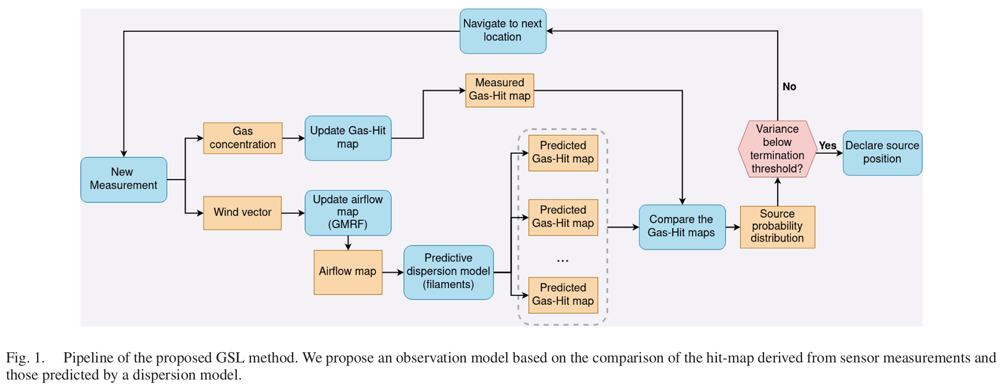
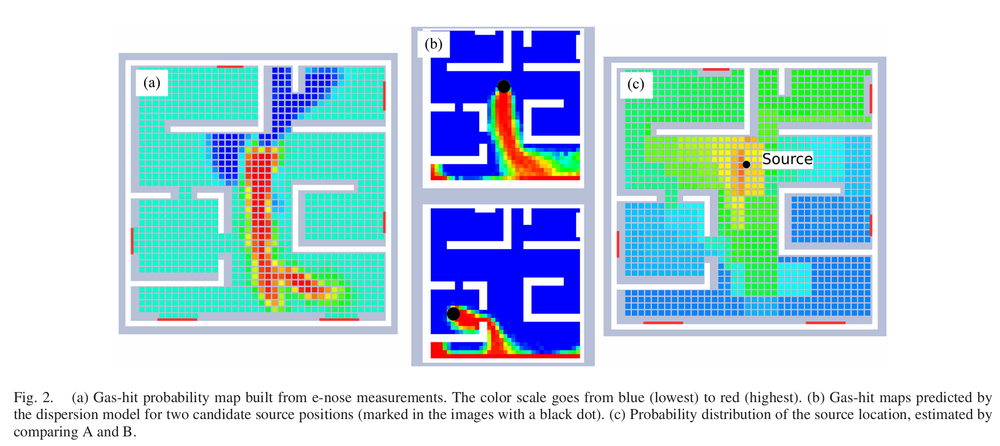

### **Robotic Gas Source Localization With Probabilistic Mapping and Online Dispersion Simulation**
 **[`IEEE Trans on Robotics 2024`]** *Pepe Ojeda, Javier Monroy, and Javier Gonzalez-Jimenez* [(IEEE)](https://ieeexplore.ieee.org/abstract/document/10592836) [(pdf)](./../Robotic%20Gas%20Source%20Localization%20With%20Probabilistic%20Mapping%20and%20Online%20Dispersion%20Simulation.pdf) (Citation: 2)

* **An Engineering-based Method**
  * Source estimation + path planning
  * Source estimation:
    * Generate a *hit map* indicating at each cell the robot will detect odor plumes
    * Find the source using *Source Term Estimation*. Based on a filament-based plume model to estimate possible odor source location.
  * Path Planning
    * Infomation value: direct the robot to move to the location that can maximize the gain of the source information. 

    

 

* **Gas Hit Map**
  * This is a gas distribution map, indicating which cell in the search area containing the gas.
  * All cell has a probility that measures the probility of the robot detecting gas, i.e., ``a hit``. 
    * ``a hit`` the cell has the enough gas for a detection
    * ``a miss`` the cell does not have the enough gas for a detection
    * $p(H_i)$ is the probability of cell $i$ has ``a hit``, where $H$ is a binary variable, indicating the cell $i$ has ``a hit`` ($H_i$=1) or not has ``a hit`` ($H_i=0$).
    * $z_k$ is the robot gas detection at cell $k$. 
    * $p(H_i|Z)$ for all $i$ is a *gas hit map* 
* **Building the Gas Hit Map**
  * Starting from an arbitrary prior $p(H_i)$
  * When the robot has a measurement at cell $i$, i.e., $z_i$, this will update $p(H_i)$ through $p(H_i|z_i)$
  * When the robot has a measurement at cell $k$, we can also use it to inference gas probability at all other cell, i.e., $p(H_i|z_k)$
    * This nearby inferece can be modeled as a Gaussian model (influenced by the wind). 
    * The core idea is that nearby cells will have similiar gas probability, and far-away cells (to the robot position) won't be updated. 
* **Compare the Gas Hit Map with Gas Prediction Maps**
  * Gas Prediction Map: generated by wind vectors and filament-based plume model. 
  * Choose Candidate Source Locations:
    * Coarse-to-fine strategy
    * Only a few source locations are simulated initially
    * Insides these locations, only the ones that produce the most promising results are recursively subdivided to obtain more precision in the final estimation

    

 