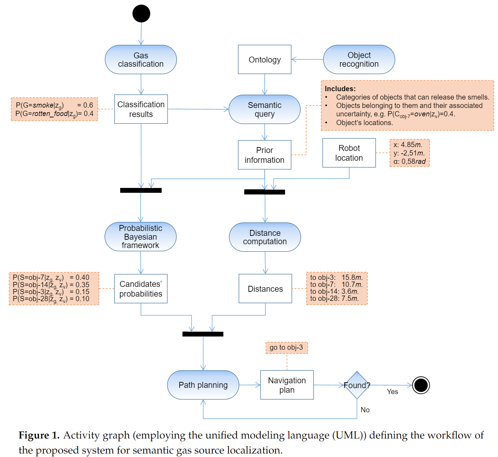
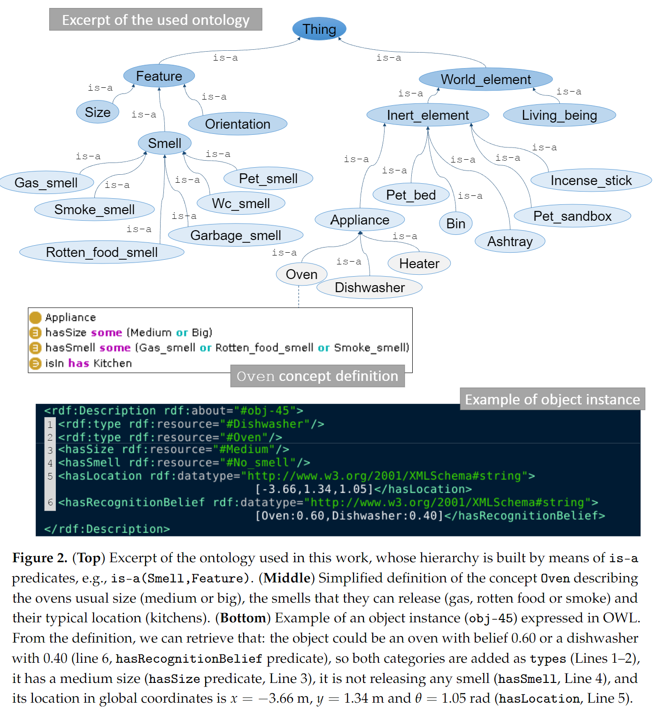

### **A Semantic-Based Gas Source Localization with a Mobile Robot Combining Vision and Chemical Sensing**
 **[`Sensors 2018`]** *Javier Monroy, Jose-Raul Ruiz-Sarmiento, ......* [(MDPI)](https://www.mdpi.com/1424-8220/18/12/4174) [(pdf)](./../A%20Semantic-Based%20Gas%20Source%20Localization%20with%20a%20Mobile%20Robot%20Combining%20Vision%20and%20Chemical%20Sensing.pdf) (Citation: 57)

* **Problem Formation**:
   * *Olfatcion*: Robot can measure and classify different chemical volatiles. 
     * Naive Bayes is used to perform gas classification
   * *Vision*: Robot can detect objects relying on computer vision.
     * YOLOv3 is used for visual recognition
   * *Fusion*: A semantic query to an ontology. 
     * The semantic relations are established via an ontology. 
     * Given the smells we are looking for, it enables us to perform semantic queries for retrieving:
       * First the categories of objects;
       * Then the instances of these categories previously detected in the robot workspace. 
   * *Other technical details*:
     * Uncertainty related to object recognition and gas classification -> Bayesian framework to propagate such classification processes.  
     * This set of candidate objects is dynamically updated as the robot operates, enabling the inclusion of new candidates not previously considered in the search.
     * Path planning is based on Markov Decision Process (MDP) 
* **Flowchart**:

    

        
    

* **Fusion Details**: 
  * An Ontology
    
    

        
    

