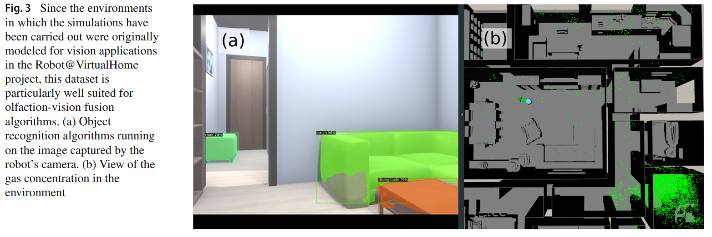

- **VGR Dataset: A CFD-based Gas Dispersion Dataset for Mobile Robotic
Olfaction**
 **[`JIRS 2023`]** *Pepe Ojeda, et al.* [(MDPI)](https://link.springer.com/article/10.1007/s10846-023-02012-z) [(pdf)](./../VGR%20Dataset%20A%20CFD-based%20Gas%20Dispersion%20Dataset%20for%20Mobile%20Robotic.pdf) (Citation: 1)

 

 * The 3D models used in teh dataset were created from the Robot@VirtualHome Project. 
 * Link to the project webpage:
   * Webpage: https://mapir.isa.uma.es/mapirwebsite/?p=1708