# AI Robotics Integration

## LLM-based Agent Review Collection:
* [Efficient LLMs: A Survey](https://github.com/AIoT-MLSys-Lab/Efficient-LLMs-Survey)
* [Awesome-LLM-Robotics](https://github.com/GT-RIPL/Awesome-LLM-Robotics?tab=readme-ov-file)
* [Awesome-Implicit-NeRF-Robotics](https://github.com/zubair-irshad/Awesome-Implicit-NeRF-Robotics?tab=readme-ov-file)

## Embodied AI Tasks
* Remote Object Grounding:
  * [REVERIE](https://github.com/YuankaiQi/REVERIE)
* Housekeeper environment:
  * [ALFRED](https://askforalfred.com/)
  * [Minedojo](https://github.com/MineDojo/MineDojo)
* Environment Understanding:
  * [OpenScene](https://github.com/pengsongyou/openscene)
  * [ScanRefer](https://daveredrum.github.io/ScanRefer/)

## Object Manipulation
- **GAPartNet Cross-Category Domain-Generalizable Object Perception and
  Manipulation via Generalizable and Actionable Parts**
 **[`CVPR 2023`]** *Haoran Geng, Helin Xu, Chengyang Zhao, Chao Xu, Li Yi, Siyuan Huang, He Wang* [(arXiv)](http://arxiv.org/abs/2211.05272) [(pdf)](./GAPartNet%20Cross-Category%20Domain-Generalizable%20Object%20Perception%20and%20Manipulation%20via%20Generalizable%20and%20Actionable%20Parts.pdf) (Citation: 8)
  - Propose a **G**eneralizable and **A**ctionable **Parts** (GAParts). 
    - Identifying and defining 9 GAPart classes (i.e., lids, handles, etc.) in 27 object categories to generate a large-scale part-centric interactive dataset, named *GAPartNet* 
    - Base on this dataset, we investigate three cross-category tasks:
      - Part segmentation
      - Part pose estimation
      - Part-based object manipulation
    - Use adversairal learning to do the 3D segmentation of an object. 

## Robotic Transformer
- **A Generalist Agent**
 **[`arXiv 2022`]** *Scott Reed, et al.* [(arXiv)](http://arxiv.org/abs/2205.06175) [(pdf)](./A%20Generalist%20Agent.pdf) (Citation: 393)
  - Gato is a multi-modal, multi-task, multi-embodiment generalist policy
  - Tokenization:
    - Text is encoded via SentencePiece with 32L subwords into the integer range [0, 32000]
    - Images are first transformed into sequences of non-overlapping 16X16 patches in raster order (ViT). Each pixel in the image patches is then normalized between [-1, 1].
    - Discrete values are flattened into sequences of integers in row-major order. The tokenized result is a sequence of integers within the range of [0,1024].
    - Continuous values are first flattened into sequences of floating point values in row-major order. The values are mu-law encoded to the range [-1, 1] if not already there, then discretized to 1024 uniform bins.
  - Convert tokens into embeddings (Transformer Input)
    - Tokens belonging to text, discrete- or continuous-valued observations or actions for any time-step are embedded via a lookup table into a learned vector embedding space. 
    - Tokens belonging to image patches are embedded using a single ResNet block to obtain a vector per patch.

 - **ChatGPT for Robotics Design Principles and Model Abilities**
 **[`arXiv 2023`]** *Sai Vemprala, Rogerio Bonatti, Arthur Bucker, Ashish Kapoor* [(arXiv)](http://arxiv.org/abs/2306.17582) [(pdf)](./ChatGPT%20for%20Robotics%20-%20Design%20Principles%20an%20Model%20Abilities.pdf) (Citation: 62)

- **RT-1 Robotics Transformer for Real-World Control at Scale**
 **[`arXiv 2022`]** *Anthony Brohan, et al.* [(arXiv)](http://arxiv.org/abs/2212.06817) [(pdf)](./rt1%20-%20robotics%20transformer%20for%20real-world%20control%20at%20scale.pdf) (Citation: 107)

 

- **RT-2 Vision-Language-Action Models Transfer Web Knowledge to Robotic
  Control**
 **[`arXiv 2023`]** *Anthony Brohan, et al.* [(arXiv)](http://arxiv.org/abs/2307.15818) [(pdf)](./rt2%20-%20vision-language-action%20models%20transfer%20web%20knowledge%20to%20robotic%20control.pdf) (Citation: 6)

  

    
  

  - **Objective**: Can large pretrained vision-language models be integrated directly into low-level robotic control to boost generalization and enable emergent semantic reasoning? -> Vision-Language-Action (VLA) model. 
  - **Approach**: Directly train vision-langauge models designed for open-vocabulary visual question answering and visual dialogue to output low-level robot actions.
    - Robot actions are tokenized into text tokens and create multimodal sentences. 
  - **VLA is built upon VLMs**: PaLI-X and PaLM-E
    - VLMs must be trained to otuput actions. Representing actions as tokens in the model's output, treated in the same way as language tokens.
    - Action Space: 6-DoF positional and rotational displacement of the robot end-effector; continuous dimensions are discretized into 256 bins uniformly. 
    - Convert action vector into a **single string**: 
    
    

    
    

    - **Input**: robot camera image and textual task description (using standard VQA format Q: what action should the robot take to [task instruction]? A:) 
    - **Output**: A string of numbers/least frequently used tokens representing a robot action. 
  - **Real-Time Inference**
    - The size of VLA is 55B parameters. It is running on a multi-TPU cloud service and querying this service over the network. 
    - The frequency of VLA is 1-3 Hz.
  - **Training Data**:
    - Web-scale Visual Question Answering
    - Unstructured interwoven image and text examples
    - Robot demonstration data (13 robots over 17 months in an office kitchen environment) 
  - **Add Chain-of-Thought**:
    - Augment the data to include an additional "Plan" step, which describes the purpose of the action that the robot is about to take in natural language first, which is then followed by the actual action tokens. 
      - For example: Instruction - I am hungry; Plan - Pick chocolate; Action: .....
      - This data augmentation scheme acts as a bridge between VQA datasets (visual reasoning) and manipulation datasets (generating actions). 
 

- **VIMA General Robot Manipulation with Multimodal Prompts**
 **[`ICML 2023`]** *Yunfan Jiang, Agrim Gupta, Zichen Zhang, Guanzhi Wang, Yongqiang Dou, Yanjun Chen, Li Fei-Fei, Anima Anandkumar, Yuke Zhu, Linxi Fan* [(arXiv)](http://arxiv.org/abs/2210.03094) [(pdf)](./VIMA%20-%20General%20Robot%20Manipulation%20with%20Multimodal%20Prompts.pdf) (Citation: 53)

 

- **Do As I Can Not As I Say Grounding Language in Robotic Affordances**
 **[`arXiv 2022`]** *Michael Ahn, Anthony Brohan, et al.* [(arXiv)](http://arxiv.org/abs/2204.01691) [(pdf)](./SayCan%20-%20Do%20As%20I%20Can%20Not%20As%20I%20Say.pdf) (Citation: 411)
  - Saycan: provide **real-world grounding** that links the LLM and robotic tasks.
    - **Real-world Grounding**: LLMs have not interacted with their environment and observed the outcome of their responses, and thus are not grounded in the world.
    - Sometimes LLM will provide a strategy to perform a task but not work in the real world.
    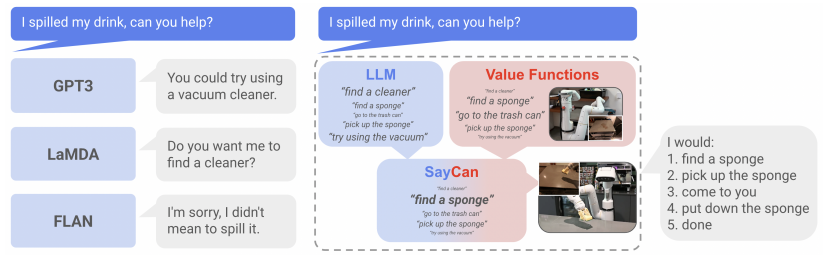
  - Saycan links LLM and environment via:
    - The robot is equipped with a group of basic behaviors (i.e., low-level skills)
    - Each skill has a **affordance function** (similar to value function in RL), specifying how likely it is to succeed in completing the instruction from the current state. 
    - The value function of each skill that is additionally conditioned on the language command is generated via an RL method (i.e., Q-learning). 
  - **Prompt Engineering**: 
    - Break down high-level instruction into sequences of available low-level skills.
  - **Dataflow**:
    - The LLM provides probabilities of a skill being useful for the high-level instruction
    - The affordances (value functions) provide probabilities of successfully executing each skill.
    - Combine these two probabilities together provides a probability that this skill furthers the execution of the high-level instruction.
  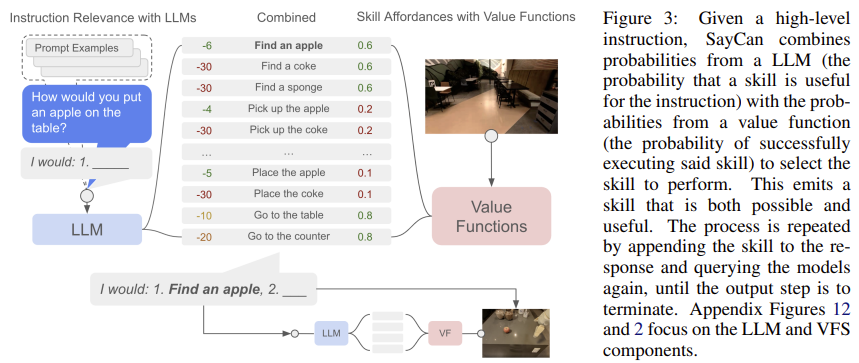
  
 

- **PaLM-E An Embodied Multimodal Language Model**
 **[`arXiv 2023`]** *Danny Driess, Fei Xia, et al.* [(arXiv)](http://arxiv.org/abs/2303.03378) [(pdf)](./palm-e.pdf) (Citation: 194)
 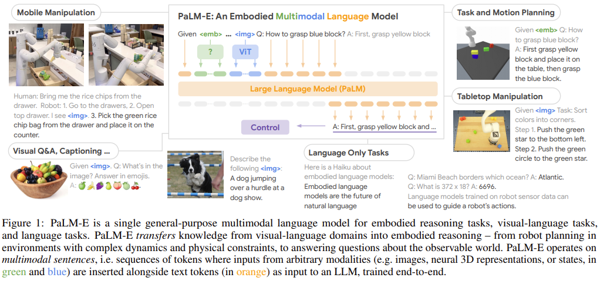
  - An Embodied Model with Multimodal Inputs 
    - Multimodal inputs include visual, **continuous state estimation**, and textual input encodings. 
    - Train the model end-to-end, with a pre-trained LLM
    - Tasks: sequential robotic manipluation planning, visual question answering, and captioning
    - Establish the link between words and percepts
  - Dataflow
    - Inputs (images and state estimates) -> tokens (image, state estimates, and language has the same dimension) -> self-attention layers (decoder-only LLM) -> Output (**sequential decisions in natural text**) -> Low-level policy or planner (translate language decisions into actions)
    

      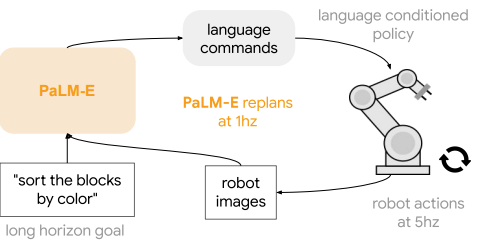
    

  - Terminologies 
    - $w_i\in \mathcal{W}$ -> a token
    - $I$ -> an image
    - $\mathcal{X} \in \mathbb{R}^k$ -> embedding space (if a token's length is 3, then the embedding space is a 3-dimensional space)
    - $\gamma : \mathcal{W} \rightarrow \mathcal{X}$ -> **Text encoder**: a LLM that embeds a token $w_i$ into a word token embedding space. PaLM model is employed in this work.
    - $\phi:\mathcal{O} \rightarrow \mathcal{X}^q$ -> **Vision encoder**: an encoder $\phi$ that maps a continuous observation space $\mathcal{O}$ into a sequence of $q$-many vectors in $\mathcal{X}$. ViT-22B and ViT-4B are employed in this work.
    - $\phi_{state}$ -> State estimation encoder (a MLP that maps inputs into the language embedding space).
  - Training
    - Training dataset $D = \left\{\left(I_{1: u_i}^i, w_{1: L_i}^i, n_i\right)\right\}_{i=1}^N$
      - $u_i$ images -> Continuous observations
      - $w_{1: L_i}^i$ -> Text contains a prefix part (i.e., prompt template) formed from multi-modal sentences and a prediction target that only contains text tokens.
      - $n_i$ -> an index that specifies the length of a pre-fix. 
    - Loss function: a cross-entropy loss averaged over the individual non-prefix tokens $w_{n_i+1: L_i}^i$. 

 

- **Learning Humanoid Locomotion with Transformers**
 **[`arXiv 2023`]** *Ilija Radosavovic, Tete Xiao, Bike Zhang, Trevor Darrell, Jitendra Malik, Koushil Sreenath* [(arXiv)](http://arxiv.org/abs/2303.03381) [(pdf)](./Learning%20Humanoid%20Locomotion%20with%20Transformers.pdf) (Citation: 6)
  - Use a causal transformer model to control a humanoid locomotion.
    - Input: robot history observations and actions
    - Output: robot actions
    - The history of observations and actions implicitly encodes the information about the world that a powerful Transformer model can use to adapt its behavior dynamically at test time. 
  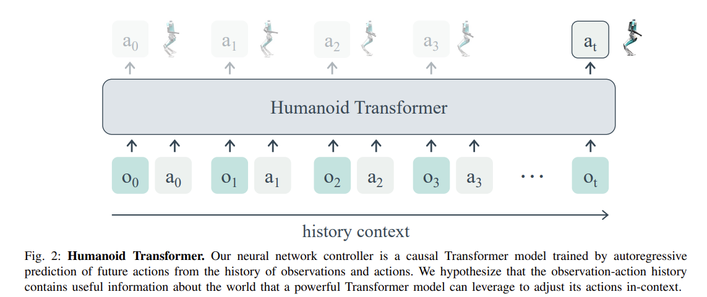
  - Why use learning-based methods?
    - Leaning-based methods have become of increasing interest due to their ability to learn from diverse simulations or real environments.
  - The Transformer-based controller is trained with online RL (in simulation) without offline dataset.
    - The loss function consists of both RL loss and a KL divergence between the policys obtained from true states $\pi_s$ and observations $\pi_o$.

 

- **RREx-BoT Remote Referring Expressions with a Bag of Tricks**
 **[`arXiv 2023`]** *Gunnar A. Sigurdsson, Jesse Thomason, Gaurav S. Sukhatme, Robinson Piramuthu* [(arXiv)](http://arxiv.org/abs/2301.12614) [(pdf)](./RREx-BoT%20Remote%20Referring%20Expressions%20with%20a%20Bag%20of%20Tricks.pdf) (Citation: 0)
    

    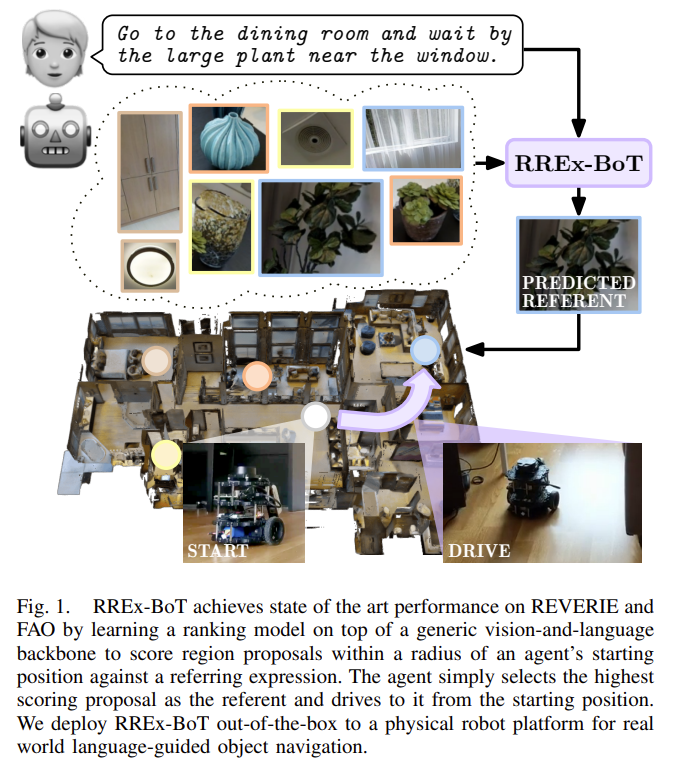
    

  - Using a generic vision-language scoring model with minor modifications for 3D encoding and operating in an embodied environment. 
  - Two challenges when applying an off-the-shelf, generic vision-and-language alignment scoring model to the task of remote, embodied visual referring expression resolution. 
    - Such VL models are trained only on 2d images
    - These models output match scores between image proposals and target language in batches, but we cannot fit hundreds of thousands of object proposal regions in a single batch, making ranking language-image match scores between batches non-trivial. 

 

- **LLM-Grounder Open-Vocabulary 3D Visual Grounding with Large Language
  Model as an Agent**
 **[`arXiv 2023`]** *Jianing Yang, Xuweiyi Chen, Shengyi Qian, Nikhil Madaan, Madhavan Iyengar, David F. Fouhey, Joyce Chai* [(arXiv)](http://arxiv.org/abs/2309.12311) [(pdf)](./LLM-Grounder%20-%20Open-Vocabulary%203D%20Visual%20Grounding%20with%20Large%20Language%20Model%20as%20an%20Agent.pdf) (Citation: 8)
  -  **Objective**: Focus on 3D visual object grounding. Let the robot to understand 3D objects.
     - **LLM-Grounder**: LLM-based 3D visual grounding pipeline. 
       - Use LLM to decompose complex natural language queries into semantic constitutents and employs a visual grounding tool to identify objects in a 3D scene. 
       - Then LLM evaluates the spatial and commonsense relations among the proposed objects to make a final grounding decision.
    

    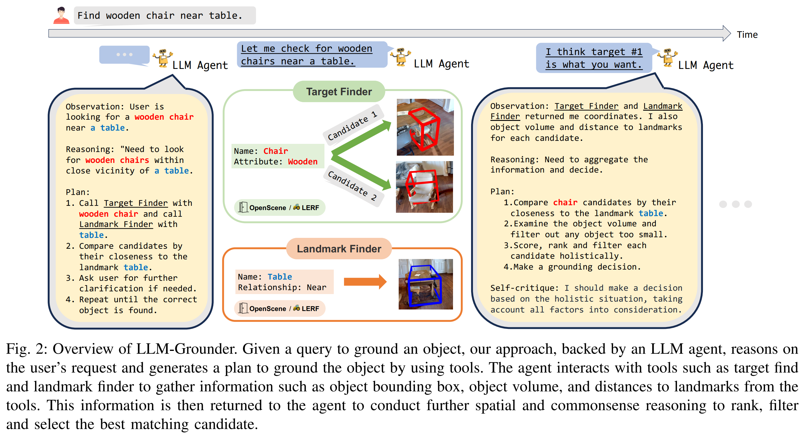
    

  
  - **Three Steps**:
    - Break down complex text into sub-tasks that can be better handled by downstream tools like a CLIP-based 3D visual grounder (OpenScene).
    - Use such tools to solve sub-tasks it proposes.
    - Reason on feedback from the environment by incorporating spatial understanding and common sense to make grounding decisions. 
  
  - **Traditional 3D Object Grounding**:
    - 3D-and-text end-to-end neural architecture (need a large amount of 3D-text pairs for training data. Do not obtain good performance on new scenes).
    - CLIP-based open-vocabulary 3D visual grounding (bag-of-words behaviors, object relations are ignored).  

  - **Limitations**:
    - Cost: use GPT-based models as core reasoning agent can be computationally expensive. 
    - Latency: the reasoning process, due to the inherent latency of GPT models, can be slow. 

 

- **Towards End-to-End Embodied Decision Making via Multi-modal Large
  Language Model Explorations with GPT4-Vision and Beyond**
 **[`arXiv 2023`]** *Liang Chen, Yichi Zhang, Shuhuai Ren, Haozhe Zhao, Zefan Cai, Yuchi Wang, Peiyi Wang, Tianyu Liu, Baobao Chang* [(arXiv)](http://arxiv.org/abs/2310.02071) [(pdf)](./Towards%20End-to-End%20Embodied%20Decision%20Making%20via%20Multi-modal%20Large%20Language%20Model%20-%20Explorations%20with%20GPT4-Vision%20and%20Beyond.pdf) (Citation: 0)

## Prompt Engineering

- **Chain-of-Thought Prompting Elicits Reasoning in Large Language Models**
 **[`arXiv 2022`]** *Jason Wei, Xuezhi Wang, Dale Schuurmans, Maarten Bosma, Brian Ichter, Fei Xia, Ed Chi, Quoc Le, Denny Zhou* [(arXiv)](http://arxiv.org/abs/2201.11903) [(pdf)](./chain-of-thought.pdf) (Citation: 1241)
  - Generate a **chain of thought**, i.e., a series of intermediate reasoning steps, to significantly improve the ability of large language models to perform complex reasoning.
  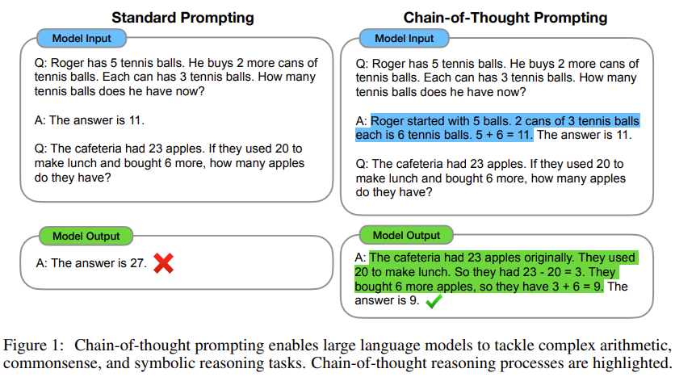
  - Decompose the problem into intermediate steps and solve each before giving the final answer.
  - In the above fiture, the blue highlighted answer is also model input, which teaches the model to think step by step.

## Vision-based Navigation

- **BADGR An Autonomous Self-Supervised Learning-Based Navigation System**
 **[`arXiv 2020`]** *Gregory Kahn, Pieter Abbeel, Sergey Levine* [(arXiv)](http://arxiv.org/abs/2002.05700) [(pdf)](./BADGR%20-%20An%20Autonomous%20Self-Supervised%20Learning-Based%20Navigation%20System.pdf) (Citation: 230)

 

- **ViNG Learning Open-World Navigation with Visual Goals**
 **[`ICRA 2021`]** *Dhruv Shah, Benjamin Eysenbach, Gregory Kahn, Nicholas Rhinehart, Sergey Levine* [(arXiv)](http://arxiv.org/abs/2012.09812) [(pdf)](./ViNG%20-%20Learning%20Open-World%20Navigation%20with%20Visual%20Goals.pdf) (Citation: 66)
  - **Objective**:
    - Propose a learning-based navigation system for reaching visually indicated goals and demonstrate this system on a real mobile robot platform.   
  - **Problem Statement**:
    - A robot is tasked with navigating to a goal location $G$ given an image observation $o_G$ taken at $G$. 
    - Outputs of the navigation model contain continuous linear and angular velocities.
  - **Training Steps**:
    - Aim to learn a traversability function $\mathcal{T}(o_i, o_j)$, indicating whether any controller can successfully navigate between observations $o_i$ and $o_j$. More specifically, learn to predict the estimated number of time steps $d_{ij}=j-i$ required by a controller to navigate from one observation to another. 
    

    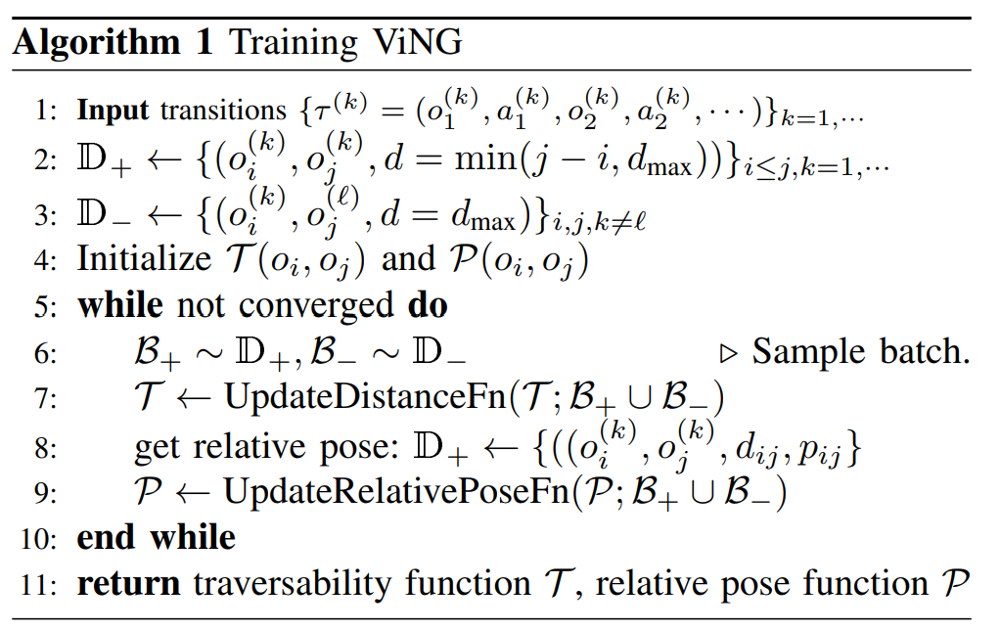
    

    - $\mathcal{T}(o_i, o_j)$ can be learned via (1) supervised learning and (2) temporal difference learning. 
    - In supervised learning, a **positive** dataset $\mathbb{D}_+$ contains observation pairs $(o_i, o_j)$ taken from teh same trajectory and regress to the number of timestpes $d_{ij}=j-i$ elapsed between observations. 
    - A **Negative** Dataset $\mathbb{D}_-$ is added. Reason: training the distance function using only observation pairs from the same trajectory performed poorly. 
    - Augment the dataset by adding $\mathbb{D}_-$, which contains sampling observations from different trajectories, labeled as $d_{max}$

  - **Deploying**
    - We build a topological graph $\mathcal{M}$ using the learned distance function together with a collection of previously-observed observations ${o_t}$. Each node in the graph corresponds to one of these observations. 
    - Add weighted edges between every node, using weights predicted by the distance function $\mathcal{T}$.
    - Use the weighted DJ algorithm to compute the shortest path to goal, and the immediate next node in the planned path is then handed over to the controller. 
  
    

    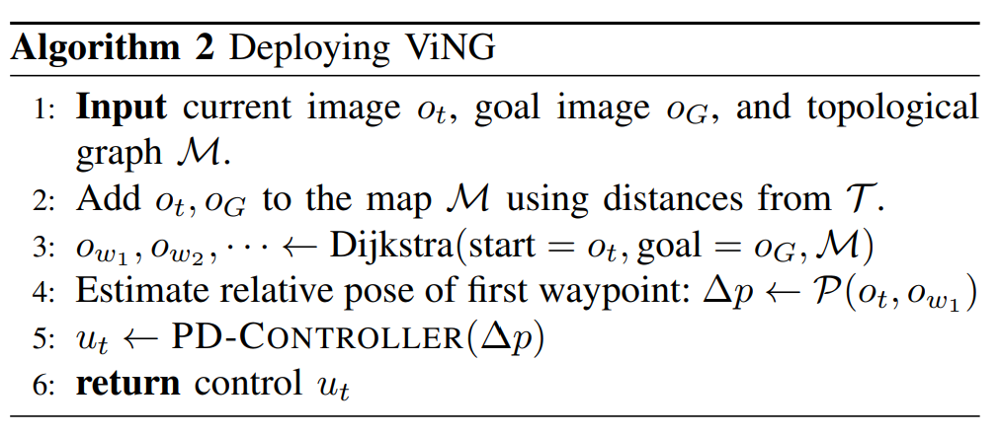
    

  
  - **Implementation Details**:
    - $\mathcal{T}$ is a MobileNet Encoder followed by three densely connected layers to project 1024-dimensional latents to 50 class labels. 
    - $\mathcal{P}$ has similar structure, comprising of a MobileNet encoder followed by three densely connected layers projecting the 1024-dimensional latents to 3 outputs for waypoints: $\{\Delta_x, \Delta_y \}$

 

- **GNM: A General Navigation Model to Drive Any Robot**
 **[`ICRA 2023`]** *Dhruv Shah, Ajay Sridhar, Arjun Bhorkar, Noriaki Hirose, Sergey Levine* [(arXiv)](http://arxiv.org/abs/2210.03370) [(pdf)](./GNM%20-%20A%20General%20Navigation%20Model%20to%20Drive%20Any%20Robot.pdf) (Citation: 35)
  - **Overall:** this is a follow-up work of the ViNG, which proposes a universal model for vision-based navigation on multiple robotic platforms.
  - **Objective:**
    - Study how a *general* goal-conditioned model for vision-based navigation can be trained on data obtained from many distinct but structurally similar robots to enable broad generalization across environments and embodiments. 
    - Using a pre-trained navigation model with broad generalization capabilities can bootstrap applications on novel robots going forward. 
  - **Dataset**:
    - 8 datasets collected on robotic platforms with varying dynamics, sensors, adn behaviors.
    - 60 hours of real-world navigation trajectories.
    - Contains forward-facing RGB images, paired with robot's commanded actions and local odometry measurements. 
  - **General Navigation Model**: 
    - A robot is tasked with navigting to a goal location $G$ specified as an image observation $o_G$ taken at $G$.
    

    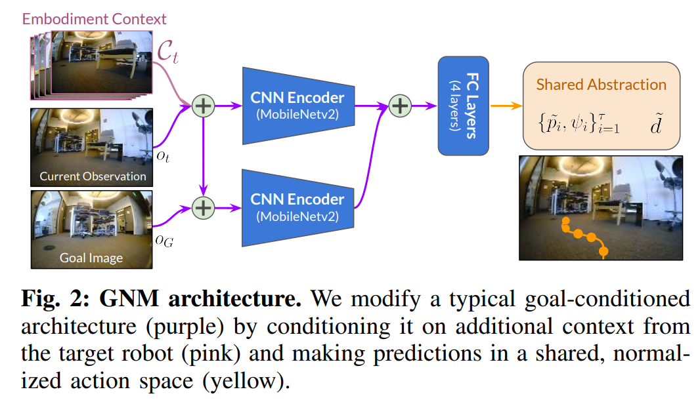
    

   
    - Architecture:
      - **Embodiment Context**: a stack of past 5 consecutive observations
      - **Output**: future waypoints + temporal distance 
  - **Training Details**:
    - Use a combination of image-goal pairs sampled from the same trajectory in the dataset as "positives" and "negatives" sampled from different trajectories, to obtain training data pairs. 

 

- **LM-Nav Robotic Navigation with Large Pre-Trained Models of Language
  Vision and Action**
 **[`arXiv 2022`]** *Dhruv Shah, Blazej Osinski, Brian Ichter, Sergey Levine* [(arXiv)](http://arxiv.org/abs/2207.04429) [(pdf)](./LM-Nav%20-%20Robotic%20Navigation%20with%20Large%20Pre-Trained%20Models%20of%20Language,%20Vision,%20and%20Action.pdf) (Citation: 160)
  - **Objective**: 
    - Enable a self-supervised system for robotic navigation to execute natural language instructions by leveraging the capabilities of pre-trained models without any user-annotated navigational data. 
    - This method uses LLMs to construct an interface that humans can use to communicate desired tasks to robots. 
    - This system enjoys the impressive generalization capabilities of the pre-trained language and vision-language models, enabling the robotic system to accept complex high-level instructions. 
  - **Method Overview**:
    

    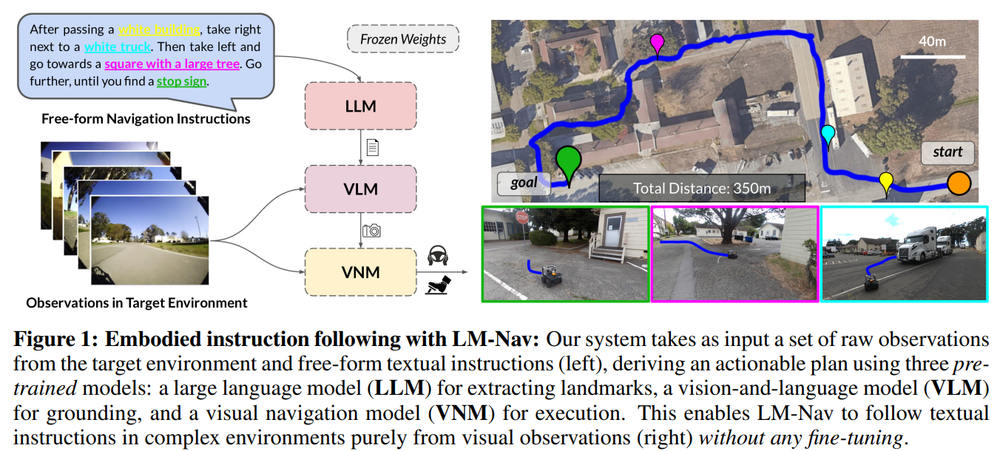
    

    - Use a visual navigation model (**VNM: ViNG**) to create a topological mental map of the environment using robot's observations. 
    - Given free-form textual instructions, we use a pre-trained **LLM (GPT-3)** to decode the instructions into a sequence of textual landmarks. 
    - Use a vision-language model (**VLM: CLIP**) for grounding these textual landmarks into the topolical map, by inferring a joint likelihood over the landmarks and nodes. 
    - A novel search algorithm is then used to maximize a probabilistic objective, and find a plan for the robot, which is then executed by **VNM**.

    

    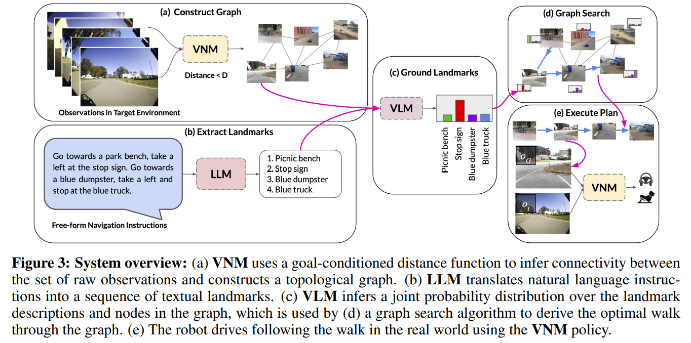
    
 

    - The **LLM** parses instructiosn into a list of landmarks $\bar{\ell}$
    - The **VLM** associates these landmarks with nodes in teh graph by estimating the probability that each node $\bar{v}$ corresponds to each $\bar{\ell}$, i.e., $P(\bar{v}|\bar{\ell})$
    - The **VNM** is then used to infer how effectively the robot can navigate between each pair of nodes in the graph, which we convert into a probability $P\left(\overline{v_i, v_j}\right)$ derived from the estimated temporal distances. 
  - **Detailed Implementation:**
    - Given a sequence of landmark $\bar{\ell}=\ell_1, \ell_2, ..., \ell_n$ extracted by the LLM, determine a sequence of waypoints $v_1, v_2, ..., v_k$ to command the robot. 
    - This can be framed as a probabilistic inference problem: 
      - To determine $p(v_i|\ell_j)$, a distribution over images given a language description (**CLIP**).
      - To determine $p\left(\overline{v_i, v_j}\right)$ that describe how likely is the robot to be able to reach $v_{i+1}$ from $v_i$ (**VNM**). 

 

- **FastRLAP A System for Learning High-Speed Driving via Deep RL and
  Autonomous Practicing**
 **[`arXiv 2023`]** *Kyle Stachowicz, Dhruv Shah, Arjun Bhorkar, Ilya Kostrikov, Sergey Levine* [(arXiv)](http://arxiv.org/abs/2304.09831) [(pdf)](./FastRLAP%20-%20A%20System%20for%20Learning%20High-Speed%20Driving%20via%20Deep%20RL%20and%20Autonomous%20Practicing.pdf) (Citation: 3)
  - **Objective**: Design a deep learning model to control a RC car to drive aggressively from visual observations using reinforcement learning.
  - **Challenges in high-speed vision-based navigation**:
    

    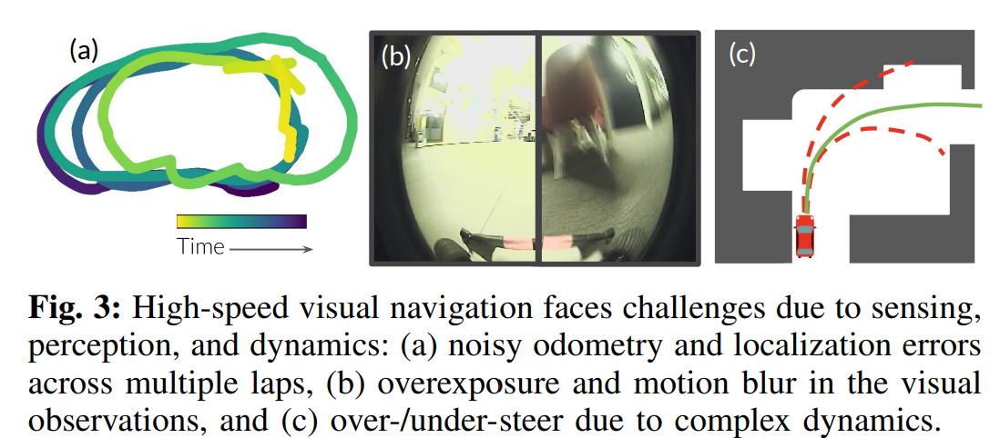
    
 

    - Onboard state estimates can be highly inaccurate due to poor localization via noisy GPS measurements
    - Generating a high-fidelity map can be difficult or impossible
    - Complex hynamics

  - **Why DL?** Learning-based methods offer a particularly appealing way to approach such challenges (challenges in high-speed control), as they can directly learn the relationship between perception and vehicle dynamics and in principle capture high-performance driving behaviors. 
  - **Methods:** 
    - First use offline data to train the DL model to learn a useful representation of visual observations that captures driving-related features, such as free space and obstacles;
    - Second train the DL model online to the target domain.
  - **Problem Formulation**:
    - The robot needs to reach a sequence of position checkpoints $\{c_i\}$
    - Frame the robot control task as a MDP:
      - State: $s=\left(V, v, \omega, \alpha, g, a_{\text {prev }}\right)$
        - $V$ is a stacked sequence of the last 3 RGB images.
        - $v, \omega, \alpha$ denote the linear velocity, angular velocity, and linear acceleration.
        - $g$ is the goal, providing as a relative vector to the next checkpoint
        - $\alpha_{prev}$ is the previous action. 
      - Action: motor velocity targets including throttle and steering actions
      - State transition dynaics: unknown $p$
      - Reward: $r$
    - The robot must recover itself without any human interventions
  - **Method Overview**:
    

    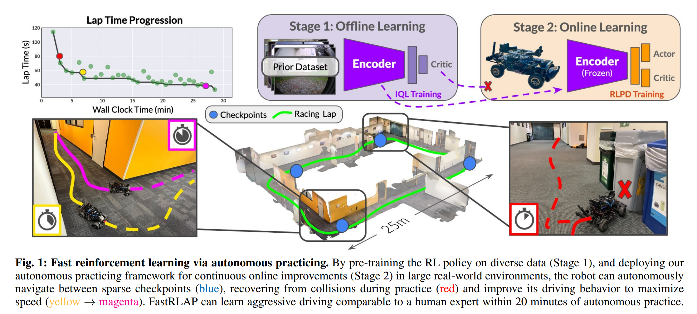
    
 
    
    - **Three components**:
      - A simple high-level finite state machine (FSM) for autonomous practicing (blue dot). The robot automatically returns to the blue dot to recover from collisions. 
      - The online RL policy (orange) is trained online in the real-world to reach goals commanded by the FSM, and continually improves to learn aggressive driving maneuvers. 
      - The Encoder to extract features from images is obtained from offline training (shown in purple).

      

      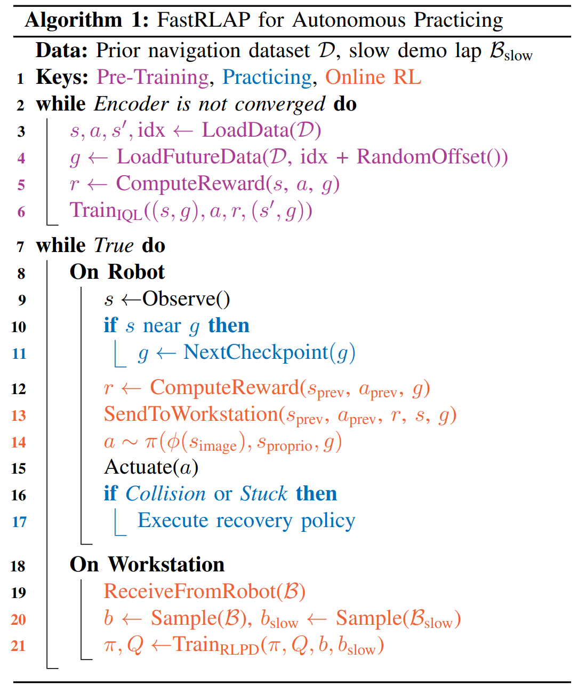
      
 

      - **Online RL Training (Orange)**: 
        - The objective of low-level policy $\pi$ is to reach the goal checkpints in the minimum possible time without colliding or getting stuck. 
        - Design a reward to penalize getting stuck.
        - Use off-policy RL to update its learned behavior: the system learn from interactions with the environment in practice laps, using a batch of new interaction sto update its learned behavior. 
        - Training policy is RLPD, a data-efficient off-policy RL algorithm that trains an ensemble of critics to avoid catastrophic overestimation. 
        

        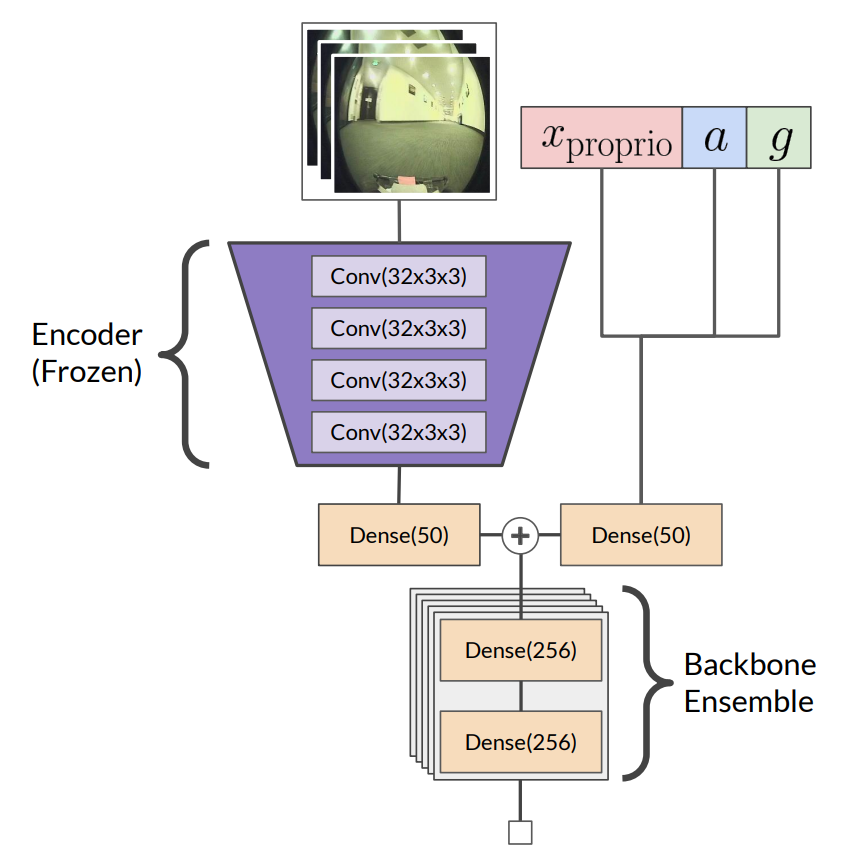
        

         
        - The inference of the trained policy is at 10Hz. 
      - **Representation Learning with Offline RL (Purple)**:
        - Pre-train an encoder to process visual observation to calculate a critic value.
        - This encoder is trained with Implicit Q-learning on a prior dataset.
        - Once the training is completed, this encoder is frozen.  
  - **Deployment**: 
      

      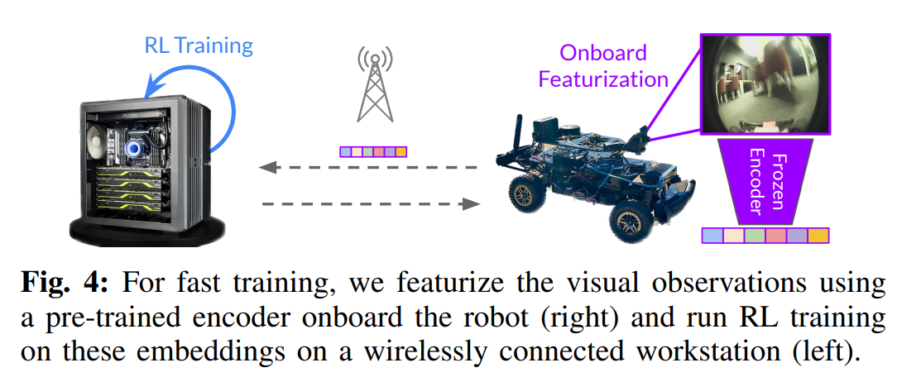
      

      - **Sensing:** 
        - PCB camera with 128 x 128 RGB images
        - Indoor localization: IMU and T265 tracking camera
        - Outdoor localization: GPS and EKF to estimate heading
        - Compute: NVIDIA Jetson Xavier NX (WIFI connect with ground station)
        - Detecting Blocked States: detect collisions via lateral acceleration. detect "stuck" using moving distance.  

  

