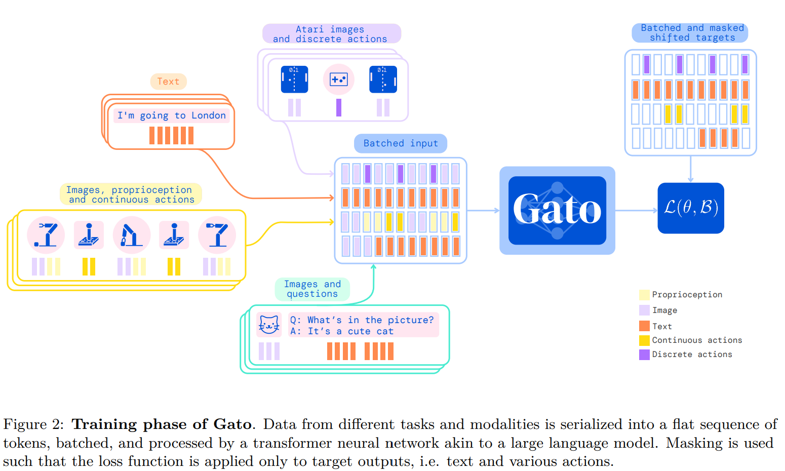
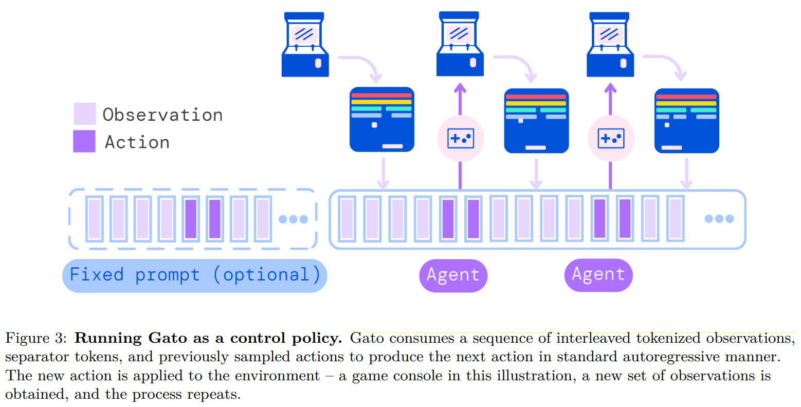

- **A Generalist Agent** **[`arXiv 2022`]** *Scott Reed, et al.* [(arXiv)](http://arxiv.org/abs/2205.06175) [(pdf)](./A%20Generalist%20Agent.pdf) (Citation: 611)
  - Gato is a multi-modal, multi-task, multi-embodiment generalist policy
  
  

  
  

  - **Tokenization**:
    - Text is encoded via SentencePiece with 32L subwords into the integer range [0, 32000]
    - Images are first transformed into sequences of non-overlapping 16X16 patches in raster order (ViT). Each pixel in the image patches is then normalized between [-1, 1].
    - Discrete values are flattened into sequences of integers in row-major order. The tokenized result is a sequence of integers within the range of [0,1024].
    - Continuous values are first flattened into sequences of floating point values in row-major order. The values are mu-law encoded to the range [-1, 1] if not already there, then discretized to 1024 uniform bins.

  

  
  

  - **Convert tokens into embeddings (Transformer Input)**
    - Tokens belonging to text, discrete- or continuous-valued observations or actions for any time-step are embedded via a lookup table into a learned vector embedding space. 
    - Tokens belonging to image patches are embedded using a single ResNet block to obtain a vector per patch.

