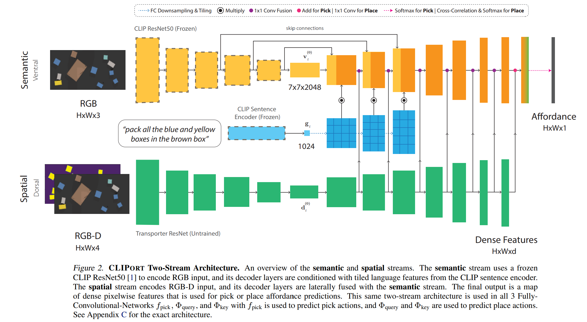

- **CLIPort What and Where Pathways for Robotic Manipulation**
 **[`arXiv 2021`]** *Mohit Shridhar, Lucas Manuelli, Dieter Fox* [(arXiv)](http://arxiv.org/abs/2109.12098) [(pdf)](./../CLIPort%20-%20What%20and%20Where%20Pathways%20for%20Robotic%20Manipulation.pdf) (Citation: 432)

    - Present a **CLIPort**, a language-conditioned imitation learning agent that combines the broad *semantic* understanding (*what*) of **CLIP** with the *spatial* precision (*where*) of **Transport**.
    - CLIPort Agent:
      - **Goal**: Learning a goal-conditioned policy $\pi$ that outputs actions $a_t$ given input $\gamma_t=(o_t,l_t)$ consisting of a viusal observation $o_t$ and an English language instruction $l_t$:
        - $\pi(\gamma_t) \rightarrow a_t$
        - The action $a$ specify the end-effector pose for picking and placing.  
        - Visual Observation: $o$ is a top-down image of the scene
        - Language instruction $l_t$: 
          - Either step-by-step instructions: "pack the scissors" -> "pack the purple tape" -> etc.
          - Single Goal Description for the who task: "pack all the blue and yellow boxes in the brown box"
      - **The training dataset**:
        - The dataset contains $n$ expert demonstrations with associated discrete-time input-action pairs ($o$, $l$, $a$), where $a$ is generated by the **expert demonstrations**.
      - **Transporter for Pick-and-Place**:
        - The policy $\pi$ is trained with Transporter to perform **spatial** **manipulation**.
        - The model first attends to a local region to decide *where to pick* and then *computes a placement location* by finding the best match through cross-correlation of deep visual features. 
        - This is done by computing two Q-functions: 
          - The pick function decides where to pick
          - The place function decides where to place
          - These functions are FNNs
      - **Two-Stream Architecture in CLIPort**
        - The CLIPort extend the network architecture of all FNNs in Transporter to allow for language input and reasoning about high-level semantic concepts. 
        - **Spatial**: ResNet (input: RGB-D; output: dense features)
        - **Semantic**: pre-trained CLIP ResNet50 (input: RGB; output: dense features)
        - **Language**: CLIP's encoder 

    

    
    
  