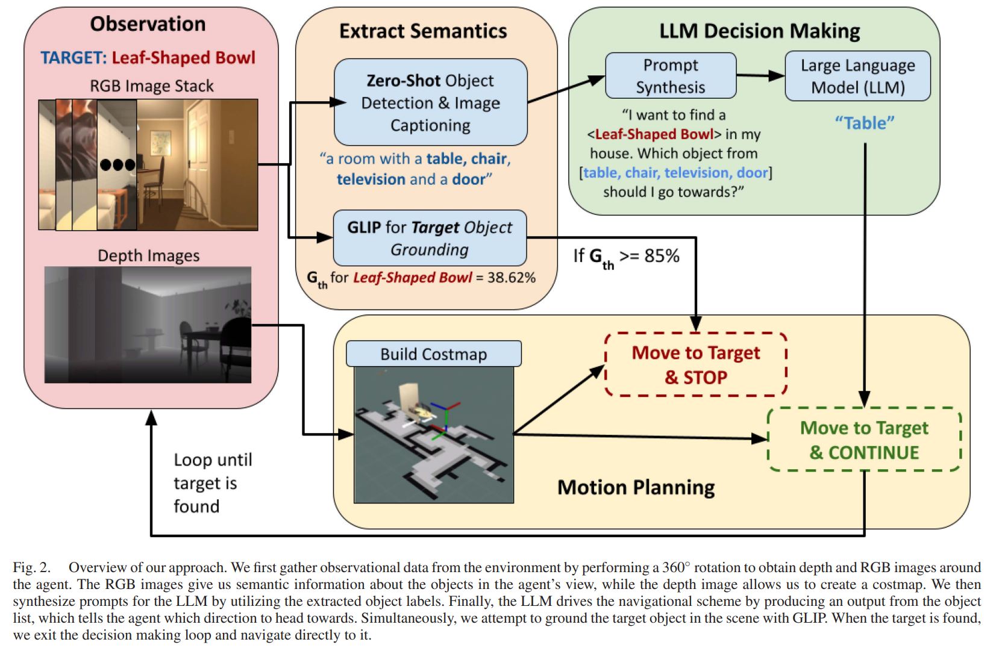

- **Can an Embodied Agent Find Your “Cat-shaped Mug”? LLM-Based Zero-Shot Object Navigation**
 **[`IEEE RAL 2023`]** *Dorbala, Vishnu Sashank and Mullen Jr, James F and Manocha, Dinesh* [(IEEE)](https://ieeexplore.ieee.org/abstract/document/10373065) [(pdf)](./../Can_an_Embodied_Agent_Find_Your_Cat-shaped_Mug_LLM-Based_Zero-Shot_Object_Navigation.pdf)
 

 

   * **Vision-based navigation using LLM**
     * **Input**: 
       * Target Object in textual description
       * RGB observation
       * Depth observation
     * **Output**:
       * Robot actions that guide the robot moving to the target.
   * **Data flow**:
     * In each run, the agent rotate in place 360 degrees to gather RGB and depth images in a set resolution of $r$. 
     * **Object detection from RGB Images**: 
       * **YOLO** to detect common household classesv to give a list of objects $O$.
       * **BLIP** to generate caption on detected objects, denoted as $C$.
       * Choose either YOLO or BLIP 
     * **Costmap from Depth Camera**:
       * RTABMAP to generate the costmap from the ``costmap_2d`` ROS package.
     * **GLIP for target object grounding**:
       * To check whether the detected object is the target object. 
       * If the target object is in the current scene, a STOP signal will be triggered. 
  
      

  