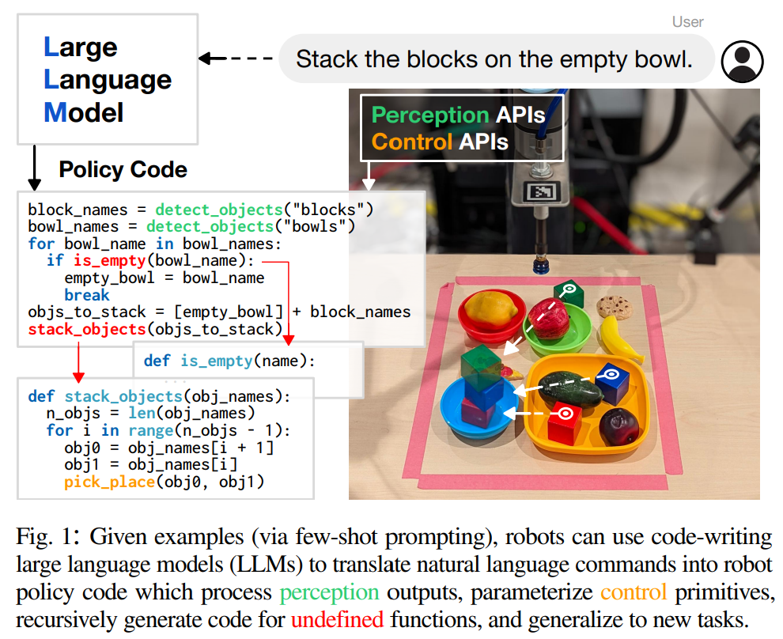
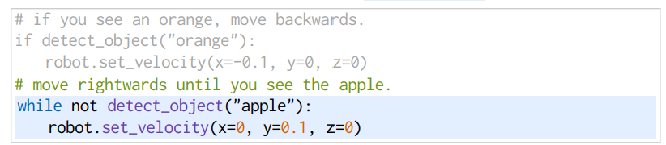

- **Code as Policies Language Model Programs for Embodied Control**
 **[`arXiv 2022`]** *Jacky Liang, Wenlong Huang, Fei Xia, Peng Xu, Karol Hausman, Brian Ichter, Pete Florence, Andy Zeng* [(arXiv)](http://arxiv.org/abs/2209.07753) [(pdf)](./../Code%20as%20Policies%20Language%20Model%20Programs%20for%20Embodied%20Control.pdf) (Citation: 300)

  

  
  

  - **Objective**:
    - The goal is to generate robot policy code from natural language commands
    - LLMs, which have been previously used for synthesizing simple Python programs from docstrings, are repurposed for this purpose.

  - **How It Works:**
    - Given **example language commands** (formatted as comments) followed by corresponding policy code, LLMs autonomously re-compose API calls to generate new policy code.
    - LLMs chain classic logic structures and reference third-party libraries (e.g., NumPy, Shapely) to perform arithmetic.
    

    - **Language Model Programs (LMP)**: react to perceptual inputs; parameterize control primitive APIs; directly complied and executed on a robot. 

  - **The resulting robot policies:**
    - Exhibit spatial-geometric reasoning.
    - Generalize to new instructions.
    - Precisely prescribe values (e.g., velocities) based on context (i.e., behavioral commonsense).
  - **Key Contributions:**
    - Hierarchical code-gen: Recursively defining undefined functions allows LLMs to write more complex code.
    - Improved state-of-the-art performance on the HumanEval benchmark by solving 39.8% of problems.