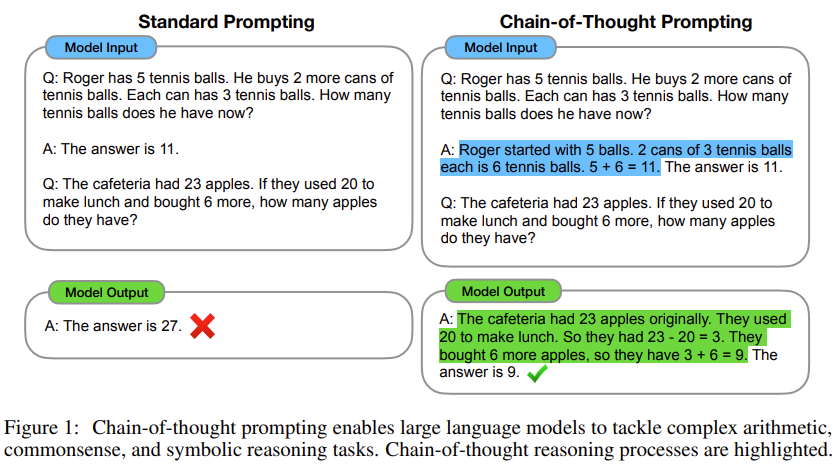

- **Chain-of-Thought Prompting Elicits Reasoning in Large Language Models**
 **[`arXiv 2022`]** *Jason Wei, Xuezhi Wang, Dale Schuurmans, Maarten Bosma, Brian Ichter, Fei Xia, Ed Chi, Quoc Le, Denny Zhou* [(arXiv)](http://arxiv.org/abs/2201.11903) [(pdf)](./../chain-of-thought.pdf) (Citation: 1241)
  - Generate a **chain of thought**, i.e., a series of intermediate reasoning steps, to significantly improve the ability of large language models to perform complex reasoning.
  
  - Decompose the problem into intermediate steps and solve each before giving the final answer.
  - In the above fiture, the blue highlighted answer is also model input, which teaches the model to think step by step.
