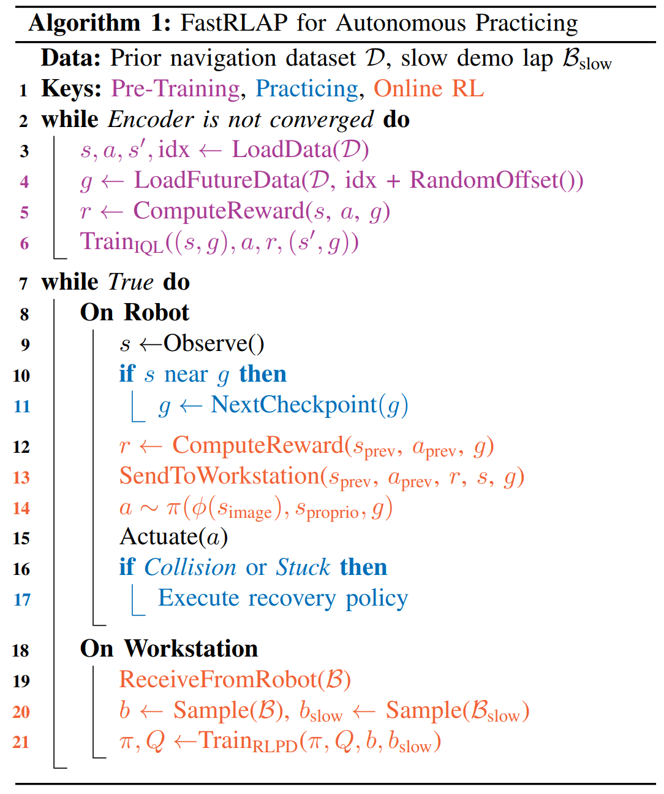
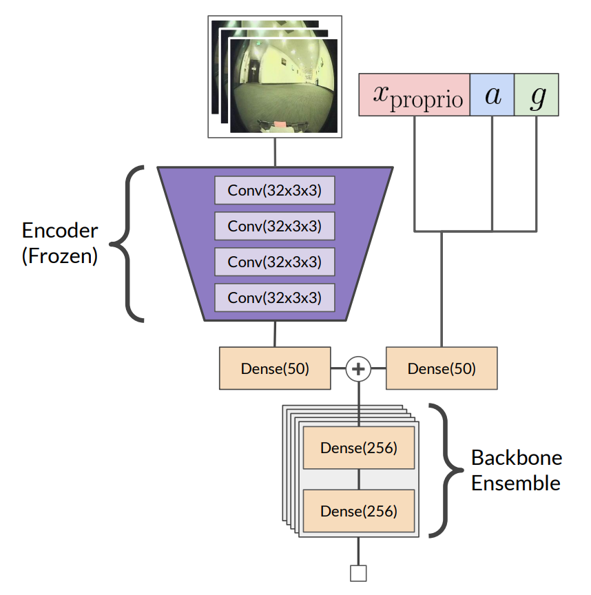
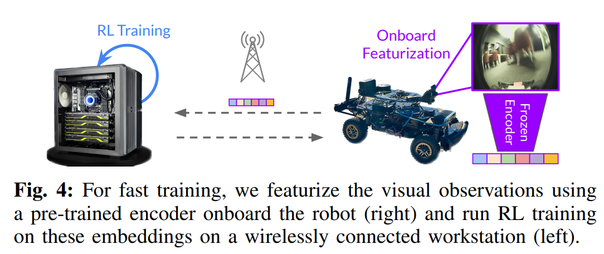

- **FastRLAP A System for Learning High-Speed Driving via Deep RL and
  Autonomous Practicing**
 **[`arXiv 2023`]** *Kyle Stachowicz, Dhruv Shah, Arjun Bhorkar, Ilya Kostrikov, Sergey Levine* [(arXiv)](http://arxiv.org/abs/2304.09831) [(pdf)](./../FastRLAP%20-%20A%20System%20for%20Learning%20High-Speed%20Driving%20via%20Deep%20RL%20and%20Autonomous%20Practicing.pdf) (Citation: 3)
  - **Objective**: Design a deep learning model to control a RC car to drive aggressively from visual observations using reinforcement learning.
  - **Challenges in high-speed vision-based navigation**:
    

    
    
 

    - Onboard state estimates can be highly inaccurate due to poor localization via noisy GPS measurements
    - Generating a high-fidelity map can be difficult or impossible
    - Complex hynamics

  - **Why DL?** Learning-based methods offer a particularly appealing way to approach such challenges (challenges in high-speed control), as they can directly learn the relationship between perception and vehicle dynamics and in principle capture high-performance driving behaviors. 
  - **Methods:** 
    - First use offline data to train the DL model to learn a useful representation of visual observations that captures driving-related features, such as free space and obstacles;
    - Second train the DL model online to the target domain.
  - **Problem Formulation**:
    - The robot needs to reach a sequence of position checkpoints $\{c_i\}$
    - Frame the robot control task as a MDP:
      - State: $s=\left(V, v, \omega, \alpha, g, a_{\text {prev }}\right)$
        - $V$ is a stacked sequence of the last 3 RGB images.
        - $v, \omega, \alpha$ denote the linear velocity, angular velocity, and linear acceleration.
        - $g$ is the goal, providing as a relative vector to the next checkpoint
        - $\alpha_{prev}$ is the previous action. 
      - Action: motor velocity targets including throttle and steering actions
      - State transition dynaics: unknown $p$
      - Reward: $r$
    - The robot must recover itself without any human interventions
  - **Method Overview**:
    

    
    
 
    
    - **Three components**:
      - A simple high-level finite state machine (FSM) for autonomous practicing (blue dot). The robot automatically returns to the blue dot to recover from collisions. 
      - The online RL policy (orange) is trained online in the real-world to reach goals commanded by the FSM, and continually improves to learn aggressive driving maneuvers. 
      - The Encoder to extract features from images is obtained from offline training (shown in purple).

      

      
      
 

      - **Online RL Training (Orange)**: 
        - The objective of low-level policy $\pi$ is to reach the goal checkpints in the minimum possible time without colliding or getting stuck. 
        - Design a reward to penalize getting stuck.
        - Use off-policy RL to update its learned behavior: the system learn from interactions with the environment in practice laps, using a batch of new interaction sto update its learned behavior. 
        - Training policy is RLPD, a data-efficient off-policy RL algorithm that trains an ensemble of critics to avoid catastrophic overestimation. 
        

        
        

         
        - The inference of the trained policy is at 10Hz. 
      - **Representation Learning with Offline RL (Purple)**:
        - Pre-train an encoder to process visual observation to calculate a critic value.
        - This encoder is trained with Implicit Q-learning on a prior dataset.
        - Once the training is completed, this encoder is frozen.  
  - **Deployment**: 
      

      
      

      - **Sensing:** 
        - PCB camera with 128 x 128 RGB images
        - Indoor localization: IMU and T265 tracking camera
        - Outdoor localization: GPS and EKF to estimate heading
        - Compute: NVIDIA Jetson Xavier NX (WIFI connect with ground station)
        - Detecting Blocked States: detect collisions via lateral acceleration. detect "stuck" using moving distance.  