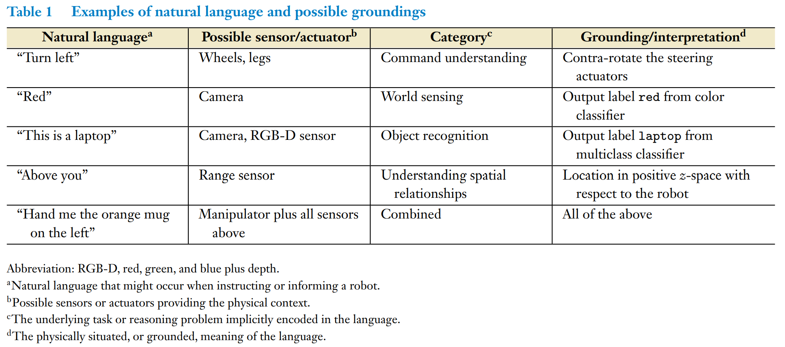

- **Grounding**:
  - Grounded language has meaning in the context of the physical world - for example, by describing the environment, physical actions, or relationships between things. 
  - Grounded language acquisition is the process of learning these connections between percepts and actions. 
    - For example, if a person instructs a robot to pick up a cup, the robot must map the world "cup" to a particular set of percepts in its high-dimensional sensor space (e.g., camera obseravtion). 

  

  
  

