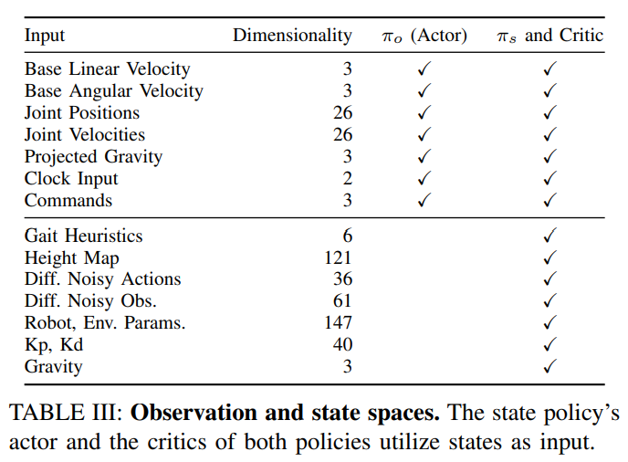

- **Learning Humanoid Locomotion with Transformers**
 **[`arXiv 2023`]** *Ilija Radosavovic, Tete Xiao, Bike Zhang, Trevor Darrell, Jitendra Malik, Koushil Sreenath* [(arXiv)](http://arxiv.org/abs/2303.03381) [(pdf)](./../Learning%20Humanoid%20Locomotion%20with%20Transformers.pdf) (Citation: 6)
  - **Use a causal transformer model to control a humanoid locomotion**.
    - **Input**: robot history observations and actions 
      - Use **MLP** as tokenizer to token observation and action spaces. 
    - **Output**: robot actions (generate autoregressively)
      - Use **MLP** as detokenizer to generate actions. 
    - **Hypothesize**: The history of observations and actions implicitly encodes the information about the world that a powerful Transformer model can use to adapt its behavior dynamically at test time. 
  
  - **Model the control problem as a POMDP:**
    - Noisy observations
    - Observation space
    - 

  - **Why use learning-based methods?**
    - Leaning-based methods have become of increasing interest due to their ability to learn from diverse simulations or real environments.
  - **Training Method:**
    - The Transformer-based controller is trained with online RL (in simulation) without offline dataset.
      - First train a state policy $\pi_s(a_t | s_t)$ based on MDP using simulation
      - Second, distill learned state policy through KL divergence  
    - The loss function consists of both RL loss and a KL divergence between the policys obtained from true states $\pi_s$ and observations $\pi_o$.
        $L\left(\pi_o\right)=L_{R L}\left(\pi_o\right)+\lambda D_{K L}\left(\pi_o \| \pi_s\right)$
  - **Implementation**:
    - Simulation Env: Issac Gym (use **domain radnomization** to reduce sim-to-real gap)
    - RL Training Algorithm: PPO
    - Transformer Model: 1.6 M parameters (decoder only)
