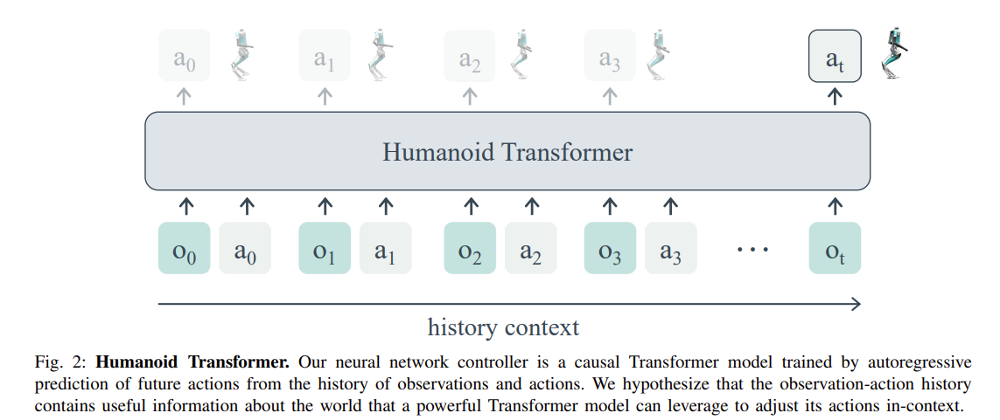

- **Learning Humanoid Locomotion with Transformers**
 **[`arXiv 2023`]** *Ilija Radosavovic, Tete Xiao, Bike Zhang, Trevor Darrell, Jitendra Malik, Koushil Sreenath* [(arXiv)](http://arxiv.org/abs/2303.03381) [(pdf)](./Learning%20Humanoid%20Locomotion%20with%20Transformers.pdf) (Citation: 6)
  - Use a causal transformer model to control a humanoid locomotion.
    - Input: robot history observations and actions
    - Output: robot actions
    - The history of observations and actions implicitly encodes the information about the world that a powerful Transformer model can use to adapt its behavior dynamically at test time. 
  
  - Why use learning-based methods?
    - Leaning-based methods have become of increasing interest due to their ability to learn from diverse simulations or real environments.
  - The Transformer-based controller is trained with online RL (in simulation) without offline dataset.
    - The loss function consists of both RL loss and a KL divergence between the policys obtained from true states $\pi_s$ and observations $\pi_o$.