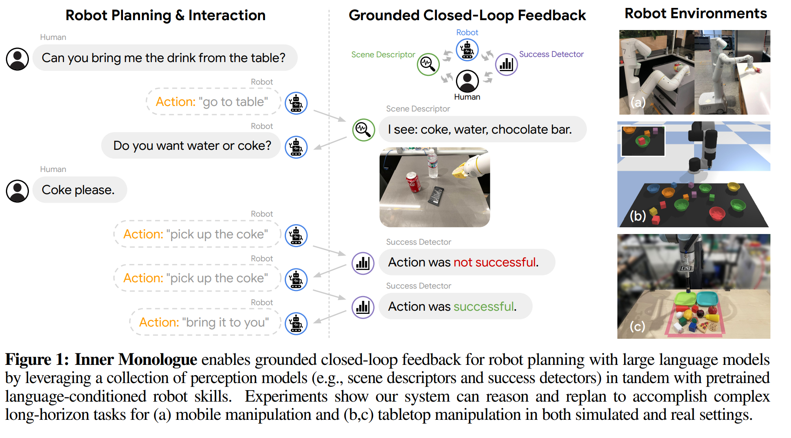
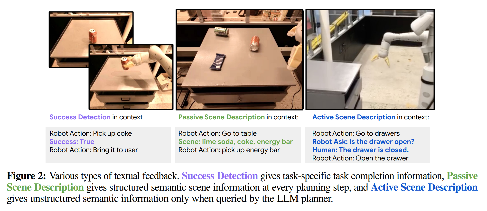
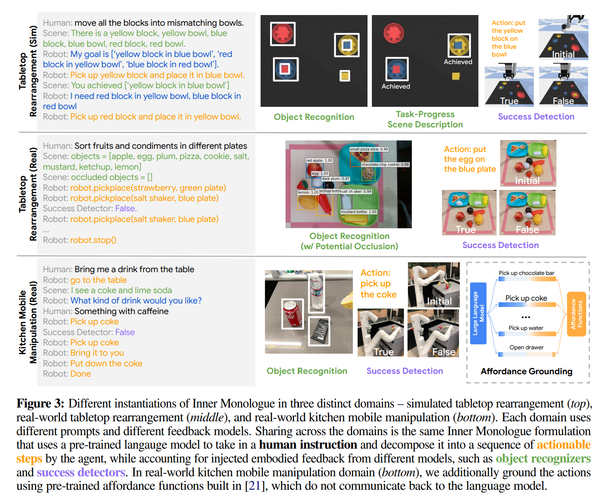

- **Inner Monologue Embodied Reasoning through Planning with Language
  Models**
 **[`arXiv 2022`]** *Wenlong Huang, Fei Xia, Ted Xiao, Harris Chan, Jacky Liang, Pete Florence, Andy Zeng, Jonathan Tompson, Igor Mordatch, Yevgen Chebotar, Pierre Sermanet, Noah Brown, Tomas Jackson, Linda Luu, Sergey Levine, Karol Hausman, Brian Ichter* [(arXiv)](http://arxiv.org/abs/2207.05608) [(pdf)](./../Inner%20Monologue%20Embodied%20Reasoning%20through%20Planning%20with%20Language.pdf) [(Notes)](./ARI_Notes/inner_monologue.md) (Citation: 456)

    - By leveraging environmetn feedback, LLMs can form an **inner monologue** that allows them to more richly process and plan in robotic control scenarios. 

  

  
  

    - Closed Agent-Environment Loop
      - Combine multiple perception models
      - To execute the commands from a user, the actions are chosen from a set of pre-trained robotic manipulation skills, together with feedback provided by a human user. 
    - **Problem Statement**:
      - The embodied agent attempts to perform a high-level natural language instruction $i$. 
      - This robotic agent is only capable fo executing short-horizon skills $\pi_k \in \Pi$ with short language description $l_k$.
      - LLM needs to find a sequenece of skills to accomplish the instruction. 
        - LLM has access to textual feedback $o$ from the environment
        - $o$ may be success detection, object detection, scene description, visual-question answering, or even human feedback. 
      - The study objective is to investigate to what extent the LLM is able to reason over and utilize such feedback to "close the loop" with the environment and improve planning.
    - **Inner Monologue**
      - Inner monologue refers to continually injecting information from various sources of feedback into the LLM planning language prompts as the robot interacts with the environment. 
    - **Source of Feedback**
      - Any type of environment feedback (as long as it can be expressed as language) can inform the LLM planner. 

    

    
    

    - **Examples:**
      - **LLM**: InstructGPT
      - **Low-level Policies**: CLIP-based Transporter Net as the pick-and-place primitive.
      - **Environment Feedback**:
        - Object Recognition: ViLD and MDETER
          - MDETER: an open-vocabulary object detection model
            - It takes RGN image with an image caption as input
            - The model tries to identify the objects described in the caption. 
        - Success Detection: Euclidean Distance < 4 cm from the place object

    

    
    

