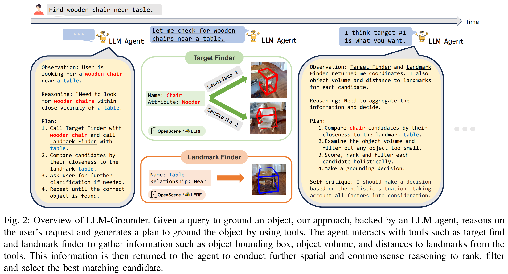

- **LLM-Grounder Open-Vocabulary 3D Visual Grounding with Large Language
  Model as an Agent**
 **[`arXiv 2023`]** *Jianing Yang, Xuweiyi Chen, Shengyi Qian, Nikhil Madaan, Madhavan Iyengar, David F. Fouhey, Joyce Chai* [(arXiv)](http://arxiv.org/abs/2309.12311) [(pdf)](./../LLM-Grounder%20-%20Open-Vocabulary%203D%20Visual%20Grounding%20with%20Large%20Language%20Model%20as%20an%20Agent.pdf)[(Notes)](./ARI_Notes/rrex-bot.md) (Citation: 8)
  -  **Objective**: Focus on 3D visual object grounding. Let the robot to understand 3D objects.
     - **LLM-Grounder**: LLM-based 3D visual grounding pipeline. 
       - Use LLM to decompose complex natural language queries into semantic constitutents and employs a visual grounding tool to identify objects in a 3D scene. 
       - Then LLM evaluates the spatial and commonsense relations among the proposed objects to make a final grounding decision.

  - **Traditional 3D Object Grounding**:
    - 3D-and-text end-to-end neural architecture (need a large amount of 3D-text pairs for training data. Do not obtain good performance on new scenes).
    - CLIP-based open-vocabulary 3D visual grounding (**bag-of-words behaviors**, object relations are ignored).  

    

    
    

  

  - **Three Steps**:
    - **Step 1:** Break down complex text into sub-tasks that can be better handled by downstream tools like a CLIP-based 3D visual grounder (e.g., OpenScene).
      - First ask the LLM to **describe its observation**
      - Second ask the LLM to **reason the observation**
      - Finally ask the LLM to **generate a plan**
    - **Step 2:** Use such tools to solve sub-tasks it proposes.
      - Target finder (LERF) and landmark finder (OpenScene)
    - **Step 3:** Reason on feedback from the environment by incorporating spatial understanding and common sense to make grounding decisions. 
  
  - **Implementation**:
    - **Training Data**: ScanRefer
    - **LLM**: GPT-3 and GPT-4

    

    
    

  - **Limitations**:
    - Cost: use GPT-based models as core reasoning agent can be computationally expensive. 
    - Latency: the reasoning process, due to the inherent latency of GPT models, can be slow. 