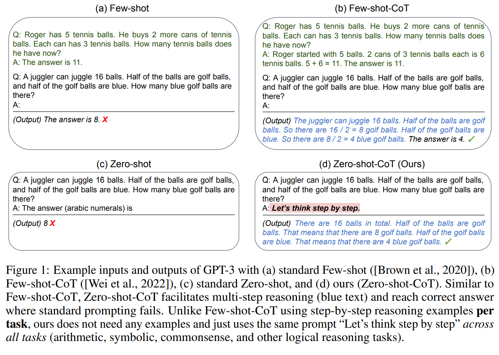
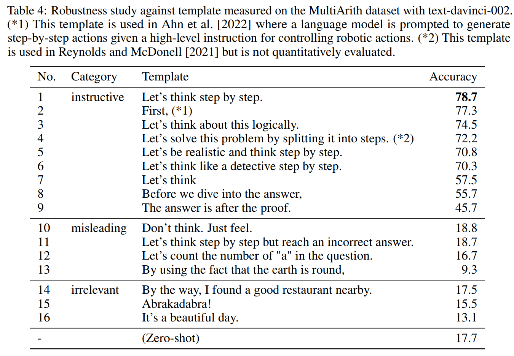
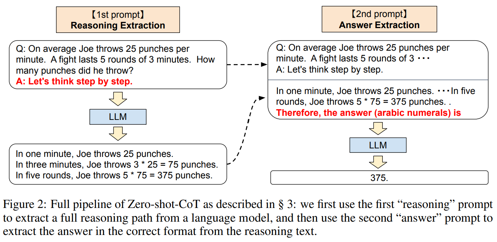

- **Large Language Models are Zero-Shot Reasoners**
 **[`NeurIPS 2022`]** *Takeshi Kojima, Shixiang Shane Gu, Machel Reid, Yutaka Matsuo, Yusuke Iwasawa* [(arXiv)](http://arxiv.org/abs/2205.11916) [(pdf)](./../Large%20Language%20Models%20are%20Zero-Shot%20Reasoners.pdf) [(Notes)](./ARI_Notes/llm_zeroshot.md) (Citation: 1483)
  - Simply add "Let's think step by step" before each answer can achieve few-shot learning. 

  

  
  

  - **The pipeline of Zero-shot-CoT**: 
    - **Stage 1**: Reasoning Extraction
      - Template: ``Q: [x]. A:[T]``, where ``[x]`` is an input slot for question and ``[T]`` is an slot for hand-crafted **trigger sentence** that would extract chain of though to answer the question ``x``. For instance, ``[T]`` could be ``Let's think step by step``. Other possible triggering questions are: 
  
    

    
    

      - Prompted text ``[x']``=`[x A]` is then fed into a language model and generate subsequent sentence ``z``.  

    

    
    

    - **Stage 2**: Answer Extraction
      - Use generated sentence ``z`` along with prompted sentence ``x'`` to extract the final answer from the language model. 
      - Simply concatenate three elements as ``[x' z A]``: ``x'`` for 1st prompt, ``z`` is generated at the first step, ``A`` is the trigger sentence to extract answer. For example, ``A`` can be ``Therefore, the answer (arabic numerals) is``.  