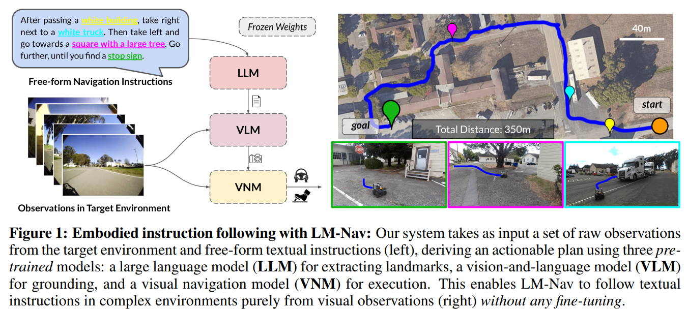
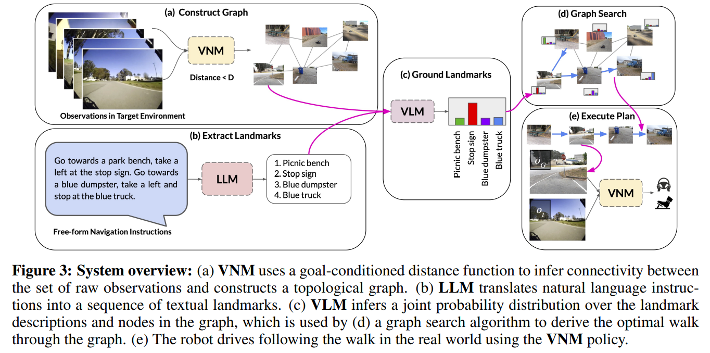

- **LM-Nav Robotic Navigation with Large Pre-Trained Models of Language
  Vision and Action**
 **[`arXiv 2022`]** *Dhruv Shah, Blazej Osinski, Brian Ichter, Sergey Levine* [(arXiv)](http://arxiv.org/abs/2207.04429) [(pdf)](./../LM-Nav%20-%20Robotic%20Navigation%20with%20Large%20Pre-Trained%20Models%20of%20Language,%20Vision,%20and%20Action.pdf) [(Notes)](./ARI_Notes/lm-nav.md) (Citation: 160)
  - **Objective**: 
    - Enable a self-supervised system for robotic navigation to execute natural language instructions by leveraging the capabilities of pre-trained models without any user-annotated navigational data. 
    - This method uses LLMs to construct an interface that humans can use to communicate desired tasks to robots. 
    - This system enjoys the impressive generalization capabilities of the pre-trained language and vision-language models, enabling the robotic system to accept complex high-level instructions. 
  - **Method Overview**:
    

    
    

    - Use a visual navigation model (**VNM: ViNG**) to create a topological mental map of the environment using robot's observations. 
      - This **VNM** predicts temporal distances between pairs of images and the corresponding actions to execute, providing an interface between images and embodiment.
      - This **VNM** serves two purposes:
        - Given a set of observations in the target environment, the distance predictions from the **VNM** can be used to construct a **topological graph**. 
        - Given a "walk", comprising of a sequence of connected subgoals to a goal node, the **VNM** can navigate the robot along this plan.
    - Given free-form textual instructions, we use a pre-trained **LLM (GPT-3)** to decode the instructions into a sequence of textual landmarks. 
    - Use a vision-language model (**VLM: CLIP**) for grounding these textual landmarks into the topolical map, by inferring a joint likelihood over the landmarks and nodes. 
    - A novel search algorithm is then used to maximize a probabilistic objective, and find a plan for the robot, which is then executed by **VNM**.

    

    
    
 

    - The **LLM** parses instructiosn into a list of landmarks $\bar{\ell}$
    - The **VLM** associates these landmarks with nodes in teh graph by estimating the probability that each node $\bar{v}$ corresponds to each $\bar{\ell}$, i.e., $P(\bar{v}|\bar{\ell})$
    - The **VNM** is then used to infer how effectively the robot can navigate between each pair of nodes in the graph, which we convert into a probability $P\left(\overline{v_i, v_j}\right)$ derived from the estimated temporal distances. 
  - **Detailed Implementation:**
    - Given a sequence of landmark $\bar{\ell}=\ell_1, \ell_2, ..., \ell_n$ extracted by the LLM, determine a sequence of waypoints $v_1, v_2, ..., v_k$ to command the robot. 
    - This can be framed as a probabilistic inference problem: 
      - To determine $p(v_i|\ell_j)$, a distribution over images given a language description (**CLIP**).
      - To determine $p\left(\overline{v_i, v_j}\right)$ that describe how likely is the robot to be able to reach $v_{i+1}$ from $v_i$ (**VNM**). 
