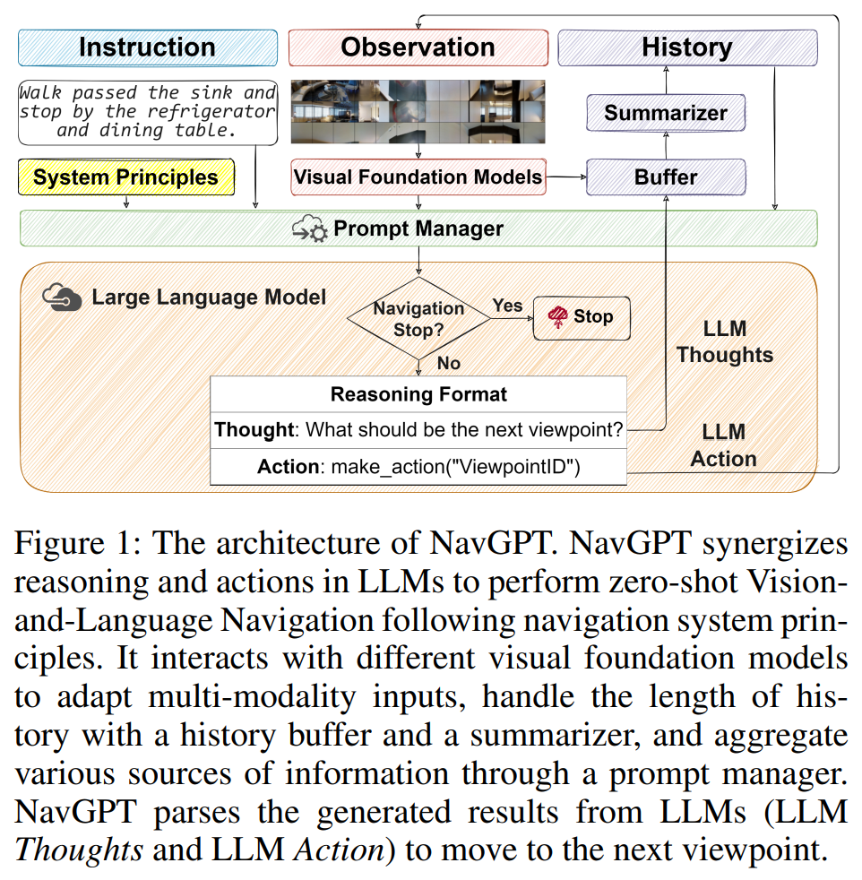
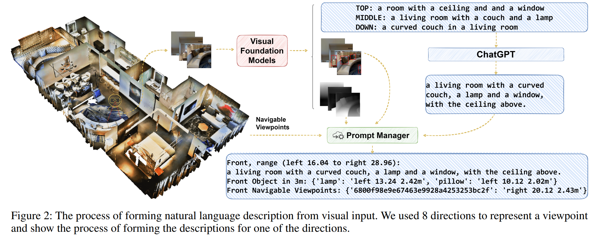

 - **NavGPT Explicit Reasoning in Vision-and-Language Navigation with Large
  Language Models**
 **[`AAAI 2023`]** *Gengze Zhou, Yicong Hong, Qi Wu* [(arXiv)](http://arxiv.org/abs/2305.16986) [(pdf)](./../NavGPT%20-%20Explicit%20Reasoning%20in%20Vision-and-Language%20Navigation%20with%20Large%20Language%20Models.pdf) (Citation: 40)

    

    
    
 

    * **NavGPT**: a purely LLM-based instruction-following navigation agent. 
      * At each step, NavGPT takes the textual descriptions of visual observations, navigation history, and future explorable directions as inputs to reason the agent's current status, and makes decisions to approach the target. 
      * **System** **Principle**: 
        * It formulates the behavior of LLM as a VLN (Vision-and-Language Navigation) agent. It clearly defines the VLN task and the basic reasoning format and rules for NavGPT at each navigation step.
        * For example, NavGPT should move along the static viewpoints (positions) of pre-defined graph of the environment by identifying the unique viewpoint ID. 
      * **Visual Foundation Models**:  
        * NavGPT as an LLM agent requires visual perception and expression ability from VFMs (visual foundation models) to translate the current environment's visual observation into natural language description. 
        * VFM plays the role of **translator**, to translate the current environment's visual observations using their own language, e.g., natural language, objects' bounding boxes, and objects' depth. 
      * **Navigation History**:
        * For NavGPT to ***evaluate the progress of the completion of the instruction***, to update the current state, and make following decisions. 
        * The history is composed of summarized descriptions of previous observations and actions, along with the reasoning thoughts from LLM. 
      * **Prompt Manager**: 
        * Collects the results from different components and parses them into a single prompt for LLM to make navigation decisions. 
    * **Visual Perceptron for NavGPT**
      * Treat visual signals as a foreign language and handle the visual input using different visual foundation models to translate them into natural language.
      

      
      

      *  For an agent standing at any viewpoint, collect 8 direction observations around the agent (360 degrees with 45 degree interval). Besides, for each direction, turn the elevation angle 30 degree above the horizon to 30 degree below, 3 levels in total. As a result, we obtain 3 x 8 = 24 views for each viewpoint. 
      *  Image-to-Text Generation -> BLIP-2
      *  Besides BLIP-2, we also excavate the lower-level feature extracted by Fast-RCNN to generate class of objects and corresponding bounding boxes. 