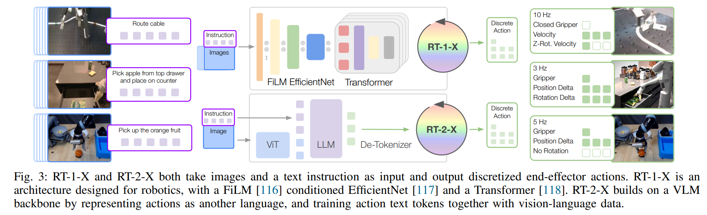

- **Open X-Embodiment Robotic Learning Datasets and RT-X Models**
 **[`arXiv 2023`]** *Open X-Embodiment Collaboration* [(arXiv)](http://arxiv.org/abs/2310.08864) [(pdf)](./../Open%20X-Embodiment%20Robotic%20Learning%20Datasets%20and%20RT-X%20Models.pdf) (Citation: 39)
  - **Objective:** 
    - Can we train generalist X-robot policy that can adapted efficiently to new robots, tasks, and environments? 
    - Provide datasets in standaraized data formats and models to make it possible to explore this possibility in robotic manipulation.
    - Assemble the dataset from 22 different robots through 22 institutions, demonstrating 527 skills. 
    - Train a high-capacity model trained on this data, showing positive transfer and improves the capabilities of multiple robots.  
  - **Challenges in robotic generalist:**
    - Computer vision and NLP can leverage large datasets sourced from the web, the large and broad datasets for robotic interaction are hard to acquire.
  - **X-embodiment Training:**
    - **A collection of training data** from multiple robotic embodiments. 
    - The open x-embodiment dataset:
      - Contains 1M+ real robot trajectories spanning 22 robot embodiments
      - Uses the RLDS (Reinforcement learning dataset) data format 
    - **RT-X Design**:
      - Input: the model receives a history of recent images and language instructions as observations
      - Output: predicts a 7-dim action vector controlling the end-effector. 
      
      

      
      

  
      - **RT-1**: 
        - Inputs: 15 history images + instruction as input
        - Images are processed via an ImageNet-pretrained EfficientNet
        - Instruction is transformed into a USE (universal sentence encoder) embedding. The visual and language representations are then interwoven via FiLM layers to produce 81 vision-language tokens.
        - Output: Tokenized actions generated via a decoder-only Transformer
      - **RT-2**:
        - Casts the tokenized actions to text tokens, e.g., a possible action may be "1 128 91 241". As such any pretrained vision-language model (VLM) can be finetuned for robotic control, leveraging the backbone of VLMs and transferring some of their generalization properties. 