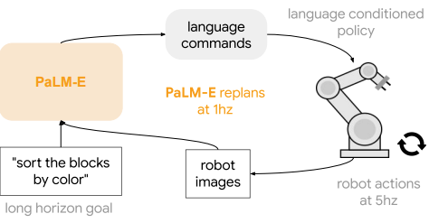

- **PaLM-E An Embodied Multimodal Language Model**
 **[`arXiv 2023`]** *Danny Driess, Fei Xia, et al.* [(arXiv)](http://arxiv.org/abs/2303.03378) [(pdf)](./palm-e.pdf) (Citation: 194)
 
  - **An Embodied Model with Multimodal Inputs** 
    - Multimodal inputs include visual, **continuous state estimation**, and textual input encodings. 
    - Train the model end-to-end, with a pre-trained LLM
    - Tasks: sequential robotic manipluation planning, visual question answering, and captioning
    - Establish the link between words and percepts
  - **Dataflow**
    - Inputs (images and state estimates) -> tokens (image, state estimates, and language has the same dimension) -> self-attention layers (decoder-only LLM) -> Output (**sequential decisions in natural text**) -> Low-level policy or planner (translate language decisions into actions)
    

      
    

  - **Terminologies**
    - $w_i\in \mathcal{W}$ -> a token
    - $I$ -> an image
    - $\mathcal{X} \in \mathbb{R}^k$ -> embedding space (if a token's length is 3, then the embedding space is a 3-dimensional space)
    - $\gamma : \mathcal{W} \rightarrow \mathcal{X}$ -> **Text encoder**: a LLM that embeds a token $w_i$ into a word token embedding space. PaLM model is employed in this work.
    - $\phi:\mathcal{O} \rightarrow \mathcal{X}^q$ -> **Vision encoder**: an encoder $\phi$ that maps a continuous observation space $\mathcal{O}$ into a sequence of $q$-many vectors in $\mathcal{X}$. ViT-22B and ViT-4B are employed in this work.
    - $\phi_{state}$ -> State estimation encoder (a MLP that maps inputs into the language embedding space).
  - **Training**
    - Training dataset $D = \left\{\left(I_{1: u_i}^i, w_{1: L_i}^i, n_i\right)\right\}_{i=1}^N$
      - $u_i$ images -> Continuous observations
      - $w_{1: L_i}^i$ -> Text contains a prefix part (i.e., prompt template) formed from multi-modal sentences and a prediction target that only contains text tokens.
      - $n_i$ -> an index that specifies the length of a pre-fix. 
    - Loss function: a cross-entropy loss averaged over the individual non-prefix tokens $w_{n_i+1: L_i}^i$. 