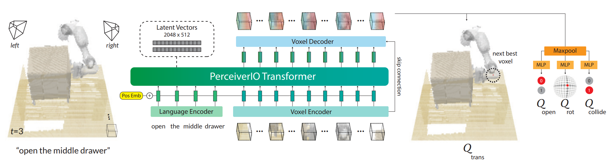
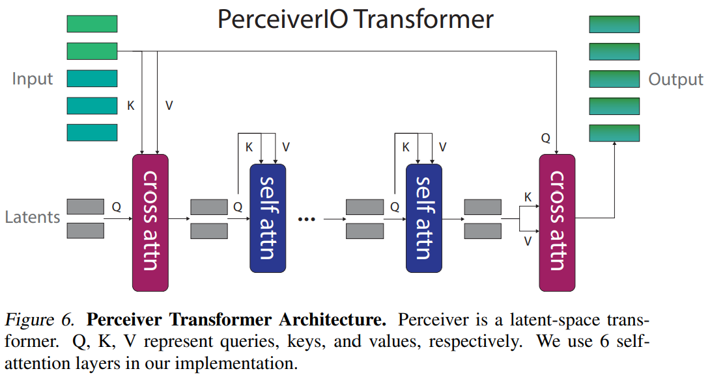

- **Perceiver-Actor A Multi-Task Transformer for Robotic Manipulation**
 **[`arXiv 2022`]** *Mohit Shridhar, Lucas Manuelli, Dieter Fox* [(arXiv)](http://arxiv.org/abs/2209.05451) [(pdf)](./../Perceiver-Actor%20-%20A%20Multi-Task%20Transformer%20for%20Robotic%20Manipulation.pdf) (Citation: 264)
    * **PreAct**: a language-conditioned behavior-cloning agent for multi-task 6-DoF manipulation. 
      * **PreAct** encodes language goals and RGB-D voxel observations within a Perceiver Transformer, and outputs discretized actions.
      * Compare with the previous work:
        * Like **CLIPort**, **PreAct** is a **classifier** trained with **supervised** **leraning** to detect actions.
        * Unlike **CLIPort**, **PreAct** uses observations and actions that are represented with 3D voxels instead of 2D image pixels.  
      * **PreAct** uses **Perceiver** **Transformer** to encode very high-dimensional input of up to 1 million voxels with only a small set of latent vectors. 
    

    * **Key** **Idea**:
      * Learn perceptual representations of actions conditioned on language goals. 
    * **Training** **Dataset** (**Demonstrations**):
      * Each demonstration is a pair of **English Language Goal** $\mathbf{I}$ and **Expert Demonstration** $\zeta$    
      * Each demonstration $\zeta$ is a sequence of continuous actions $\mathcal{A}=\{a_1, a_2, ..., a_t\}$ paired with observations $\mathcal{O}=\{ o_1, o_2, ..., o_t\}$.  
      * $a$ is a collection of 6-DoF pose, gripper open state, and collision avoidance motion planner
      * $o$ is a collection of images collected from four cameras. 
    * **Keyframes** **and** **Voxelization**
      * **Problem**: training to predict continuous actions is inefficient and noisy. 
      * For each demonstration $\zeta$, extract a set of **keyframe** **actions** that capture bottleneck end-effector poses in the action sequence with a simple heuristic: an action is a **keyframe** if (1) the joint-velocities are near zero and (2) the gripper open state has not changed. 
      * To learn action-centric representations in 3D, use a **voxel** **grid** to represent both the observation and action space. 
        * The voxel grid size is $100^3$. 
 

    

    
    
 

    * **PreAct** **Agent**:
      * The **language** goal $\mathbf{I}$ is encoded with a pre-trained **CLIP**. 
      * The **voxel** **observation** is split into 3D pataches of size $5^3$. 
        * These patches are extracted with a 3D **convolution layer** with a kernel size and stride of 5, and then flattened into a sequence of voxel encodings. 
      * The langauge encodings are finetuned with a linear layer and then appended with the voxel encodings to form the **input** **sequence**. 
        * However, this input sequence is **extremely long**. 
        * To solve this, use a **Perceiver** **Transformer** to compute cross-attention between the input and a much smaller set of latent vectors (randomly initialized and trained). The latents are encoded with self-attention layers and for the final output, the latents are again cross-attended with the input to match the input-size. 
        

        
        
  
      * **Voxel Decoder** is a 3D convolution layer and tri-linear upsampling to decode 64-dimensional voxel features. 
      * The voxel features are reshaped into the **original voxel grid** to form a 3D **Q-function** of action-values. 
    * **Training Details**
      * The agent was trained with a batch-size of 16 on 8 V100 GPUs for **16** days. 

  * **Simulation Env**:
    * **CoppelaSim** and interfaced through **PyRep**
    * Input observations are captured from four RGB-D cameras and the resolution is 128 x 128.
    * 18 tasks, and each task is runned 25 times. 