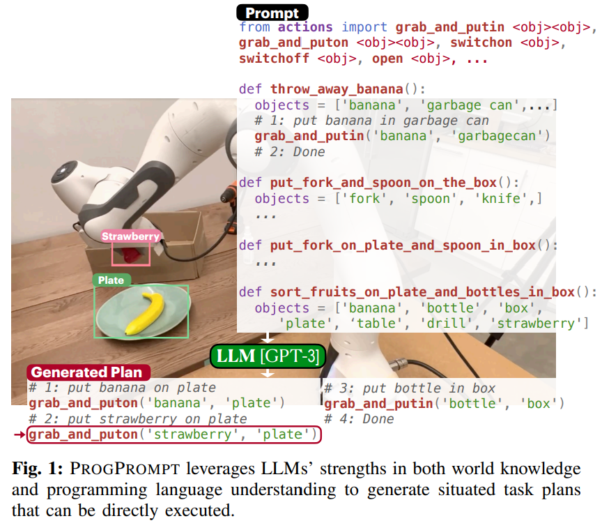
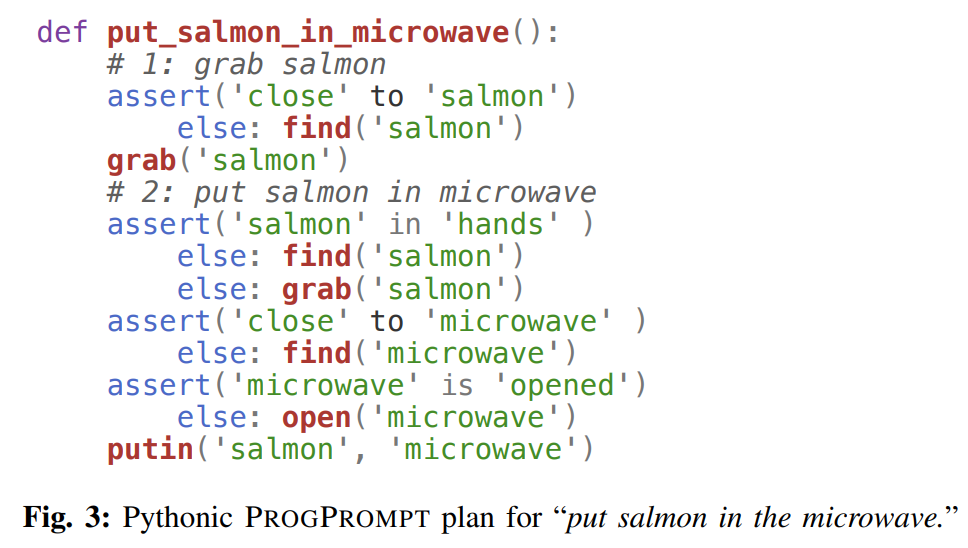
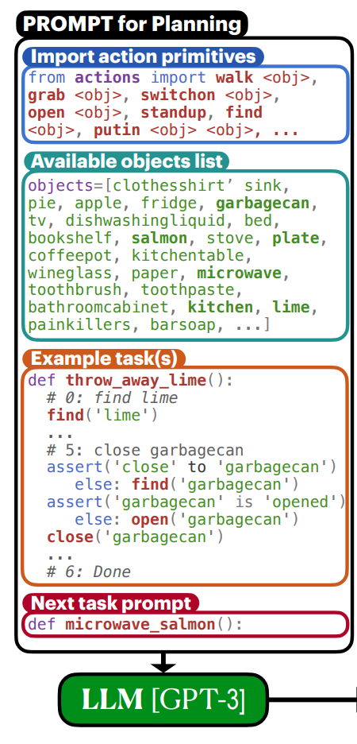
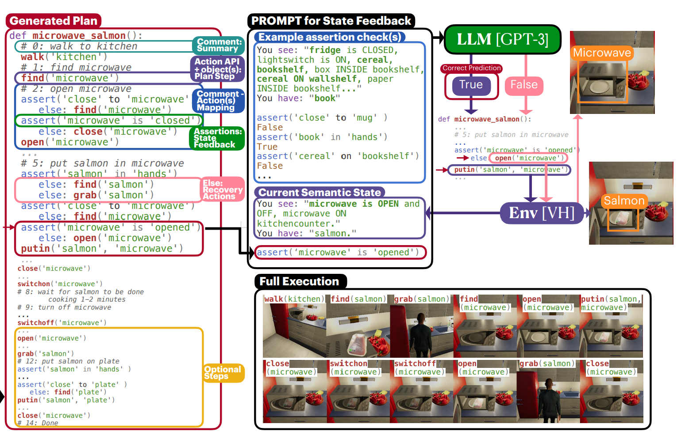

- **ProgPrompt Generating Situated Robot Task Plans using Large Language
  Models**
 **[`arXiv 2022`]** *Ishika Singh, Valts Blukis, Arsalan Mousavian, Ankit Goyal, Danfei Xu, Jonathan Tremblay, Dieter Fox, Jesse Thomason, Animesh Garg* [(arXiv)](http://arxiv.org/abs/2209.11302) [(pdf)](./../ProgPrompt%20Generating%20Situated%20Robot%20Task%20Plans%20using%20Large%20Language.pdf) (Citation: 271)
 

  

  
  

  - **Objective**: this work introduces situated awareness in LLM-based robot task planning.
    - A key component missing in LLM-based task planning is state feedback from the environment.
    - For example, to instruct a LLM to make a dinner, the fridge may not contain chicken, soda, or pickles, but a high-level instruction "Make dinner" does not give the LLM that world state information. 
  - **ProgPrompt**: Programming Language-inspired Prompt Generator.
    - Represent robot plans as **Pythonic Functions**.
    

    
    

    - ``Comments`` help LLM about immediate goals, reducing the possibility of incoherent, divergent, or repetitive outputs. 
    
    - **Constuct Programming Language Prompts**
      - Provide information about the environment and **primitive actions** to the LLM via prompt construction. 
      - Also provide the LLM with **examples of sample tasks and plans**. 
      - The LLM then predicts the ``<next_task>`` as an executable function. 
        
        

        
        

    - **Task Plan Generation and Execution**

        

        
        

        - Assertion checking is done in a closed-loop manner during execution, providing current environment state feedback. 